本篇文章是分析JDK8u20攻击链的前提，如果你想理解JDK8u20则一定需要对反序列化协议的格式有所了解。

本文章会介绍以下内容

* 环境准备(JDK、[010Editor](https://download.sweetscape.com/010EditorWin64Installer15.0.1.exe)、[zkar](https://github.com/phith0n/zkar)、[SerializationDumper](https://github.com/NickstaDB/SerializationDumper))
* 一个反序列化Demo
* 反序列化协议分析：通过反序列化工具来分析序列化后的字节码文件
* 通过010Editor修改字节码文件

这篇文章写的很不错：[用一个 case 去理解 jdk8u20 原生反序列化漏洞](https://cloud.tencent.com/developer/article/2204437)，但这是一篇分析JDK8u20的具体文章，本文是把对反序列化协议的内容择出来并做了对应细节的补充。

## 环境准备

这里的环境工具都以Windows x64为例了。

**SerializationDumper 和 Zkar只需任选其一即可**

### JDK

JDK就使用任意版本的JDK8就行了，我这里正在调试JDK8u20攻击链，所以这里用的是JDK8u66

但是你还需要一个额外的高版本JDK

### 010Editor

下载链接：https://download.sweetscape.com/010EditorWin64Installer15.0.1.exe

然后直接通过下边的激活码就能使用

```
Name:Aoe
Key:CC62-A69C-4E9D-2CCB

Name:Aoe
Key:E685-219C-BA20-062C

Name:Aoe
Key:BE44-0C9C-B358-5EED

Name:Aoe
Key:B33E-E59C-D0C7-5397

Name:Aoe
Key:071F-659C-B94A-E7B6

Name:Aoe
Key:DAB7-699C-4C9C-3A1E

Name:Aoe
Key:B7FF-099C-9DCA-5756

Name:Aoe
Key:E9BA-509C-E1B9-0913
```

破解010Editor参考链接：https://blog.aoe.top/notes/437

### SerializationDumper

SerializationDumper是一个开源的用于分析原始序列化流的工具，它提供了对Java反序列化的字节码识别能力并将其转换为对应的标签。

下载链接：https://github.com/NickstaDB/SerializationDumper/releases

这里一定要用高版本JDK，我这里用的是JDK17，然后执行`/JAVA_HOME/bin/java -jar SerializationDumper-v1.14.jar -r jdk21.ser`

就能得到对应的序列化格式输出。


### zkar

zkar是[phith0n](https://github.com/phith0n)写的一款类似于SerializationDumper的工具，但是使用go语言编写的，所以运行起来就比较方便一些，没有那么强的底层依赖，可以使用go很轻松的安装它。

但是你需要注意，zkar更像是一个API库，所以你需要一个golang项目来依赖zkar，然后调用zkar的API，就像这样：

```
go get -u github.com/phith0n/zkar
```

创建一个golang的项目，执行安装命令。

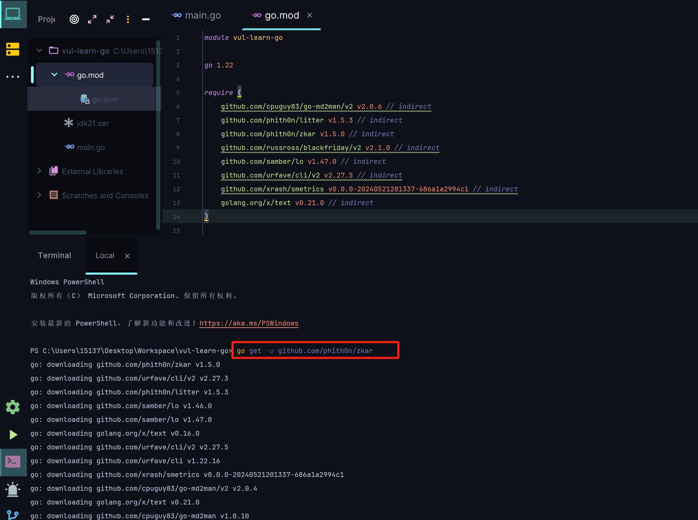

根据zkar提供的demo来获取 `jdk21.ser`的序列化格式代码

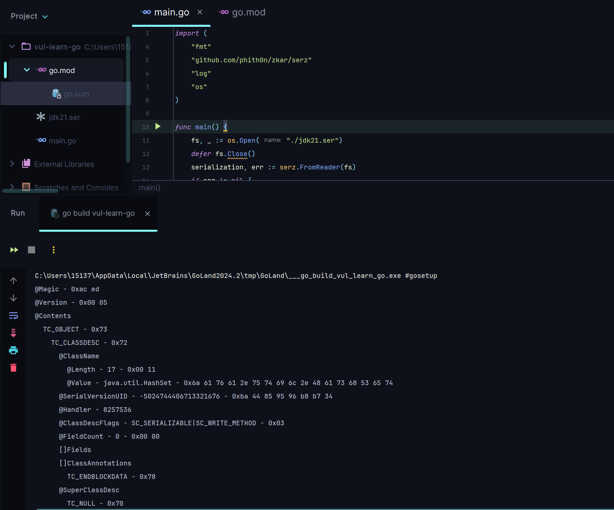

## 序列化Demo

[反序列化基础]()

这里就不过多介绍反序列化基础的内容了，要不然都是重复的篇幅。

SerialDemo.java

```java
package jdk8u20.demo;
import java.io.*;
public class SerialDemo implements Serializable {
    private final static String serialFileName="serialDemo.ser";
    private String name;
    private Integer age;
    private String sex;
    public SerialDemo(String name, Integer age, String sex){
        this.name = name;
        this.age = age;
        this.sex = sex;
    }
    private void readObject(ObjectInputStream input) throws Exception {
        input.defaultReadObject();
    }

    private void writeObject(ObjectOutputStream oos) throws Exception{
        oos.defaultWriteObject();
    }

    @Override
    public String toString() {
        return "SerialDemo{" +
                "name='" + name + '\'' +
                ", age=" + age +
                ", sex='" + sex + '\'' +
                '}';
    }

    public static void main(String[] args) throws Exception {
        SerialDemo support = new SerialDemo("erosion2020", 21, "男");
        // 序列化
        FileOutputStream fos = new FileOutputStream(serialFileName);
        ObjectOutputStream oos = new ObjectOutputStream(fos);
        oos.writeObject(support);
        oos.flush();
        oos.close();
        fos.close();
        // 反序列化
        FileInputStream fileInputStream = new FileInputStream(serialFileName);
        ObjectInputStream ois = new ObjectInputStream(fileInputStream);
        SerialDemo demo = (SerialDemo) ois.readObject();
        System.out.println(demo.toString());
    }
}
```

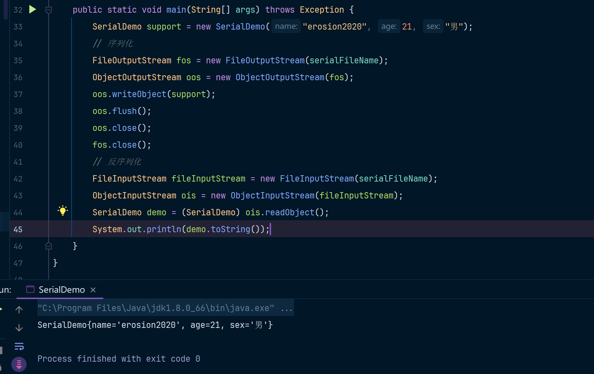

这份代码会在本地写入一个名为`serialDemo.ser`的二进制序列化文件。我们的重点是分析这个二进制序列化文件。

## 序列化协议分析(1)

### 尝试分析一个Demo

使用`SerializationDumper`识别`serialDemo.ser`这个文件。

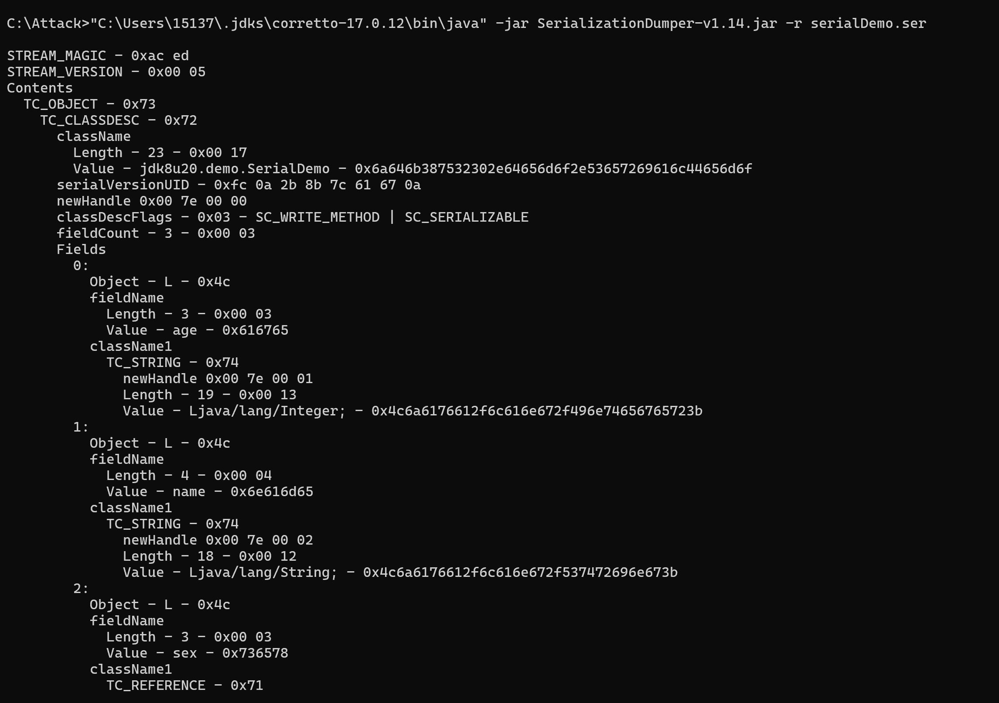

注意，`SerializationDumper`这个工具为了格式化出来的内容容易阅读，所以它额外加了一些标签，但在序列化文件中，他们是不存在的。

可以使用010Editor打开这个序列化文件，然后对照`SerializationDumper`给的内容做对比就可以了。

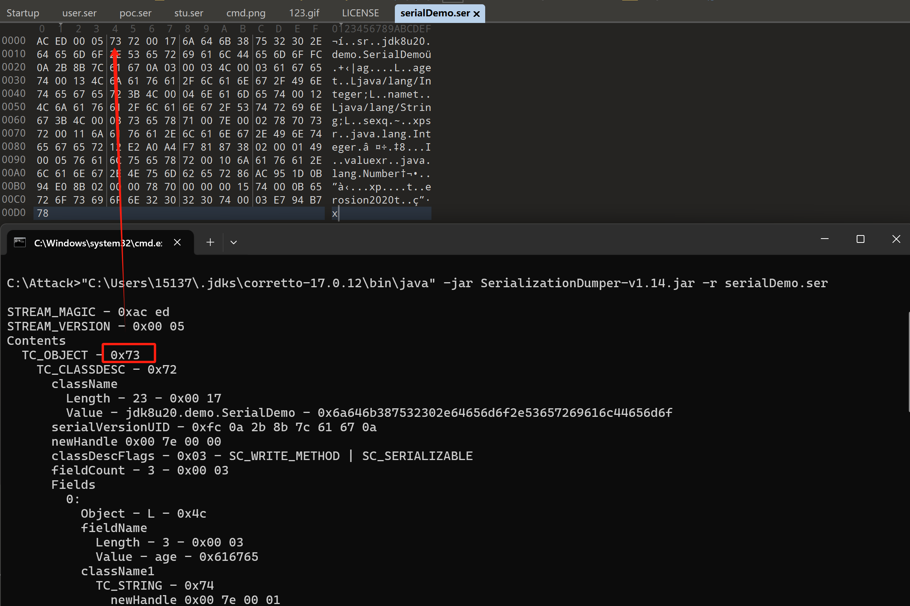

**当序列化文件中不存在这个描述标识时，我会使用 -------------不存在-------------- 这样的注释写法标识出来**

```bash
# 0xac ed，固定值，用来标识 Java 序列化流。
STREAM_MAGIC - 0xac ed
# 说是表示序列化流版本号,但是一般来说都是05,我还没见过其他的值
STREAM_VERSION - 0x00 05
# --------在实际序列化文件中不存在-------
Contents
# 标识一个对象的起始符
  TC_OBJECT - 0x73
  	# 表示类描述信息的开始
    TC_CLASSDESC - 0x72
   	 # ---------不存在-----------
      className
      	# 类的全限定名长度
        Length - 23 - 0x00 17 
        # 类的全限定名
        Value - jdk8u20.demo.SerialDemo - 0x6a646b387532302e64656d6f2e53657269616c44656d6f	
      # SUID,类的序列化标识符,用于版本一致性校验
      serialVersionUID - 0xfc 0a 2b 8b 7c 61 67 0a	
      # ----------- 用来描述在 Java 序列化流中分配给类描述符、对象实例或其他序列化元素的唯一句柄标识。默认句柄标识以0x00 7e 00 00开始，这是逻辑上的，在实际序列化文件中并不存在该值
      newHandle 0x00 7e 00 00	
      # SC_WRITE_METHOD = 0x01, 表示一个类实现了writeObject方法
      # SC_SERIALIZABLE = 0x02, 表示一个类实现了Serializable接口
      # 0x03这个值就是这么来的：0x01 | 0x02 = 0x03
      classDescFlags - 0x03 - SC_WRITE_METHOD | SC_SERIALIZABLE
      # 类中总共有三个字段
      fieldCount - 3 - 0x00 03
      # --------字段描述---------
      Fields
        # 第一个字段
        0:
          # 该字段是对象类型，非常没毛病，Integer就是一个对象类型
          Object - L - 0x4c
          # --------字段名描述---------
          fieldName
          	# 字段名长度是3
            Length - 3 - 0x00 03
            # 字段名是age
            Value - age - 0x616765
          # 这个(Integer)对象类型的描述信息
          className1
          	# 这是一个类型描述符，用于标识字段的具体类型
            TC_STRING - 0x74
              # ----------为(Integer)对象类型描述符分配的句柄，用于后续引用---------
              newHandle 0x00 7e 00 01
              # 类型描述符的长度是19
              Length - 19 - 0x00 13
              # 类型的全限定名是 Ljava/lang/Integer;
              Value - Ljava/lang/Integer; - 0x4c6a6176612f6c616e672f496e74656765723b
        # 第二个字段
        1:
          # 该字段是对象类型(String)
          Object - L - 0x4c
          # --------字段名描述---------
          fieldName
          	# 字段名长度是4
            Length - 4 - 0x00 04
            # 字段名是name
            Value - name - 0x6e616d65
          # 这个(String)对象类型的描述信息
          className1
            TC_STRING - 0x74
              # ----------为(String)对象类型描述符分配的句柄，用于后续引用---------
              newHandle 0x00 7e 00 02
              # 长度为18，其实就是 "Ljava/lang/String;" 这个字符串的长度
              Length - 18 - 0x00 12
              # (String)对象类型的定义值，也就是 "Ljava/lang/String;" 这个字符串
              Value - Ljava/lang/String; - 0x4c6a6176612f6c616e672f537472696e673b
        # 第三个字段
        2:
          Object - L - 0x4c
          # --------字段名描述---------
          fieldName
          	# 字段名长度是3
            Length - 3 - 0x00 03
            # 字段名是sex
            Value - sex - 0x736578
          # 这个(String)对象类型的描述信息，这里有点不一样了哦~
          className1
            # Java 序列化文件中用于引用句柄的标识符。
            TC_REFERENCE - 0x71
              # 具体引用的值是0x00 7e 00 02，也就是第二个字段中的类型描述，也就是String
              # 这里的对象也是类描述符，但上边已经存在String的类描述符了，这里会使用句柄地址指向原有的String类描述符
              Handle - 8257538 - 0x00 7e 00 02
      # 在序列化文件中类描述符的注解
      classAnnotations
      	# 在序列化文件中表示当前类描述符的注解部分已经结束
        TC_ENDBLOCKDATA - 0x78
      # 该类(jdk8u20.demo.SerialDemo)的父类描述符
      superClassDesc
      	# TC_NULL表示没有父类
        TC_NULL - 0x70
    # ----------当前对象(jdk8u20.demo.SerialDemo)的句柄--------------
    newHandle 0x00 7e 00 03
    # ---------实例化数据部分 - 如果这有多个实例化对象的话，classdata内部就是多个类--------
    classdata
    # --------表示这是对象(jdk8u20.demo.SerialDemo)的实例化数据部分---------
      jdk8u20.demo.SerialDemo
        # ----------具体的实例化字段数据(这里应该是有三个，也就是age、name、sex)------
        values
          # ----------age字段------
          age
            (object)
          	  # 标识一个对象的起始符,这里指的是java.lang.Integer类描述符的标识
              TC_OBJECT - 0x73
  			   # 表示java.lang.Integer类描述信息的开始
                TC_CLASSDESC - 0x72
                  # ---------类名称信息-----------
                  className
                  	# 类全类名名称长度为17 
                    Length - 17 - 0x00 11
                    # 类全类名(java.lang.Integer),刚好17个字符
                    Value - java.lang.Integer - 0x6a6176612e6c616e672e496e7465676572
                  # SUID,类的序列化标识符,用于版本一致性校验
                  serialVersionUID - 0x12 e2 a0 a4 f7 81 87 38
                  # --------指定java.lang.Integer句柄标识为0x00 7e 00 04-----------
                  newHandle 0x00 7e 00 04
                  # java.lang.Integer继承了java.io.Serializable接口
                  # java.lang.Integer继承了Number类，而Number类实现了java.io.Serializable接口
                  # 所以java.lang.Integer继承了java.io.Serializable接口
                  classDescFlags - 0x02 - SC_SERIALIZABLE
                  # 字段总数1
                  # 因为java.lang.Integer是int类型的包装类型，所以很显然这个类中是封装了一个int类型字段
                  # 确实是这样的，Integer中是这样定义的：private final int value;
                  fieldCount - 1 - 0x00 01
                  # --------java.lang.Integer中的字段描述---------
                  Fields
                    # ------------第一个字段------------
                    0:
                      # I表示是Int类型，对应值是0x49
                      Int - I - 0x49
                      # -------字段名-------
                      fieldName
                        # 字段名长度为5
                        Length - 5 - 0x00 05
                        # 字段名(value)
                        Value - value - 0x76616c7565
      			 # -------java.lang.Integer类描述符的注解--------
                  classAnnotations
                  	# java.lang.Integer类描述符的结束标识
                    TC_ENDBLOCKDATA - 0x78
                  # -------java.lang.Integer类的父类信息--------
                  # -------在Integer中是这么写的 Integer extends Number implements Comparable<Integer> ----
                  superClassDesc
                    # Number类描述符
                    TC_CLASSDESC - 0x72
                  	  # ---------Number类名称信息-----------
                      className
                        # 全类名长度为16
                        Length - 16 - 0x00 10
                        # 全类名：java.lang.Number
                        Value - java.lang.Number - 0x6a6176612e6c616e672e4e756d626572
                      # SUID,类的序列化标识符,用于版本一致性校验
                      serialVersionUID - 0x86 ac 95 1d 0b 94 e0 8b
                  	  # --------指定java.lang.Integer句柄标识为0x00 7e 00 05-----------
                      newHandle 0x00 7e 00 05
                      # Number类实现了java.io.Serializable接口
                      classDescFlags - 0x02 - SC_SERIALIZABLE
                      # Number类中并没有任何字段
                      fieldCount - 0 - 0x00 00
      			 	 # -------java.lang.Integer类描述符的注解--------
                      classAnnotations
                  	    # java.lang.Integer类描述符的结束标识
                        TC_ENDBLOCKDATA - 0x78
                      # --------Number的父类描述信息---------
                      superClassDesc
                      	# TC_NULL 在这里表示Number没有任何父类了
                        TC_NULL - 0x70
                # --------指定java.lang.Integer句柄标识为0x00 7e 00 06-----------
                newHandle 0x00 7e 00 06
                # --------实例化数据部分-----------
                classdata
                  # --------java.lang.Number本身并没有附加字段，所以在 values 部分是空的。--------
                  java.lang.Number
                    values
                  # --------在java.lang.Integer中存储了int值21--------
                  java.lang.Integer
                    # --------固定格式，表示类中的所有字段--------
                    values
                      # --------字段名--------
                      value
                        # 字段value的值是21
                        (int)21 - 0x00 00 00 15
          # ------name字段的实例化数据部分--------
          name
            (object)
              # TC_STRING表示这个字段是一个String类型
              TC_STRING - 0x74
                # --------name字段的实例化数据的句柄标识0x00 7e 00 07-----------
                newHandle 0x00 7e 00 07
                # name字段中数据的长度
                Length - 11 - 0x00 0b
                # name中的数据: erosion2020
                Value - erosion2020 - 0x65726f73696f6e32303230
          # ------sex字段的实例化数据部分--------
          sex
            (object)
              # TC_STRING表示这个字段是一个String类型
              TC_STRING - 0x74
                # --------name字段的实例化数据的句柄标识0x00 7e 00 08-----------
                newHandle 0x00 7e 00 08
                # sex字段中数据的长度(这个汉字在UTF-8编码下占用了3个字节长度)
                Length - 3 - 0x00 03
                # 这里没有显示出来，应该是这个工具没有兼容汉字。但不影响我们分析。这里应该是: 男
                Value - ??? - 0xe794b7
        # ----------类实例注解描述,后边紧跟类实例结束符----------
        objectAnnotation
          # jdk8u20.demo.SerialDemo类描述符的结束标识
          TC_ENDBLOCKDATA - 0x78
```

关于一些小白可能会提出的问题

### String为什么没有Integer那样的类描述信息

在 Java 的序列化文件中，`String` 虽然是一个对象，但被视为一种特殊的引用类型，不会像普通类那样包含完整的 **类描述信息**。这主要是因为 `String` 是Java 标准库中的一个内置对象，并且在序列化协议中有特殊处理。

`String` 在 Java 序列化中的表现

1. 不需要类描述符：
   - Java 的序列化协议为 `String` 类型提供了特殊优化。当序列化 `String` 时，不会通过 TC_CLASSDESC来描述它的类信息，而是直接在序列化流中使用 `TC_STRING` (0x74)或 `TC_LONGSTRING` (0x7c)
   - `TC_STRING` 用于较短的字符串（长度 < 65535 字节）。
   - `TC_LONGSTRING` 用于较长的字符串（长度 ≥ 65535 字节）。
2. 字符串内容直接存储：
   - 在序列化流中，`String` 的内容以长度 + UTF-8 编码表示，避免了冗余的类描述信息。

为什么 `String` 被特殊处理

1. 高频使用：
   - `String` 是 Java 中最常用的对象类型，几乎所有序列化对象中都会包含字符串字段。
   - 为了提升序列化效率，协议对其做了特殊优化。
2. 稳定的类结构：
   - `String` 的类结构非常稳定，其字段和行为不会改变，因此可以不通过 `TC_CLASSDESC` 显式描述类信息。

### 什么是句柄

在 Java 序列化中，`句柄（Handle)` 是一个用于标识某个对象或数据的唯一标记，用于优化序列化流的空间效率和解析速度。它起到了`引用指针`的作用，使得在序列化流中可以高效地引用之前已经记录过的对象或数据。

通常你可以简单的理解成：句柄就是一个Java定义的一个标记数字`0x 00 7e 00 00`，其他有用到句柄的地方都是在`0x 00 7e 00 00`的基础上增加。

句柄可以标识字段的类型描述符，描述该字段的数据类型（例如 `Ljava/lang/Integer;` 表示一个 `Integer` 类型的字段）。也可以标识具体的对象实例或常量值，如某个 `Integer` 或 `String` 对象。

### 描述符和实例的区别

描述符可以简单理解成：

```java
// 这个字段是Integer类型的
// 这个字段的可存储长度就是Integer的长度，也就是Integer.SIZE的大小
// 这个字段的名字长度是3
// 这个字段的名字是age
Integer age = 25;
```

实例就是

```java
// 这个变量中对应的内容中存储着25这个值
Integer age = 25;
```

对比如下

| 特性         | 描述符                                                      | 实例                                                         |
| ------------ | ----------------------------------------------------------- | ------------------------------------------------------------ |
| 存储的内容   | 类名、字段名称、字段类型、父类信息、`serialVersionUID` 等。 | 字段的具体值（如 `age = 21`，`name = "John"`）。             |
| 是否存储数据 | 不存储字段的值，仅描述字段的类型和结构。                    | 存储字段的值，是描述符对应类的实际表现。                     |
| 静态/动态    | 静态，描述类的结构，序列化和反序列化过程中通常不变。        | 动态，表示某个类的具体对象值，在序列化流中会随字段值不同而变化。 |

### 总结

可以看到Java的序列化过程其实就是保存了类信息、父类信息、类中的字段信息、父类中的字段值、类中的字段值。

字段类型被描述成了类似这样的形式`Ljava/lang/String;`，其中L表示后边跟的是一个全类路径。

## 序列化协议分析(2)

如果writeObject两次同一个对象，会发生什么情况呢？

### 尝试writeObject两次

还在(1)的代码示例基础上，尝试writeObject两次。只需修改main方法中的内容即可。

```java
public static void main(String[] args) throws Exception {
    SerialDemo support = new SerialDemo("erosion2020", 21, "男");
    // 序列化
    FileOutputStream fos = new FileOutputStream("serialDemo2.ser");
    ObjectOutputStream oos = new ObjectOutputStream(fos);
    oos.writeObject(support);
    oos.writeObject(support);
    oos.flush();
    oos.close();
    fos.close();
    // 反序列化
    FileInputStream fileInputStream = new FileInputStream(serialFileName);
    ObjectInputStream ois = new ObjectInputStream(fileInputStream);
    System.out.println(ois.readObject().toString());
    SerialDemo demo = (SerialDemo) ois.readObject();
    System.out.println(demo.toString());
}
```

结果如下：

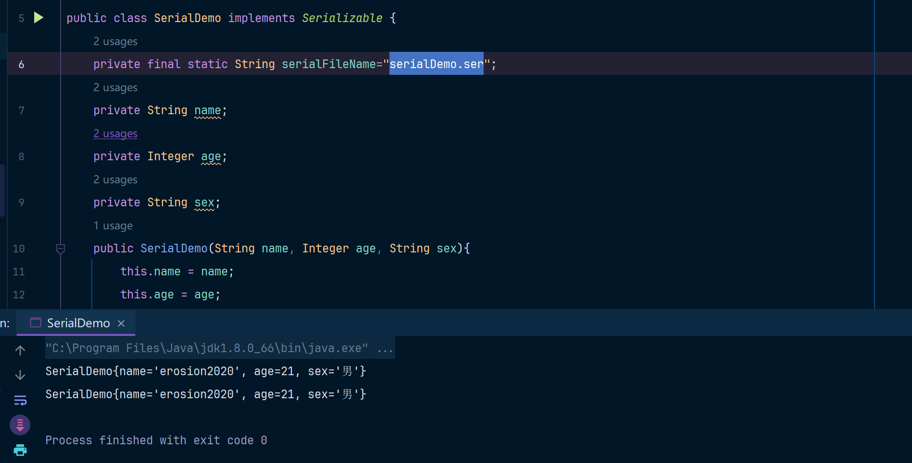

看起来结果就是写入两次和读取两次，完全没有变化嘛。然后我们看一下序列化文件中产生了变化。

因为内容比较长，直接用文本对比工具对比一下两者的区别。

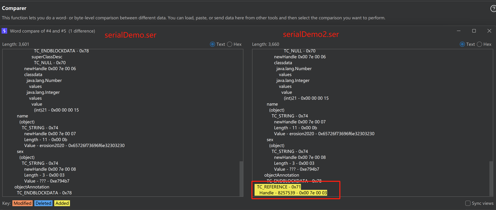

可以发现多了一个`TC_REFERENCE`这个标签，这个标签的含义就是引用的意思。

然后在Handle中指向了一个句柄，句柄的值就是`0x00 7e 00 03`，这不就是`jdk8u20.demo.SerialDemo`这个东西嘛。

其实啊，`TC_REFERENCE`标签就是引用之前已经出现的对象实例，在序列化中对象实例是怎么被表示的呢，对！就是句柄，而Java使用`TC_REFERENCE`标签就是为了避免在序列化数据中重复存储同一个对象，属于是一种优化手段。

我们跟到的代码中，看看他是怎么处理的，找到ObjectInputStream.readObject()方法中的readObject0方法。

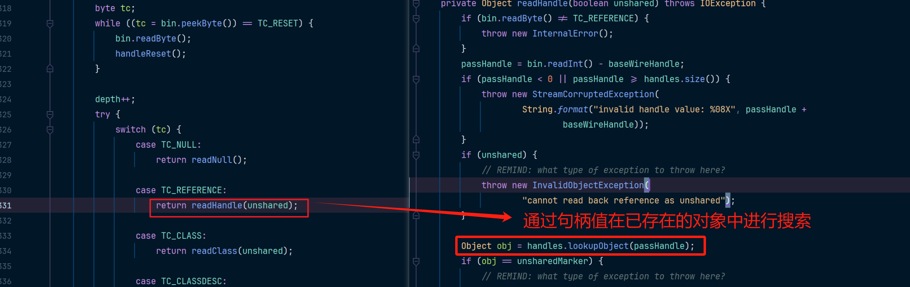

如果`TC_REFERENCE`引用的类已经被实例化，那么此时通过readObject来读取`TC_REFERENCE`对应的类，这个类将不会再次被实例化，就变成一个单纯的赋值动作了。

记住上边这句话哦，JDK8u20要考的，这句话就是JDK8u20绕过异常抛出的核心。

### 尝试readObject三次

Java 的序列化和反序列化过程是**严格对应**的。反序列化必须按照序列化时的写入顺序逐步读取，否则会出错。

让我们来尝试下writeObject两次，但是readObject三次的情况。

在(1)的代码中修改main方法。

```java
public static void main(String[] args) throws Exception {
    SerialDemo support = new SerialDemo("erosion2020", 21, "男");
    // 序列化
    FileOutputStream fos = new FileOutputStream("serialDemo2.ser");
    ObjectOutputStream oos = new ObjectOutputStream(fos);
    oos.writeObject(support);
    oos.writeObject(support);
    oos.flush();
    oos.close();
    fos.close();
    // 反序列化
    FileInputStream fileInputStream = new FileInputStream(serialFileName);
    ObjectInputStream ois = new ObjectInputStream(fileInputStream);
    System.out.println(ois.readObject().toString());
    System.out.println(ois.readObject().toString());
    // 第三次进行读取
    System.out.println(ois.readObject().toString());
}
```

再次运行这份代码会得到一个EOF异常，表示序列化文件已经结束了，但是我们还在尝试进行读取。

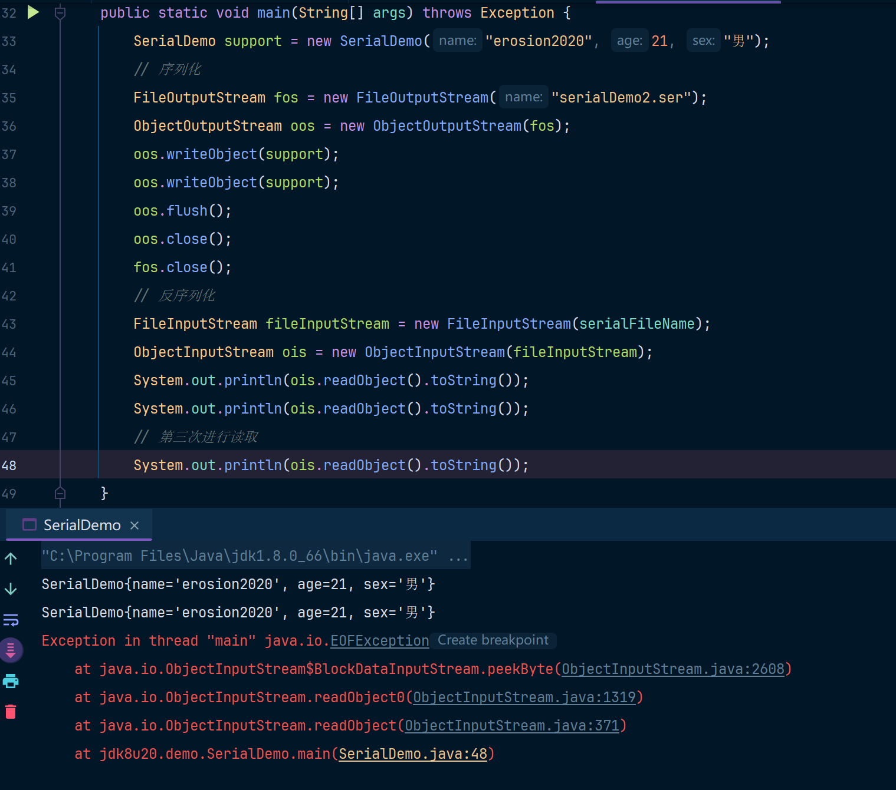

这是因为序列化包含以下特性：

| 特性         | 描述                                                         | 错误类型                                         | 解决方法                                       |
| ------------ | ------------------------------------------------------------ | ------------------------------------------------ | ---------------------------------------------- |
| 顺序性       | 写入和读取对象必须严格按照相同的顺序进行。                   | ClassCastException` 或 `StreamCorruptedException | 保证序列化和反序列化顺序一致。                 |
| 类型匹配     | 反序列化时，读取的对象类型必须与序列化写入的对象类型一致。   | ClassCastException                               | 确保读取时的类型与序列化写入时的类型一致。     |
| 额外读取     | 读取已写入对象之外的数据会抛出异常。                         | EOFException                                     | 使用结束标志（如 `null`）来指示序列化结束。    |
| 流结束       | 序列化流中的所有数据读取完成后，流到达末尾。                 | EOFException                                     | 在读取完数据后不再尝试额外读取。               |
| 格式正确性   | 流中的数据格式必须正确，反序列化时解析格式化数据。           | StreamCorruptedException                         | 保持序列化流的完整性，不允许流被破坏或被修改。 |
| 引用一致性   | 同一对象的多次序列化只写入一次，后续使用 `TC_REFERENCE` 引用已写入对象。 | 无直接错误，但可能导致逻辑问题                   | 了解并正确处理引用特性，确保引用对象一致性。   |
| 基础类型优化 | `String` 等基础类型会优化处理，无需额外的类描述符。          | 无直接错误                                       | 不需要显式添加类描述符，可直接序列化。         |
| 标志控制     | 可使用标志位（如 `TC_NULL` 或自定义标志）表示对象序列结束或特殊状态。 | 无直接错误                                       | 合理使用标志位终止反序列化或区分不同对象。     |

### 总结

Java优化了序列化文件，使用`TC_REFERENCE`标记一个引用对象，使得序列化可以引用一个已经被创建的对象实例。

序列化包含一些比较重要的特性(和后续学JDK8u20有关联)

* **顺序性**：比如我按照1、2、3、4的顺序进行序列化写入操作，那么反序列化就要按照1、2、3、4的顺序进行读取操作，如果在4之后还尝试读取，就会抛出EOFException
* **引用一致性**：同一对象的多次序列化只写入一次，后续使用 `TC_REFERENCE` 引用已写入对象。
* **基础类型优化**：`String` 等基础类型会优化处理，无需额外的类描述符。
* **类型匹配**：确保读取时的类型与序列化写入时的类型一致。

## 修改字节码文件

在`序列化协议分析(2)`中我们通过代码writeObject两次，然后可以readObject两次，那么其实我们知道了序列化规则之后，还可以通过直接修改字节码文件的方式来达到实现两次writeObject的效果。

### 使用010Editor编辑字节码文件

把`71 00 7e 00 03`通过010Editor追加到原始的文件末尾，如下

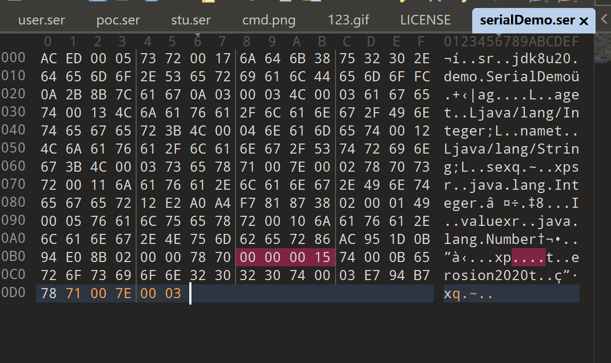

此时我们没有调用两次writeObject方法，但是这和调用了两次writeObject方法没有任何区别。

我们尝试反序列化并两次readObject，如下：

```java
public static void main(String[] args) throws Exception {
    // 反序列化
    FileInputStream fileInputStream = new FileInputStream("serialDemo.ser");
    ObjectInputStream ois = new ObjectInputStream(fileInputStream);
    System.out.println(ois.readObject().toString());
    // 二次读取
    System.out.println(ois.readObject().toString());
}
```

效果如下

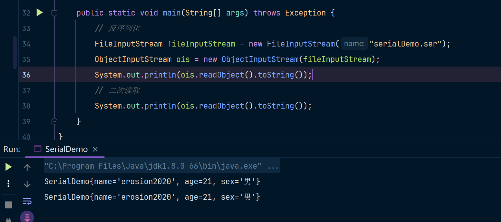

JDK8u20中就是这样的思路。通过`TC_REFERENCE`和修改字节码文件完成对应的异常绕过。

### 补充：010Editor创建Hex文件

010Editor中可以把16进制字符串写入到文件中，如：

```
aced 0005 7372 0020 636f 6d2e 7061 6e64
612e 7365 632e 4265 616e 436f 6e74 6578
7453 7570 706f 7274 0000 0000 0000 0014
0300 0078 7073 7200 2963 6f6d 2e70 616e
6461 2e73 6563 2e41 6e6e 6f74 6174 696f
6e49 6e76 6f63 6174 696f 6e48 616e 646c
6572 0000 0000 0000 000a 0200 0149 0004
7a65 726f 7870 0000 0000 7871 007e 0003
```

打开010Editor，创建Hex文件

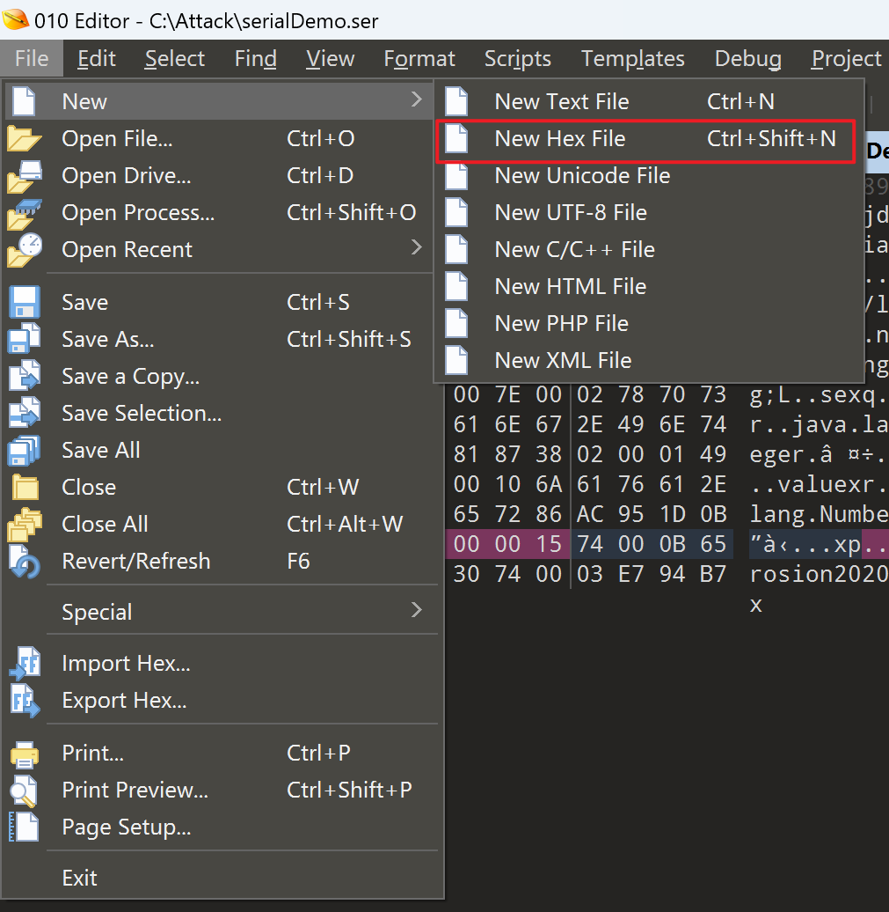

然后使用`ctrl + shift + v`把内容粘贴进来，然后将其保存成文件即可。

在规范的做法中Java的序列化文件以`.ser`结尾，但这不是固定的，你可以任意命名，很多人也喜欢以`.bin`结尾

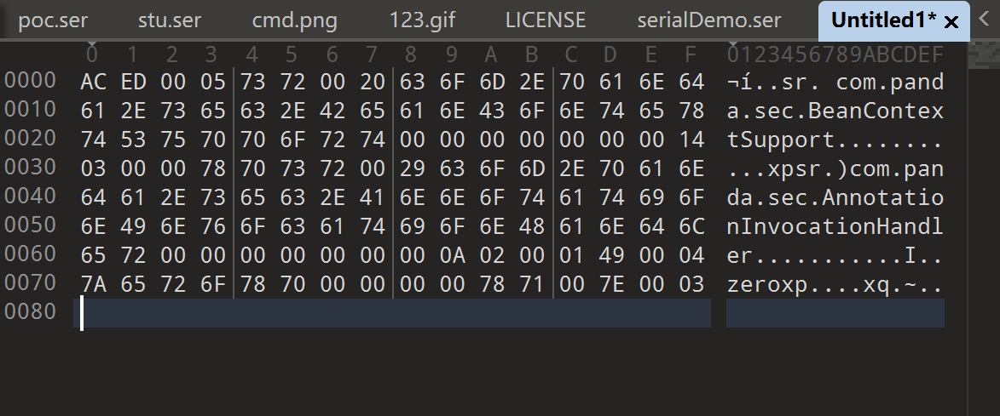

## 参考

破解010Editor: https://blog.aoe.top/notes/437

用一个 case 去理解 jdk8u20 原生反序列化漏洞: https://cloud.tencent.com/developer/article/2204437

Zkar: https://github.com/phith0n/zkar

SerializationDumper: https://github.com/NickstaDB/SerializationDumper