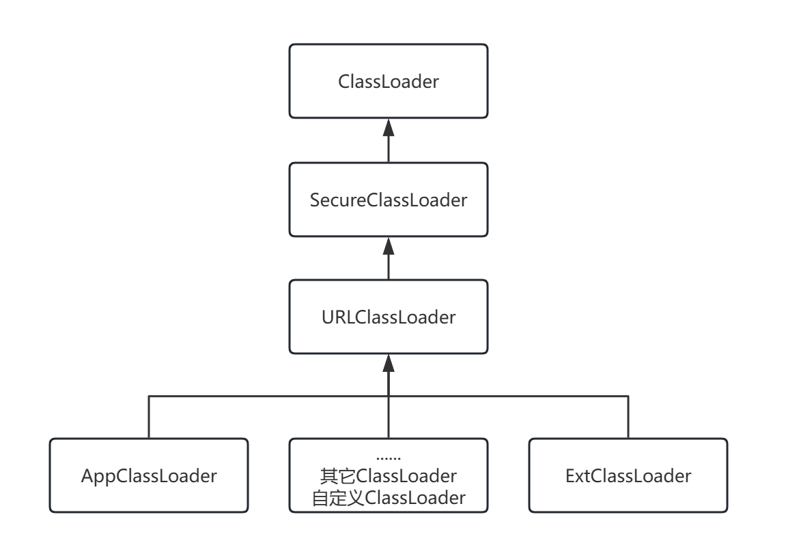
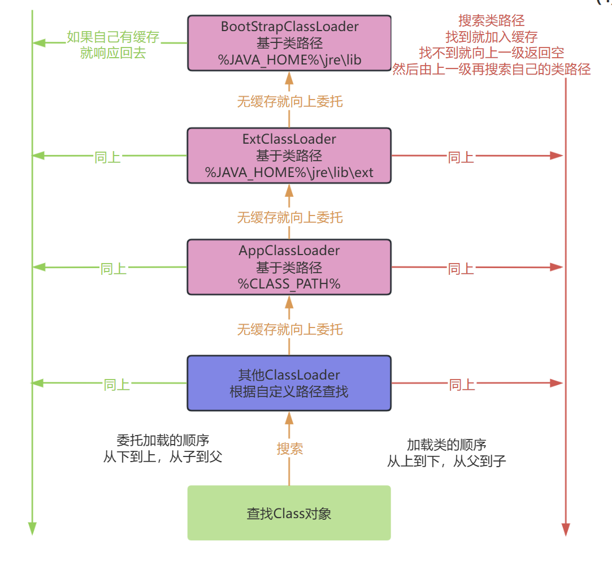

## 概要说明

**注：本篇文章是网上多篇文章的缝合，把我觉得写的不错的，对我理解ClassLoader有帮助的内容写到博客中，同时我尽量让一些学Java安全的同学更详细的学习ClassLoader。**

参考文章(1)：https://www.cnblogs.com/luckforefforts/p/13642685.html - 简短，可以快速了解ClassLoader概念和双亲委派等机制

参考文章(2)：https://cloud.tencent.com/developer/article/1383145 - 分析&调试ClassLoader部分代码，更详细

## 什么是ClassLoader？

ClassLoader，翻译成中文就是“类加载器”。对于普通的 Java 开发者来说，可能接触得比较少，但对于框架开发者或者需要深度定制 Java 应用的开发者来说，这是一个非常重要的工具。理解 ClassLoader 的工作机制，能帮助我们更好地理解 Java 程序的运行原理，还能指导我们编写出更高效的代码。

ClassLoader 的主要功能是将 `.class` 文件加载到 JVM（Java 虚拟机）中，使程序能够正常运行。不过，JVM 在启动时并不会一次性将所有的类文件加载到内存中，而是根据需要动态加载。想想看，如果启动时就把所有的 JAR 包和类文件都加载到内存里，包中那么多类，内存都扛不住啦！动态加载的机制不仅节省了资源，还提升了程序的启动速度和运行效率。

本文将通过学习 ClassLoader 的加载机制，深入探讨其原理和使用场景，帮助大家在实际开发中更好地理解和运用这一核心概念。

## Class文件的认识

在Java中，程序运行的核心是JVM（Java虚拟机）。我们平时在文本编辑器或者IDE中编写的程序通常是以`.java`文件的形式保存的，这是最基础的源码格式。但是，这种文件本身是无法直接运行的。举个例子，我们来写一个简单的程序：

```java
public class HelloWorld {
    public static void main(String[] args) {
        System.out.println("Hello world!");
    }
}
```

写完这段代码后，需要通过命令行编译这个`.java`文件：

```
javac HelloWorld.java
```

编译完成后，会在同一目录下生成一个 .class 文件。这就是字节码文件，它是Java程序运行的关键。接下来，我们可以通过以下命令运行程序：

```
java HelloWorld
```

上面的例子是所有学习Java入门时都会接触到的基础内容。这里再次提到，是希望大家重新聚焦在`.class`文件上。因为Java虚拟机（JVM）并不能直接识别我们写的`.java`源文件，而是需要通过`javac`命令将它们转换成`.class`文件后才能执行。

更有趣的是，JVM并不限制这些`.class`文件的来源。只要格式符合字节码规范，无论是用C语言、Python，还是其他语言编写并正确转换为`.class`文件，Java虚拟机都可以识别并运行。这也是Java的一大优势——跨语言的灵活性。

了解了`.class`文件的作用后，我们再来思考一个问题：我们编写完的Java程序，是如何从代码变成运行中的程序的？换句话说，我们自己编写的各种类究竟是如何被加载到JVM中的？接下来，我们就从这个问题入手，深入探索类加载的过程。

## 深入探索类加载过程

学Java的时候，有没有被配置环境变量难住过？相信很多人都有这样的经历：第一次下载并安装JDK后，按照书本或者网上的教程战战兢兢地配置环境变量。配置好之后，过段时间再需要操作时，又忘了！而且是必忘。每次都要重新查资料，甚至还会感到气愤：为什么这么重要的工具竟然需要手动配置环境变量？一点都不人性化！这也导致了不少初学者在这一步就打了退堂鼓，挫败感满满。

为了让这部分知识变得更直观易懂，下面我只讲解在 **Windows** 平台上的环境变量配置（其他平台类似），主要包括以下三个变量：`JAVA_HOME`、`PATH` 和 `CLASSPATH`。

### JAVA_HOME

```
JAVA_HOME=C:\Program Files\Java\jdk-1.8
```

这个变量指向的是你安装 JDK 的位置。设置它的目的是为了让系统知道 JDK 的安装目录在哪里，方便其他工具（比如 IDE）找到它。

### PATH

这个变量的作用是让你在命令行中可以直接使用某些命令，而不需要输入它们的完整路径。比如，运行 `javac` 和 `java` 命令时，如果没有将 JDK 中的 `bin` 目录添加到 PATH 中，就需要输入全路径，非常麻烦。

```
PATH=%JAVA_HOME%\bin\
```

**正确的配置方法**：
在原有的 PATH 路径上，添加 JDK 安装目录下的 `bin` 目录和 JRE 的 `bin` 目录。配置完成后，你可以直接在命令行中运行 `javac` 和 `java`。

### CLASSPATH

```
CLASSPATH=.;%JAVA_HOME%\lib;%JAVA_HOME%\lib\tools.jar
```

顾名思义，这个变量是用来指向 `.jar` 包或 `.class` 文件所在路径的。JVM 在运行时会根据 CLASSPATH 找到你需要加载的类文件或依赖包。

**需要注意的一点**：CLASSPATH 的值通常以 `.;` 开头，其中 `.` 表示当前目录。如果省略了这部分，JVM 可能无法识别当前目录下的类文件。

## Java中的三个系统类加载器

在Java中，系统自带了三个主要的类加载器，它们各自负责加载不同路径下的类和资源。下面我们逐一了解它们的功能和加载路径。

### Bootstrap ClassLoader（引导类加载器）

这是Java中最顶层的类加载器，负责加载核心类库。它会加载 `%JRE_HOME%\lib` 目录下的重要文件，例如 `rt.jar`、`resources.jar`、`charsets.jar` 等基础类库。

**注意事项**：

- 引导类加载器的加载路径可以通过启动 JVM 时的 `-Xbootclasspath` 参数进行调整。例如：

- ```bash
  java -Xbootclasspath/a:path
  // 这样会将指定的路径文件追加到默认的引导加载路径中。
  ```

你可以在文件资源管理器中打开 `%JRE_HOME%\lib` 目录，检查这些 `.jar` 文件是否存在。

### Extension ClassLoader（扩展类加载器）

扩展类加载器用于加载 `%JRE_HOME%\lib\ext` 目录下的 `.jar` 包和 `.class` 文件。除此之外，还可以通过 JVM 参数 `-Djava.ext.dirs=路径` 指定其他扩展加载目录。

### Application ClassLoader（应用类加载器）

也被称为 `System ClassLoader`，它是用户最常接触的类加载器，主要负责加载当前应用程序的类路径（`classpath`）中的所有类。用户自己编写的类和依赖库大多由它加载。

## 加载顺序

1. Bootstrap CLassloder 
2. Extention ClassLoader 
3. AppClassLoader     

为了更好的理解，我们可以查看源码。  看`sun.misc.Launcher`,它是一个java虚拟机的入口应用。

```java
public class Launcher {
    private static Launcher launcher = new Launcher();
    private static String bootClassPath =
        System.getProperty("sun.boot.class.path");

    public static Launcher getLauncher() {
        return launcher;
    }

    private ClassLoader loader;

    public Launcher() {
        // Create the extension class loader
        ClassLoader extcl;
        try {
            extcl = ExtClassLoader.getExtClassLoader();
        } catch (IOException e) {
            throw new InternalError(
                "Could not create extension class loader", e);
        }

        // Now create the class loader to use to launch the application
        try {
            loader = AppClassLoader.getAppClassLoader(extcl);
        } catch (IOException e) {
            throw new InternalError(
                "Could not create application class loader", e);
        }

        //设置AppClassLoader为线程上下文类加载器，这个文章后面部分讲解
        Thread.currentThread().setContextClassLoader(loader);
    }

    /*
     * Returns the class loader used to launch the main application.
     */
    public ClassLoader getClassLoader() {
        return loader;
    }
    /*
     * The class loader used for loading installed extensions.
     */
    static class ExtClassLoader extends URLClassLoader {}

/**
     * The class loader used for loading from java.class.path.
     * runs in a restricted security context.
     */
    static class AppClassLoader extends URLClassLoader {}
}
```

我们可以得到相关的信息。  

*  Launcher初始化了ExtClassLoader和AppClassLoader。
* Launcher中并没有看见BootstrapClassLoader，但通过`System.getProperty("sun.boot.class.path")`得到了字符串`bootClassPath`,这个应该就是BootstrapClassLoader加载的jar包路径。 

先代码测试一下`sun.boot.class.path`是什么内容。

```java
System.out.println(System.getProperty("sun.boot.class.path"));
```

结果

```java
C:\Program Files\Java\jdk-1.8\jre\lib\resources.jar;
C:\Program Files\Java\jdk-1.8\jre\lib\rt.jar;
C:\Program Files\Java\jdk-1.8\jre\lib\jsse.jar;
C:\Program Files\Java\jdk-1.8\jre\lib\jce.jar;
C:\Program Files\Java\jdk-1.8\jre\lib\charsets.jar;
C:\Program Files\Java\jdk-1.8\jre\lib\jfr.jar;
C:\Program Files\Java\jdk-1.8\jre\classes
```

可以看到，这些全是JRE目录下的jar包或者是class文件。 

### ExtClassLoader工作流程：

```java
/*
     * The class loader used for loading installed extensions.
     */
    static class ExtClassLoader extends URLClassLoader {

        static {
            ClassLoader.registerAsParallelCapable();
        }

        /**
         * create an ExtClassLoader. The ExtClassLoader is created
         * within a context that limits which files it can read
         */
        public static ExtClassLoader getExtClassLoader() throws IOException
        {
            final File[] dirs = getExtDirs();

            try {
                // Prior implementations of this doPrivileged() block supplied
                // aa synthesized ACC via a call to the private method
                // ExtClassLoader.getContext().

                return AccessController.doPrivileged(
                    new PrivilegedExceptionAction<ExtClassLoader>() {
                        public ExtClassLoader run() throws IOException {
                            int len = dirs.length;
                            for (int i = 0; i < len; i++) {
                                MetaIndex.registerDirectory(dirs[i]);
                            }
                            return new ExtClassLoader(dirs);
                        }
                    });
            } catch (java.security.PrivilegedActionException e) {
                throw (IOException) e.getException();
            }
        }

        private static File[] getExtDirs() {
            String s = System.getProperty("java.ext.dirs");
            File[] dirs;
            if (s != null) {
                StringTokenizer st =
                    new StringTokenizer(s, File.pathSeparator);
                int count = st.countTokens();
                dirs = new File[count];
                for (int i = 0; i < count; i++) {
                    dirs[i] = new File(st.nextToken());
                }
            } else {
                dirs = new File[0];
            }
            return dirs;
        }

......
    }
```

先前的内容有说过，可以指定`-D java.ext.dirs`参数来添加和改变ExtClassLoader的加载路径。这里我们通过可以编写测试代码。

```java
System.out.println(System.getProperty("java.ext.dirs"));
```

结果

```
C:\Program Files\Java\jdk-1.8\jre\lib\ext;
C:\Windows\Sun\Java\lib\ext
```

### AppClassLoader工作流程

```java
/**
 * The class loader used for loading from java.class.path.
 * runs in a restricted security context.
 */
static class AppClassLoader extends URLClassLoader {


    public static ClassLoader getAppClassLoader(final ClassLoader extcl)
        throws IOException
    {
        final String s = System.getProperty("java.class.path");
        final File[] path = (s == null) ? new File[0] : getClassPath(s);


        return AccessController.doPrivileged(
            new PrivilegedAction<AppClassLoader>() {
                public AppClassLoader run() {
                URL[] urls =
                    (s == null) ? new URL[0] : pathToURLs(path);
                return new AppClassLoader(urls, extcl);
            }
        });
    }
    ......
}
```

可以看到AppClassLoader加载的就是`java.class.path`下的路径。我们同样打印它的值。 

```
System.out.println(System.getProperty("java.class.path"));
```

结果

```java
C:\Program Files\Java\jdk-1.8\jre\lib\charsets.jar;
C:\Program Files\Java\jdk-1.8\jre\lib\deploy.jar;
......
C:\Users\15137\Desktop\Workspace\vuln-learn\target\classes;
C:\Users\15137\.m2\repository\javax\enterprise\cdi-api\2.0.SP1\cdi-api-2.0.SP1.jar;
......
C:\Users\15137\.m2\repository\javassist\javassist\3.12.1.GA\javassist-3.12.1.GA.jar;
C:\Users\15137\.m2\repository\commons-beanutils\commons-beanutils\1.9.1\commons-beanutils-1.9.1.jar;
```

包括了所有的依赖路径（`.jar` 文件或目录），它是 **类路径（classpath）** 的配置内容。包含了当前项目中的所有的依赖jar包。

自此我们已经知道了BootstrapClassLoader、ExtClassLoader、AppClassLoader实际是查阅相应的环境属性`sun.boot.class.path`、`java.ext.dirs`和`java.class.path`来加载资源文件的。

来写个demo代码做个实验。

```java
public class ClassLoaderTest {
    public static void main(String[] args) {
        // TODO Auto-generated method stub
        ClassLoader cl = Test.class.getClassLoader();
        System.out.println("ClassLoader is:"+cl.toString());
    }
}
class Test{}
```

结果

```java
ClassLoader is:sun.misc.Launcher$AppClassLoader@22d8cfe0
```

也就是说明Test.class文件是由AppClassLoader加载的。

这个Test类是我们自己编写的，那么int.class或者是String.class的加载是由谁完成的呢？  我们可以在代码中尝试  

````
public class ClassLoaderTest {
    public static void main(String[] args) {
        // TODO Auto-generated method stub
        ClassLoader cl = Test.class.getClassLoader();
        System.out.println("ClassLoader is:"+cl.toString());
        cl = int.class.getClassLoader();
        System.out.println("ClassLoader is:"+cl.toString());
    }
}
````

运行一下，报错了

```
ClassLoader is:sun.misc.Launcher$AppClassLoader@22d8cfe0
Exception in thread "main" java.lang.NullPointerException
	at ClassLoaderLearn.main(ClassLoaderLearn.java:6)
```

提示的是空指针，意思是int.class这类基础类没有类加载器加载？  

当然不是！  int.class是由Bootstrap ClassLoader加载的。要想弄明白这些，我们首先得知道一个前提。

## 每个类加载器都有一个父加载器

每个类加载器都有一个父加载器，比如加载Test.class是由AppClassLoader完成，那么AppClassLoader也有一个父加载器，怎么样获取呢？很简单，通过getParent方法。比如代码可以这样编写：

```java
ClassLoader cl = Test.class.getClassLoader();

System.out.println("ClassLoader is:"+cl.toString());
System.out.println("ClassLoader\'s parent is:"+cl.getParent().toString());
```

运行结果如下

```
ClassLoader is:sun.misc.Launcher$AppClassLoader@22d8cfe0
ClassLoader's parent is:sun.misc.Launcher$ExtClassLoader@73a28541
```

这个说明，AppClassLoader的父加载器是ExtClassLoader。那么ExtClassLoader的父加载器又是谁呢？

```java
ClassLoader cl = Test.class.getClassLoader();
System.out.println("ClassLoader is:"+cl.toString());
System.out.println("ClassLoader\'s parent is:"+cl.getParent().toString());
System.out.println("ClassLoader\'s grand father is:"+cl.getParent().getParent().toString());
```

结果

```
ClassLoader is:sun.misc.Launcher$AppClassLoader@22d8cfe0
ClassLoader's parent is:sun.misc.Launcher$ExtClassLoader@73a28541
Exception in thread "main" java.lang.NullPointerException
	at ClassLoaderLearn.main(ClassLoaderLearn.java:7)
```

又是一个空指针异常，这表明ExtClassLoader也没有父加载器。那么，为什么标题又是每一个加载器都有一个父加载器呢？这不矛盾吗？为了解释这一点，我们还需要看下面的一个基础前提。

### 父加载器不是父类

再看一下ExtClassLoader和AppClassLoader的定义。

````java
static class ExtClassLoader extends URLClassLoader {}
static class AppClassLoader extends URLClassLoader {}
````

可以看见ExtClassLoader和AppClassLoader同样继承自URLClassLoader，但上面一小节代码中，为什么调用AppClassLoader的`getParent()`代码会得到ExtClassLoader的实例呢？先从URLClassLoader说起，这个类又是什么？ 

先看一个ClassLoader的类继承关系图



URLClassLoader的源码中并没有找到`getParent()`方法。这个方法在ClassLoader.java中。  

```java
public abstract class ClassLoader {

    // The parent class loader for delegation
    // Note: VM hardcoded the offset of this field, thus all new fields
    // must be added *after* it.
    private final ClassLoader parent;
    // The class loader for the system
        // @GuardedBy("ClassLoader.class")
    private static ClassLoader scl;

    private ClassLoader(Void unused, ClassLoader parent) {
        this.parent = parent;
        ...
    }
    protected ClassLoader(ClassLoader parent) {
        this(checkCreateClassLoader(), parent);
    }
    protected ClassLoader() {
        this(checkCreateClassLoader(), getSystemClassLoader());
    }
    public final ClassLoader getParent() {
        if (parent == null)
            return null;
        return parent;
    }
    public static ClassLoader getSystemClassLoader() {
        initSystemClassLoader();
        if (scl == null) {
            return null;
        }
        return scl;
    }

    private static synchronized void initSystemClassLoader() {
        if (!sclSet) {
            if (scl != null)
                throw new IllegalStateException("recursive invocation");
            sun.misc.Launcher l = sun.misc.Launcher.getLauncher();
            if (l != null) {
                Throwable oops = null;
                //通过Launcher获取ClassLoader
                scl = l.getClassLoader();
                try {
                    scl = AccessController.doPrivileged(
                        new SystemClassLoaderAction(scl));
                } catch (PrivilegedActionException pae) {
                    oops = pae.getCause();
                    if (oops instanceof InvocationTargetException) {
                        oops = oops.getCause();
                    }
                }
                if (oops != null) {
                    if (oops instanceof Error) {
                        throw (Error) oops;
                    } else {
                        // wrap the exception
                        throw new Error(oops);
                    }
                }
            }
            sclSet = true;
        }
    }
}
```

可以看到`getParent()`实际上返回的就是一个ClassLoader对象parent，parent的赋值是在ClassLoader对象的构造方法中，它有两个情况：  1. 由外部类创建ClassLoader时直接指定一个ClassLoader为parent。  2.  由`getSystemClassLoader()`方法生成，也就是在sun.misc.Laucher通过`getClassLoader()`获取，也就是AppClassLoader。直白的说，一个ClassLoader创建时如果没有指定parent，那么它的parent默认就是AppClassLoader。  

我们主要研究的是ExtClassLoader与AppClassLoader的parent的来源，正好它们与Launcher类有关，我们上面已经粘贴过Launcher的部分代码。 

```java
public class Launcher {
    private static URLStreamHandlerFactory factory = new Factory();
    private static Launcher launcher = new Launcher();
    private static String bootClassPath =
        System.getProperty("sun.boot.class.path");

    public static Launcher getLauncher() {
        return launcher;
    }

    private ClassLoader loader;

    public Launcher() {
        // Create the extension class loader
        ClassLoader extcl;
        try {
            extcl = ExtClassLoader.getExtClassLoader();
        } catch (IOException e) {
            throw new InternalError(
                "Could not create extension class loader", e);
        }

        // Now create the class loader to use to launch the application
        try {
        //将ExtClassLoader对象实例传递进去
            loader = AppClassLoader.getAppClassLoader(extcl);
        } catch (IOException e) {
            throw new InternalError(
                "Could not create application class loader", e);
        }
    }

	public ClassLoader getClassLoader() {
        return loader;
    }
	static class ExtClassLoader extends URLClassLoader {

        /**
         * create an ExtClassLoader. The ExtClassLoader is created
         * within a context that limits which files it can read
         */
        public static ExtClassLoader getExtClassLoader() throws IOException
        {
            final File[] dirs = getExtDirs();

            try {
                // Prior implementations of this doPrivileged() block supplied
                // aa synthesized ACC via a call to the private method
                // ExtClassLoader.getContext().

                return AccessController.doPrivileged(
                    new PrivilegedExceptionAction<ExtClassLoader>() {
                        public ExtClassLoader run() throws IOException {
                            //ExtClassLoader在这里创建
                            return new ExtClassLoader(dirs);
                        }
                    });
            } catch (java.security.PrivilegedActionException e) {
                throw (IOException) e.getException();
            }
        }

        /*
         * Creates a new ExtClassLoader for the specified directories.
         */
        public ExtClassLoader(File[] dirs) throws IOException {
            super(getExtURLs(dirs), null, factory);
        }
    }
}
```

我们需要注意

```java
// 重点是这一段代码
ClassLoader extcl;
extcl = ExtClassLoader.getExtClassLoader();
loader = AppClassLoader.getAppClassLoader(extcl);
```

代码已经说明了问题AppClassLoader的parent是一个ExtClassLoader实例。  

ExtClassLoader并没有直接找到对parent的赋值。它调用了它的父类也就是URLClassLoder的构造方法并传递了3个参数。  

```java
public ExtClassLoader(File[] dirs) throws IOException {
            super(getExtURLs(dirs), null, factory);   
}
// 对应的代码
public  URLClassLoader(URL[] urls, ClassLoader parent,
                          URLStreamHandlerFactory factory) {
     super(parent);
}
```

答案已经很明了了，ExtClassLoader的parent为null。

上面张贴这么多代码也是为了说明AppClassLoader的parent是ExtClassLoader，ExtClassLoader的parent是null。这符合我们之前编写的测试代码。

不过，细心的同学发现，还是有疑问的我们只看到ExtClassLoader和AppClassLoader的创建，那么BootstrapClassLoader呢？

还有，ExtClassLoader的父加载器为null,但是Bootstrap CLassLoader却可以当成它的父加载器这又是为何呢？  

我们继续往下进行。  

## Bootstrap ClassLoader

从Java虚拟机的角度来说，只存在两种不同的类加载器：一种是启动类加载器（Bootstrap ClassLoader），这个类加载器使用C++语言实现（HotSpot虚拟机中），是虚拟机自身的一部分；另一种就是所有其他的类加载器，这些类加载器都有Java语言实现，独立于虚拟机外部，并且全部继承自java.lang.ClassLoader。

Bootstrap ClassLoader是由C/C++编写的，它本身是虚拟机的一部分，所以它并不是一个JAVA类，也就是无法在java代码中获取它的引用，JVM启动时通过Bootstrap类加载器加载rt.jar等核心jar包中的class文件，之前的int.class,String.class都是由它加载。然后呢，我们前面已经分析了，JVM初始化sun.misc.Launcher并创建Extension ClassLoader和AppClassLoader实例。并将ExtClassLoader设置为AppClassLoader的父加载器。Bootstrap没有父加载器，但是它却可以作用一个ClassLoader的父加载器。比如ExtClassLoader。这也可以解释之前通过ExtClassLoader的getParent方法获取为Null的现象。

### 双亲委托

我们终于来到了这一步了。  一个类加载器查找class和resource时，是通过“委托模式”进行的，它首先判断这个class是不是已经加载成功，如果没有的话它并不是自己进行查找，而是先通过父加载器，然后递归下去，直到Bootstrap ClassLoader，如果Bootstrap classloader找到了，直接返回，如果没有找到，则一级一级返回，最后到达自身去查找这些对象。这种机制就叫做双亲委托。



这个机制分为两部分，第一部分是向上委托的过程：

* 一个AppClassLoader查找资源时，先看看缓存是否有，缓存有从缓存中获取，否则委托给父加载器。
* 递归，重复第1步骤的操作。 
* 如果ExtClassLoader也没有加载过，则由Bootstrap ClassLoader出面，它首先查找缓存。如果有的话则返回，没有的话，则开始第二部分过程。

如果上诉还是没有找到对应的类，则开始第二部分的过程：

* 如果Bootstrap ClassLoader缓存没有找到的话，就去找自己的规定的路径下，也就是`sun.mic.boot.class`下面的路径。找到就返回，没有找到，让子加载器自己去找。 
* Bootstrap ClassLoader如果没有查找成功，则ExtClassLoader自己在`java.ext.dirs`路径中去查找，查找成功就返回，查找不成功，再向下让子加载器找。 
* ExtClassLoader查找不成功，AppClassLoader就自己查找，在`java.class.path`路径下查找。找到就返回。如果没有找到就让子类找，如果没有子类会怎么样？抛出各种异常。

上面已经详细介绍了加载过程，但具体为什么是这样加载，我们还需要了解几个个重要的方法loadClass()、findLoadedClass()、findClass()、defineClass()。

### 重要方法

#### loadClass

JDK文档中是这样写的，通过指定的全限定类名加载class，它通过同名的loadClass(String,boolean)方法。

```java
protected Class<?> loadClass(String name,
                             boolean resolve)
                      throws ClassNotFoundException
```

上面是方法原型，一般实现这个方法的步骤是  

1. 执行`findLoadedClass(String)`去检测这个class是不是已经加载过了。 
2. 执行父加载器的`loadClass`方法。如果父加载器为null，则jvm内置的加载器去替代，也就是Bootstrap ClassLoader。这也解释了ExtClassLoader的parent为null,但仍然说Bootstrap ClassLoader是它的父加载器。
3. 如果向上委托父加载器没有加载成功，则通过`findClass(String)`查找。  

如果class在上面的步骤中找到了，参数resolve又是true的话，那么`loadClass()`又会调用`resolveClass(Class)`这个方法来生成最终的Class对象。 我们可以从源代码看出这个步骤。  

```java
protected Class<?> loadClass(String name, boolean resolve)
        throws ClassNotFoundException
    {
        synchronized (getClassLoadingLock(name)) {
            // 首先，检测是否已经加载
            Class<?> c = findLoadedClass(name);
            if (c == null) {
                long t0 = System.nanoTime();
                try {
                    if (parent != null) {
                        //父加载器不为空则调用父加载器的loadClass
                        c = parent.loadClass(name, false);
                    } else {
                        //父加载器为空则调用Bootstrap Classloader
                        c = findBootstrapClassOrNull(name);
                    }
                } catch (ClassNotFoundException e) {
                    // ClassNotFoundException thrown if class not found
                    // from the non-null parent class loader
                }

                if (c == null) {
                    // If still not found, then invoke findClass in order
                    // to find the class.
                    long t1 = System.nanoTime();
                    //父加载器没有找到，则调用findclass
                    c = findClass(name);

                    // this is the defining class loader; record the stats
                    sun.misc.PerfCounter.getParentDelegationTime().addTime(t1 - t0);
                    sun.misc.PerfCounter.getFindClassTime().addElapsedTimeFrom(t1);
                    sun.misc.PerfCounter.getFindClasses().increment();
                }
            }
            if (resolve) {
                //调用resolveClass()
                resolveClass(c);
            }
            return c;
        }
    }
```

代码解释了双亲委托。

另外，要注意的是如果要编写一个classLoader的子类，也就是自定义一个classloader，建议覆盖`findClass()`方法，而不要直接改写`loadClass()`方法。 

另外

```java
if (parent != null) {
    //父加载器不为空则调用父加载器的loadClass
    c = parent.loadClass(name, false);
} else {
    //父加载器为空则调用Bootstrap Classloader
    c = findBootstrapClassOrNull(name);
}
```

前面说过ExtClassLoader的parent为null，所以它向上委托时，系统会为它指定Bootstrap ClassLoader。

## 自定义ClassLoader

不知道大家有没有发现，不管是Bootstrap ClassLoader还是ExtClassLoader等，这些类加载器都只是加载指定的目录下的jar包或者资源。如果在某种情况下，我们需要动态加载一些东西呢？比如从D盘某个文件夹加载一个class文件，或者从网络上下载class主内容然后再进行加载，这样可以吗？  

如果要这样做的话，需要我们自定义一个classloader。  

### 自定义步骤

1. 编写一个类继承自ClassLoader抽象类。  
2. 复写它的`findClass()`方法。
3. 在`findClass()`方法中调用`defineClass()`。

### defineClass

这个方法在编写自定义classloader的时候非常重要，它能将class二进制内容转换成Class对象，如果不符合要求的会抛出各种异常。 

### 注意点

**一个ClassLoader创建时如果没有指定parent，那么它的parent默认就是AppClassLoader。**  

上面说的是，如果自定义一个ClassLoader，默认的parent父加载器是AppClassLoader，因为这样就能够保证它能访问系统内置加载器加载成功的class文件。

### 自定义ClassLoader示例

假设我们需要一个自定义的classloader,默认加载路径为`D:\lib`下的jar包和资源。  

我们写编写一个测试用的类文件，Test.java

```java
package com.frank.test;
public class Test {
    public void say(){
        System.out.println("Say Hello");
    }
}
```

然后将它编译过年class文件Test.class放到`D:\lib`这个路径下。

##### DiskClassLoader

我们编写DiskClassLoader的代码。

```java
import java.io.ByteArrayOutputStream;
import java.io.File;
import java.io.FileInputStream;
import java.io.FileNotFoundException;
import java.io.IOException;


public class DiskClassLoader extends ClassLoader {

    private String mLibPath;

    public DiskClassLoader(String path) {
        // TODO Auto-generated constructor stub
        mLibPath = path;
    }
    @Override
    protected Class<?> findClass(String name) throws ClassNotFoundException {
        // TODO Auto-generated method stub
        String fileName = getFileName(name);
        File file = new File(mLibPath,fileName);
        try {
            FileInputStream is = new FileInputStream(file);
            ByteArrayOutputStream bos = new ByteArrayOutputStream();
            int len = 0;
            try {
                while ((len = is.read()) != -1) {
                    bos.write(len);
                }
            } catch (IOException e) {
                e.printStackTrace();
            }
            byte[] data = bos.toByteArray();
            is.close();
            bos.close();
            return defineClass(name,data,0,data.length);
        } catch (IOException e) {
            // TODO Auto-generated catch block
            e.printStackTrace();
        }
        return super.findClass(name);
    }
    //获取要加载 的class文件名
    private String getFileName(String name) {
        // TODO Auto-generated method stub
        int index = name.lastIndexOf('.');
        if(index == -1){ 
            return name+".class";
        }else{
            return name.substring(index+1)+".class";
        }
    }
}
```

我们在`findClass()`方法中定义了查找class的方法，然后数据通过`defineClass()`生成了Class对象。 

##### 测试

现在我们要编写测试代码。我们知道如果调用一个Test对象的say方法，它会输出”Say Hello”这条字符串。但现在是我们把Test.class放置在应用工程所有的目录之外，我们需要加载它，然后执行它的方法。具体效果如何呢？我们编写的DiskClassLoader能不能顺利完成任务呢？我们拭目以待。

```java
import java.lang.reflect.InvocationTargetException;
import java.lang.reflect.Method;

public class ClassLoaderTest {
    public static void main(String[] args) {
        // TODO Auto-generated method stub
        //创建自定义classloader对象。
        DiskClassLoader diskLoader = new DiskClassLoader("D:\\lib");
        try {
            //加载class文件
            Class c = diskLoader.loadClass("com.frank.test.Test");
            if(c != null){
                try {
                    Object obj = c.newInstance();
                    Method method = c.getDeclaredMethod("say",null);
                    //通过反射调用Test类的say方法
                    method.invoke(obj, null);
                } catch (InstantiationException | IllegalAccessException 
                        | NoSuchMethodException
                        | SecurityException | 
                        IllegalArgumentException | 
                        InvocationTargetException e) {
                    // TODO Auto-generated catch block
                    e.printStackTrace();
                }
            }
        } catch (ClassNotFoundException e) {
            // TODO Auto-generated catch block
            e.printStackTrace();
        }
    }
}
```

执行结果：

```
Say Hello
```

可以看到，Test类的say方法正确执行，也就是我们写的DiskClassLoader编写成功。

## 总结

### 关键字 - 路径

- 从开篇的环境变量
- 到3个主要的JDK自带的类加载器
- 到自定义的ClassLoader  

它们的关联部分就是路径，也就是要加载的class或者是资源的路径。  BootStrap ClassLoader、ExtClassLoader、AppClassLoader都是加载指定路径下的jar包。如果我们要突破这种限制，实现自己某些特殊的需求，我们就得自定义ClassLoader，自已指定加载的路径，可以是磁盘、内存、网络或者其它。

**所以，你说路径能不能成为它们的关键字？** 

当然上面的只是我个人的看法，可能不正确，但现阶段，这样有利于自己的学习理解。

## 其它

下边是原有博客中对ClassLoader的其他扩展的分析和Demo代码编写，对于大多数同学来说，到这个地方就对ClassLoader有了一定了解，这其实也就够了。如果想再深入学习的话也可以看一下原文章：https://cloud.tencent.com/developer/article/1383145

### 自定义ClassLoader还能做什么

突破了JDK系统内置加载路径的限制之后，我们就可以编写自定义ClassLoader，然后剩下的就叫给开发者你自己了。你可以按照自己的意愿进行业务的定制，将ClassLoader玩出花样来。

### 玩出花之Class解密类加载器

常见的用法是将Class文件按照某种加密手段进行加密，然后按照规则编写自定义的ClassLoader进行解密，这样我们就可以在程序中加载特定了类，并且这个类只能被我们自定义的加载器进行加载，提高了程序的安全性。  

下面，我们编写代码。

#### 1.定义加密解密协议

加密和解密的协议有很多种，具体怎么定看业务需要。在这里，为了便于演示，我简单地将加密解密定义为异或运算。当一个文件进行异或运算后，产生了加密文件，再进行一次异或后，就进行了解密。

#### 2.编写加密工具类

```java
import java.io.File;
import java.io.FileInputStream;
import java.io.FileNotFoundException;
import java.io.FileOutputStream;
import java.io.IOException;
public class FileUtils {
    public static void test(String path){
        File file = new File(path);
        try {
            FileInputStream fis = new FileInputStream(file);
            FileOutputStream fos = new FileOutputStream(path+"en");
            int b = 0;
            int b1 = 0;
            try {
                while((b = fis.read()) != -1){
                    //每一个byte异或一个数字2
                    fos.write(b ^ 2);
                }
                fos.close();
                fis.close();
            } catch (IOException e) {
                // TODO Auto-generated catch block
                e.printStackTrace();
            }
        } catch (FileNotFoundException e) {
            // TODO Auto-generated catch block
            e.printStackTrace();
        }
    }
}
```

我们再写测试代码

```java
FileUtils.test("D:\\lib\\Test.class");
```

然后可以看见路径`D:\\lib\\Test.class`下Test.class生成了Test.classen文件。

#### 编写自定义classloader，DeClassLoader

```java
import java.io.ByteArrayOutputStream;
import java.io.File;
import java.io.FileInputStream;
import java.io.IOException;
public class DeClassLoader extends ClassLoader {
    private String mLibPath;
    public DeClassLoader(String path) {
        // TODO Auto-generated constructor stub
        mLibPath = path;
    }
    @Override
    protected Class<?> findClass(String name) throws ClassNotFoundException {
        // TODO Auto-generated method stub
        String fileName = getFileName(name);
        File file = new File(mLibPath,fileName);
        try {
            FileInputStream is = new FileInputStream(file);
            ByteArrayOutputStream bos = new ByteArrayOutputStream();
            int len = 0;
            byte b = 0;
            try {
                while ((len = is.read()) != -1) {
                    //将数据异或一个数字2进行解密
                    b = (byte) (len ^ 2);
                    bos.write(b);
                }
            } catch (IOException e) {
                e.printStackTrace();
            }
            byte[] data = bos.toByteArray();
            is.close();
            bos.close();
            return defineClass(name,data,0,data.length);
        } catch (IOException e) {
            // TODO Auto-generated catch block
            e.printStackTrace();
        }
        return super.findClass(name);
    }
    //获取要加载 的class文件名
    private String getFileName(String name) {
        // TODO Auto-generated method stub
        int index = name.lastIndexOf('.');
        if(index == -1){ 
            return name+".classen";
        }else{
            return name.substring(index+1)+".classen";
        }
    }
}
```

#### 测试

我们可以在ClassLoaderTest.java中的main方法中如下编码：

```java
DeClassLoader diskLoader = new DeClassLoader("D:\\lib");
try {
    //加载class文件
    Class c = diskLoader.loadClass("com.frank.test.Test");
    if(c != null){
        try {
            Object obj = c.newInstance();
            Method method = c.getDeclaredMethod("say",null);
            //通过反射调用Test类的say方法
            method.invoke(obj, null);
        } catch (InstantiationException | IllegalAccessException 
                | NoSuchMethodException
                | SecurityException | 
                IllegalArgumentException | 
                InvocationTargetException e) {
            // TODO Auto-generated catch block
            e.printStackTrace();
        }
    }
} catch (ClassNotFoundException e) {
    // TODO Auto-generated catch block
    e.printStackTrace();
}
```

查看运行结果是：

```java
Say Hello
```

可以看到了，同样成功了。现在，我们有两个自定义的ClassLoader:DiskClassLoader和DeClassLoader，我们可以尝试一下，看看DiskClassLoader能不能加载Test.classen文件也就是Test.class加密后的文件。  

我们首先移除`D:\\lib\\Test.class`文件，只剩下一下Test.classen文件，然后进行代码的测试。

```java
DeClassLoader diskLoader1 = new DeClassLoader("D:\\lib");
    try {
        //加载class文件
        Class c = diskLoader1.loadClass("com.frank.test.Test");
        if(c != null){
            try {
                Object obj = c.newInstance();
                Method method = c.getDeclaredMethod("say",null);
                //通过反射调用Test类的say方法
                method.invoke(obj, null);
            } catch (InstantiationException | IllegalAccessException 
                    | NoSuchMethodException
                    | SecurityException | 
                    IllegalArgumentException | 
                    InvocationTargetException e) {
                // TODO Auto-generated catch block
                e.printStackTrace();
            }
        }
    } catch (ClassNotFoundException e) {
        // TODO Auto-generated catch block
        e.printStackTrace();
    }
    DiskClassLoader diskLoader = new DiskClassLoader("D:\\lib");
    try {
        //加载class文件
        Class c = diskLoader.loadClass("com.frank.test.Test");
        if(c != null){
            try {
                Object obj = c.newInstance();
                Method method = c.getDeclaredMethod("say",null);
                //通过反射调用Test类的say方法
                method.invoke(obj, null);
            } catch (InstantiationException | IllegalAccessException 
                    | NoSuchMethodException
                    | SecurityException | 
                    IllegalArgumentException | 
                    InvocationTargetException e) {
                // TODO Auto-generated catch block
                e.printStackTrace();
            }
        }
    } catch (ClassNotFoundException e) {
        // TODO Auto-generated catch block
        e.printStackTrace();
    }
}
```

我们可以看到。DeClassLoader运行正常，而DiskClassLoader却找不到Test.class的类,并且它也无法加载Test.classen文件。

### Context ClassLoader 线程上下文类加载器

前面讲到过Bootstrap ClassLoader、ExtClassLoader、AppClassLoader，现在又出来这么一个类加载器，这是为什么？  

前面三个之所以放在前面讲，是因为它们是真实存在的类，而且遵从”双亲委托“的机制。而ContextClassLoader其实只是一个概念。 

查看Thread.java源码可以发现

```java
public class Thread implements Runnable {

/* The context ClassLoader for this thread */
   private ClassLoader contextClassLoader;

   public void setContextClassLoader(ClassLoader cl) {
       SecurityManager sm = System.getSecurityManager();
       if (sm != null) {
           sm.checkPermission(new RuntimePermission("setContextClassLoader"));
       }
       contextClassLoader = cl;
   }

   public ClassLoader getContextClassLoader() {
       if (contextClassLoader == null)
           return null;
       SecurityManager sm = System.getSecurityManager();
       if (sm != null) {
           ClassLoader.checkClassLoaderPermission(contextClassLoader,
                                                  Reflection.getCallerClass());
       }
       return contextClassLoader;
   }
}
```

contextClassLoader只是一个成员变量，通过`setContextClassLoader()`方法设置，通过`getContextClassLoader()`设置。  

每个Thread都有一个相关联的ClassLoader，默认是AppClassLoader。并且子线程默认使用父线程的ClassLoader除非子线程特别设置。  

我们同样可以编写代码来加深理解。   现在有2个SpeakTest.class文件，一个源码是  

```java
package com.frank.test;
public class SpeakTest implements ISpeak {
    @Override
    public void speak() {
        // TODO Auto-generated method stub
        System.out.println("Test");
    }
}
```

它生成的SpeakTest.class文件放置在`D:\\lib\\test`目录下。   另外ISpeak.java代码  

```java
package com.frank.test;
public interface ISpeak {
    public void speak();
}
```

然后，我们在这里还实现了一个SpeakTest.java

```java
package com.frank.test;
public class SpeakTest implements ISpeak {
    @Override
    public void speak() {
        // TODO Auto-generated method stub
        System.out.println("I\' frank");
    }
}
```

它生成的SpeakTest.class文件放置在`D:\\lib`目录下。 

然后我们还要编写另外一个ClassLoader，DiskClassLoader1.java这个ClassLoader的代码和DiskClassLoader.java代码一致，我们要在DiskClassLoader1中加载位置于`D:\\lib\\test`中的SpeakTest.class文件。

测试代码：

```java
DiskClassLoader1 diskLoader1 = new DiskClassLoader1("D:\\lib\\test");
Class cls1 = null;
try {
//加载class文件
 cls1 = diskLoader1.loadClass("com.frank.test.SpeakTest");
System.out.println(cls1.getClassLoader().toString());
if(cls1 != null){
    try {
        Object obj = cls1.newInstance();
        //SpeakTest1 speak = (SpeakTest1) obj;
        //speak.speak();
        Method method = cls1.getDeclaredMethod("speak",null);
        //通过反射调用Test类的speak方法
        method.invoke(obj, null);
    } catch (InstantiationException | IllegalAccessException 
            | NoSuchMethodException
            | SecurityException | 
            IllegalArgumentException | 
            InvocationTargetException e) {
        // TODO Auto-generated catch block
        e.printStackTrace();
    }
}
} catch (ClassNotFoundException e) {
// TODO Auto-generated catch block
e.printStackTrace();
}
DiskClassLoader diskLoader = new DiskClassLoader("D:\\lib");
System.out.println("Thread "+Thread.currentThread().getName()+" classloader: "+Thread.currentThread().getContextClassLoader().toString());
new Thread(new Runnable() {

    @Override
    public void run() {
        System.out.println("Thread "+Thread.currentThread().getName()+" classloader: "+Thread.currentThread().getContextClassLoader().toString());

        // TODO Auto-generated method stub
        try {
            //加载class文件
        //  Thread.currentThread().setContextClassLoader(diskLoader);
            //Class c = diskLoader.loadClass("com.frank.test.SpeakTest");
            ClassLoader cl = Thread.currentThread().getContextClassLoader();
            Class c = cl.loadClass("com.frank.test.SpeakTest");
            // Class c = Class.forName("com.frank.test.SpeakTest");
            System.out.println(c.getClassLoader().toString());
            if(c != null){
                try {
                    Object obj = c.newInstance();
                    //SpeakTest1 speak = (SpeakTest1) obj;
                    //speak.speak();
                    Method method = c.getDeclaredMethod("speak",null);
                    //通过反射调用Test类的say方法
                    method.invoke(obj, null);
                } catch (InstantiationException | IllegalAccessException 
                        | NoSuchMethodException
                        | SecurityException | 
                        IllegalArgumentException | 
                        InvocationTargetException e) {
                    // TODO Auto-generated catch block
                    e.printStackTrace();
                }
            }
        } catch (ClassNotFoundException e) {
            // TODO Auto-generated catch block
            e.printStackTrace();
        }
    }
}).start();
```

我们可以得到如下的信息:

1. DiskClassLoader1加载成功了SpeakTest.class文件并执行成功。
2. 子线程的ContextClassLoader是AppClassLoader。
3. AppClassLoader加载不了父线程当中已经加载的SpeakTest.class内容。  

我们修改一下代码，在子线程开头处加上这么一句内容。  

可以看到子线程的ContextClassLoader变成了DiskClassLoader。

继续改动代码：

```java
Thread.currentThread().setContextClassLoader(diskLoader);
```

可以看到DiskClassLoader1和DiskClassLoader分别加载了自己路径下的SpeakTest.class文件，并且它们的类名是一样的`com.frank.test.SpeakTest`，但是执行结果不一样，因为它们的实际内容不一样。  

### Context ClassLoader的运用时机

其实这个我也不是很清楚，我的主业是Android，研究ClassLoader也是为了更好的研究Android。网上的答案说是适应那些Web服务框架软件如Tomcat等。主要为了加载不同的APP，因为加载器不一样，同一份class文件加载后生成的类是不相等的。如果有同学想多了解更多的细节，请自行查阅相关资料。  

## 总结

1. ClassLoader用来加载class文件的。
2. 系统内置的ClassLoader通过双亲委托来加载指定路径下的class和资源。 
3. 可以自定义ClassLoader一般覆盖findClass()方法。
4. ContextClassLoader与线程相关，可以获取和设置，可以绕过双亲委托的机制。  

## 下一步

1. 你可以研究ClassLoader在Web[容器](https://cloud.tencent.com/product/tke?from_column=20065&from=20065)内的应用了，如Tomcat。  
2. 可以尝试以这个为基础，继续学习Android中的ClassLoader机制。

## 原博客参考引用文献

我这篇文章写了好几天，修修改改，然后加上自己的理解。参考了下面的这些网站。

1. [grepcode ClassLoader源码](https://cloud.tencent.com/developer/tools/blog-entry?target=https%3A%2F%2Fblog.csdn.net%2Fwww.grepcode.comfile%2Frepository.grepcode.com%2Fjava%2Froot%2Fjdk%2Fopenjdk%2F8u40-b25%2Fjava%2Flang%2FClassLoader.java&objectId=1383145&objectType=1)

2. [http://blog.csdn.net/xyang81/article/details/7292380](https://cloud.tencent.com/developer/tools/blog-entry?target=http%3A%2F%2Fblog.csdn.net%2Fxyang81%2Farticle%2Fdetails%2F7292380&objectId=1383145&objectType=1)

3. [http://blog.csdn.net/irelandken/article/details/7048817](https://cloud.tencent.com/developer/tools/blog-entry?target=http%3A%2F%2Fblog.csdn.net%2Firelandken%2Farticle%2Fdetails%2F7048817&objectId=1383145&objectType=1)

4. [https://docs.oracle.com/javase/7/docs/api/java/net/URLClassLoader.html](https://cloud.tencent.com/developer/tools/blog-entry?target=https%3A%2F%2Fdocs.oracle.com%2Fjavase%2F7%2Fdocs%2Fapi%2Fjava%2Fnet%2FURLClassLoader.html&objectId=1383145&objectType=1)