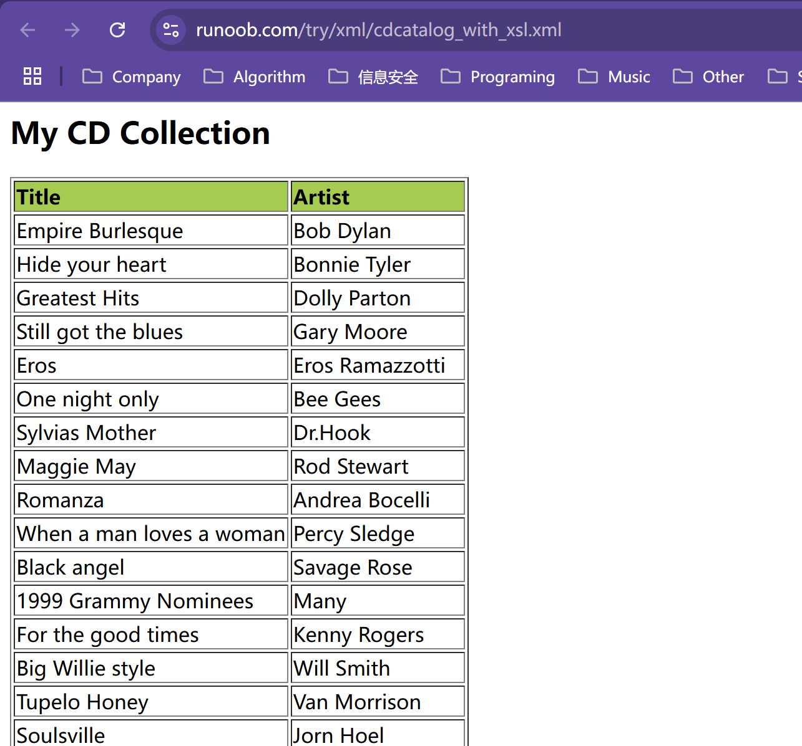

刚开始看一些师傅上来就一通分析fastJSON，给我分析的一脸懵逼，然后师傅的base64的_bytecodes也没给，只能硬着头皮硬调了，把第一个漏洞调完之后最后回头总结一下，我希望把分析过程，过程中遇到的问题都抛出来，避免后浪师傅们踩太多的坑。

学这个的时候师傅们总在自己的博客中写关于TemplatesImpl的一些base64加密过后的字节码，然后可能是师傅默认看博客的人都是会的，其实俺真的不会啊师傅~（哭

所以这里写了一个Base64解码的小工具，这样的话再看不懂师傅的Base64字符串的时候只需要把这个字符串拿到，然后把它转成.class文件，就能在IDEA中看到对应的源代码了（一般构造的类都是比较简单的，反编译出来也是很好看的），参考我写的这个博客哦：[Java类转字节码工具](https://www.cnblogs.com/erosion2020/p/18595215)

## 概述

OK，开始正式分析FastJSON的内容，一点一点分析吧，虽然之前学过CC链中已经接触到了TemplateImpl类，但是这里为了博客的内容完整性这里还是再次分析一遍吧，同时补充TemplateImpl类的不足，这里的TemplateImpl的介绍主要还是来自网上师傅们的文章。

## TemplateImpl

在TemplateImpl中包含了几个概念，我们先来看一下。

### XSLT

[XSL](https://www.runoob.com/xsl/xsl-languages.html) 指扩展样式表语言（EXtensible Stylesheet Language）, 它是一个 XML 文档的样式表语言，类似CSS与HTML的关系。

[XSLT](https://www.runoob.com/xsl/xsl-intro.html)（Extensible Stylesheet Language Transformations）是XSL转换语言，它是XSL的一部分，用于转换 XML 文档，可将一种 XML 文档转换为另外一种 XML 文档，如XHTML。

总结来说：

* **XSL** 是一个描述如何处理 XML 文档的框架，包含了 **XSLT**、**XPath** 和 **XSL-FO** 三个部分。
* **XSLT** 是 **XML** 到其他格式（如 **HTML**）的转换器，通常用于将 XML 数据根据样式表转换成需要展示的格式。

通过这个[示例](https://www.runoob.com/xsl/xsl-transformation.html)可以得知，其实就是把xml加上了样式，其实我们不用真的去本地去搞一个这样的xml、xsl，只需要了解对应的概念即可。

这是runoob给的示例：https://www.runoob.com/try/xml/cdcatalog_with_xsl.xml，这是一个xml文件，但是看起来他就像是一个html一样，还包含了对应的样式。



### Templates接口

在 XSLT 转换过程中，通常需要使用 **XSLT 样式表** 来将一个 XML 文档转换为目标格式（如 HTML、XML 或文本）。Java 提供了 `javax.xml.transform` 包来支持 XSLT 处理。`Templates` 接口是这个过程中的一个关键部分，它允许你将 XSLT 样式表编译成模板，并在后续转换中复用这些模板，而不是每次转换时都重新编译样式表。

`Templates` 接口的作用是提供对已编译 XSLT 样式表的访问，它是通过 `TransformerFactory` 创建的。具体来说，`Templates` 存储了通过解析 XSLT 样式表文件（通常是 `.xsl` 文件）所生成的 **模板信息**。

`javax.xml.transform.Templates`接口的实现类，它只定义了两个方法，官方代码如下，其中对于该类的英文注释我已转换成中文：

```java
/**
 * 实现此接口的对象是已处理的转换指令的运行时表示。
 * ---------------------------------------------------------------------------------------------
 * <p>对于给定实例，模板必须对同时运行的多个线程具有线程安全性，并且可能在给定会话中多次使用。</p>
 */
public interface Templates {
    /**
  	 * 为这个 Templates 对象创建一个新的转换上下文。
     * ---------------------------------------------------------------------------------------------
     * Returns: 返回一个 Transformer 的有效非空实例。
     * ---------------------------------------------------------------------------------------------
     * Throws: 如果无法创建 Transformer，抛出TransformerConfigurationException。
     */
    Transformer newTransformer() throws TransformerConfigurationException;

    /**
     * ---------------------------------------------------------------------------------------------
     * 获取有效 xsl:output 元素相对应的属性。
     * 返回的对象将是内部值的克隆。因此，它可以在不改变 Templates 对象的情况下进行变形
     * 然后传递给 {@link javax.xml.transform.Transformer#setOutputProperties}。
     * ---------------------------------------------------------------------------------------------
     * <p>返回的属性应包含样式表设置的属性，
     * 并且这些属性是“默认”的，由
     * <a href="http://www.w3.org/TR/xslt#output">XSL 转换 (XSLT) W3C 建议书第 16 节</a> 指定的默认属性。
     * 样式表专门设置的属性应位于基本
     * 属性列表中，而未专门设置的 XSLT 默认属性应位于“默认”属性列表中。因此，
     * getOutputProperties().getProperty(String key) 将获取样式表设置的任何
     * 属性，<em>或</em>默认
     * 属性，而
     * getOutputProperties().get(String key) 将仅检索样式表中明确设置的属性。</p>
     * ---------------------------------------------------------------------------------------------
     * <p>对于 XSLT，
     * <a href="http://www.w3.org/TR/xslt#attribute-value-templates">属性
     * 值模板</a> 属性值将以未扩展的形式返回（因为此时没有上下文）。
     * 属性值模板内的命名空间前缀将不扩展，
     * 因此它们仍然是有效的 XPath 值。</p>
     * 
     * @return 属性对象，永不为空。
     */
    Properties getOutputProperties();
}
```

总结一下：

* newTransformer()：为一个(当前)Transformer创建实例
* getOutputProperties()：获取有效 xsl:output 元素相对应的属性。

`TemplatesImpl` 在 `com.sun.org.apache.xalan.internal.xsltc` 包下，按照包名了解这好像是一个apache的一个叫做xalan的项目，实际就是这样的。xalan 是 Apache 软件基金会下的一个项目，主要用于处理 XSLT（可扩展样式表语言转换，XML 的一种样式表语言）。它(xalan)是一个 XSLT 处理器，可以将 XML 数据转换为其他格式（例如 HTML 或 XML）。

XSLTC指xslt compiler或xslt compiling，可以把XSLT文件编译成一个或者多个Java的class文件，通过这种方式可以加速xsl的转换速度。**这些class或者class的集合被称为Translet，他们被转换时自动会继承AbstractTranslet。**

### TemplatesImpl

TemplatesImpl主要是通过获取Translet的Class或字节码来创建 XSLTC 模板对象。根据上面的学习这里不难理解，XSLTC生成的Translets，需要转为模板对象，可以用TemplatesImpl定义和处理。

TemplatesImpl定义如下：

```java
public final class TemplatesImpl implements Templates, Serializable {
	......
}
```

### TransletClassLoader

在TemplatesImpl中包含一段重要代码，这也是漏洞利用的关键：

具体可以参考我以前写过的一篇博客：

```java
static final class TransletClassLoader extends ClassLoader {
        private final Map<String,Class> _loadedExternalExtensionFunctions;

         TransletClassLoader(ClassLoader parent) {
             super(parent);
            _loadedExternalExtensionFunctions = null;
        }

        TransletClassLoader(ClassLoader parent,Map<String, Class> mapEF) {
            super(parent);
            _loadedExternalExtensionFunctions = mapEF;
        }

        public Class<?> loadClass(String name) throws ClassNotFoundException {
            Class<?> ret = null;
            if (_loadedExternalExtensionFunctions != null) {
                ret = _loadedExternalExtensionFunctions.get(name);
            }
            if (ret == null) {
                ret = super.loadClass(name);
            }
            return ret;
         }
    // 读取字节数组中的值
        Class defineClass(final byte[] b) {
            return defineClass(null, b, 0, b.length);
        }
    }
```

