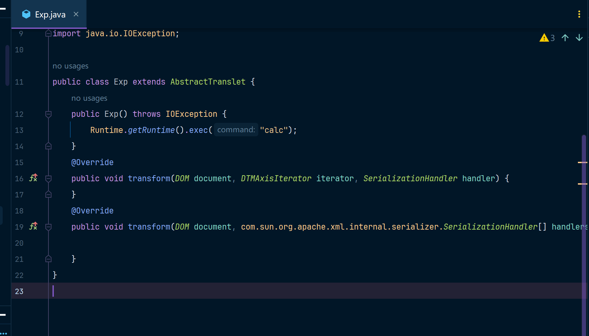
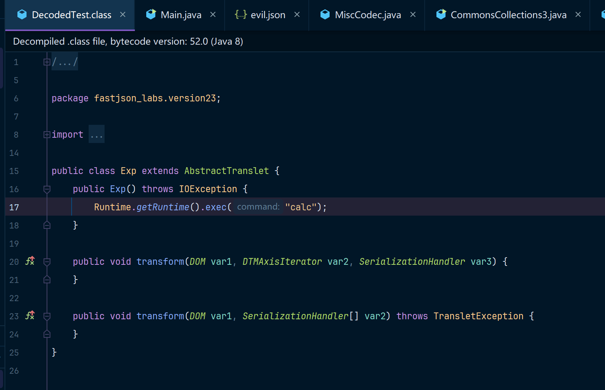
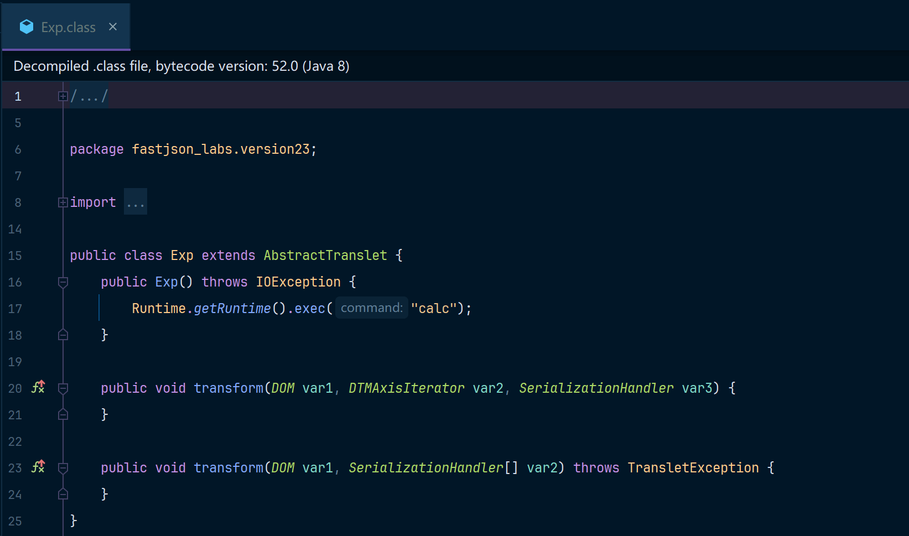

学Java安全的时候发现好多师傅分析漏洞的时候直接就给了一段Base64字节码，然后虽然一些师傅也会给出来对应的代码，但是有些小白是不知道怎么把一个java类转成Base64字节码的。

对于刚学Java安全的小白来说真的太不友好啦，也不知道这玩意儿是什么意思，所以这里写一个小工具，专门用来把Java类转成Base64字节码，以及把字节码转成.class文件，这样即便有些师傅只给了Base64我们也可以用这份代码还原一下师傅用的字节码文件。

代码中给了几个工具的示例用法。

## Java代码

可以看链接中的Java代码，点击这里[JavaClassByteUtil](./JavaClassByteUtil.java)


```java
package fastjson_labs.utils;

import javax.tools.JavaCompiler;
import javax.tools.ToolProvider;
import java.io.File;
import java.io.FileInputStream;
import java.io.FileOutputStream;
import java.io.IOException;
import java.nio.file.Path;
import java.nio.file.Paths;
import java.util.Base64;

public class JavaClassByteUtil {
    /**
     * 编译javaFile文件
     */
    public static File compile(File javaFile){
        String javaFilePath = javaFile.getPath();
        if (!javaFile.exists()) {
            throw new RuntimeException(".java 文件 Not Found：" + javaFilePath);
        }
        // 获取 Java 编译器
        JavaCompiler compiler = ToolProvider.getSystemJavaCompiler();
        if (compiler == null) {
            throw new IllegalStateException("未找到 Java 编译器，请确保使用的是 JDK 而不是 JRE。");
        }
        // 编译 Java 文件
        int result = compiler.run(null, null, null, javaFile.getPath());
        if (result != 0) {
            throw new RuntimeException("Java 文件编译失败，请检查语法错误：" + javaFile.getPath());
        }
        // 将Java文件编译之后的class文件返回
        String classFilePath = javaFile.getPath().replace(".java", ".class");
        return new File(classFilePath);
    }

    public static byte[] compile2Byte(String javaFilePath) throws Exception{
        return compile2Byte(new File(javaFilePath));
    }

    public static byte[] compile2Byte(File javaFile) throws Exception{
        File classFile = compile(javaFile);
        String classFilePath = classFile.getPath();
        if (!classFile.exists()) {
            throw new RuntimeException(".class 文件 Not Found：" + classFilePath);
        }
        return readFileToByteArray(classFile);
    }

    public static String compile2Base64Byte(String javaFilePath) throws Exception{
        return compile2Base64Byte(new File(javaFilePath));
    }

    /**
     * 将classFile转成Base64编码之后的字符串
     */
    public static String compile2Base64Byte(File javaFile) throws Exception{
        byte[] classBytes = compile2Byte(javaFile);
        // 转换为 Base64 字符串
        return Base64.getEncoder().encodeToString(classBytes);
    }

    private static byte[] readFileToByteArray(File file) throws IOException {
        try (FileInputStream fis = new FileInputStream(file)) {
            byte[] buffer = new byte[(int) file.length()];
            int ignore = fis.read(buffer);
            return buffer;
        }
    }

    public static void byte2JavaClassFile(byte[] data, String targetDirPath) {
        Path path = Paths.get(targetDirPath, "DecodedTest.class");
        byte2JavaClassFile(data, path.toFile());
    }

    public static void byte2JavaClassFile(byte[] data, File target){
        boolean classFile = target.getPath().endsWith(".class");
        if(!classFile){
            throw new RuntimeException("错误的 .class文件路径" + target.getPath());
        }
        // 写入Class文件
        try (FileOutputStream fos = new FileOutputStream(target)) {
            fos.write(data);
        } catch (IOException e) {
            e.printStackTrace();
        }
    }

    /**
     * 将base64编码过后的Byte数组写入到目标路径中,文件名为默认的DecodedTest.class
     */
    public static void base64Byte2JavaClassFile(String base64Data, String targetDirPath) {
        Path path = Paths.get(targetDirPath, "DecodedTest.class");
        base64Byte2JavaClassFile(base64Data, path.toFile());
    }

    public static void base64Byte2JavaClassFile(String base64Data, File target){
        boolean classFile = target.getPath().endsWith(".class");
        if(!classFile){
            throw new RuntimeException("错误的 .class文件路径" + target.getPath());
        }
        // 解码 Base64 数据
        byte[] classData = Base64.getDecoder().decode(base64Data);
        // 写入Class文件
        try (FileOutputStream fos = new FileOutputStream(target)) {
            fos.write(classData);
            System.out.println("Class file decoded successfully!");
        } catch (IOException e) {
            e.printStackTrace();
        }
    }

    public static void main(String[] args) throws Exception {
        // 示例1: 将Exp.java编译后再转换成base64
        String base64Byte = JavaClassByteUtil.compile2Base64Byte("C:\\Users\\15137\\Desktop\\Workspace\\vuln-learn\\src\\test\\java\\fastjson_labs\\version23\\Exp.java");
        System.out.println(base64Byte);
        
        // 示例2: 将base64编码的字符串转换成.classFile,也就是C:\Users\15137\Desktop\DecodedTest.class
        JavaClassByteUtil.base64Byte2JavaClassFile(base64Byte, "C:\\Users\\15137\\Desktop");

        // 示例3: 将Exp.java编译成byte[]
        byte[] expByte = JavaClassByteUtil.compile2Byte("C:\\Users\\15137\\Desktop\\Workspace\\vuln-learn\\src\\test\\java\\fastjson_labs\\version23\\Exp.java");

        // 示例4: 将byte[] 转换成.classFile,指定还原到文件 C:\Users\15137\Desktop\Exp.class
        JavaClassByteUtil.byte2JavaClassFile(expByte, new File("C:\\Users\\15137\\Desktop\\Exp.class"));
    }
}
```

我要转换的Java代码如下：



然后执行脚本会有一些输出：

```bash
# 一些警告......
yv66vgAAADQAIQoABgATCgAUABUIABYKABQAFwcAGAcAGQEABjxpbml0PgEAAygpVgEABENvZGUBAA9MaW5lTnVtYmVyVGFibGUBAApFeGNlcHRpb25zBwAaAQAJdHJhbnNmb3JtAQCmKExjb20vc3VuL29yZy9hcGFjaGUveGFsYW4vaW50ZXJuYWwveHNsdGMvRE9NO0xjb20vc3VuL29yZy9hcGFjaGUveG1sL2ludGVybmFsL2R0bS9EVE1BeGlzSXRlcmF0b3I7TGNvbS9zdW4vb3JnL2FwYWNoZS94bWwvaW50ZXJuYWwvc2VyaWFsaXplci9TZXJpYWxpemF0aW9uSGFuZGxlcjspVgEAcihMY29tL3N1bi9vcmcvYXBhY2hlL3hhbGFuL2ludGVybmFsL3hzbHRjL0RPTTtbTGNvbS9zdW4vb3JnL2FwYWNoZS94bWwvaW50ZXJuYWwvc2VyaWFsaXplci9TZXJpYWxpemF0aW9uSGFuZGxlcjspVgcAGwEAClNvdXJjZUZpbGUBAAhFeHAuamF2YQwABwAIBwAcDAAdAB4BAARjYWxjDAAfACABABtmYXN0anNvbl9sYWJzL3ZlcnNpb24yMy9FeHABAEBjb20vc3VuL29yZy9hcGFjaGUveGFsYW4vaW50ZXJuYWwveHNsdGMvcnVudGltZS9BYnN0cmFjdFRyYW5zbGV0AQATamF2YS9pby9JT0V4Y2VwdGlvbgEAOWNvbS9zdW4vb3JnL2FwYWNoZS94YWxhbi9pbnRlcm5hbC94c2x0Yy9UcmFuc2xldEV4Y2VwdGlvbgEAEWphdmEvbGFuZy9SdW50aW1lAQAKZ2V0UnVudGltZQEAFSgpTGphdmEvbGFuZy9SdW50aW1lOwEABGV4ZWMBACcoTGphdmEvbGFuZy9TdHJpbmc7KUxqYXZhL2xhbmcvUHJvY2VzczsAIQAFAAYAAAAAAAMAAQAHAAgAAgAJAAAALgACAAEAAAAOKrcAAbgAAhIDtgAEV7EAAAABAAoAAAAOAAMAAAAMAAQADQANAA4ACwAAAAQAAQAMAAEADQAOAAEACQAAABkAAAAEAAAAAbEAAAABAAoAAAAGAAEAAAARAAEADQAPAAIACQAAABkAAAADAAAAAbEAAAABAAoAAAAGAAEAAAAVAAsAAAAEAAEAEAABABEAAAACABI=
Class file decoded successfully!

```

最终在你给出的路径下回输出一个



同时也会输出一个Exp.class，当然这和DecodedTest.class区别只是一个是纯byte[]，另一个是byte[] 被base64编码之后的字符串而已

