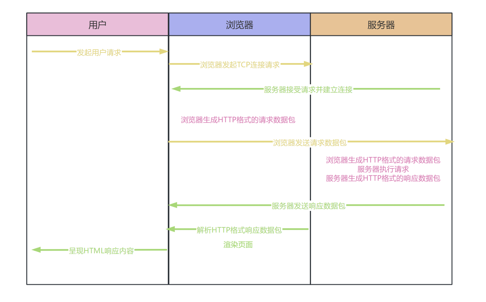
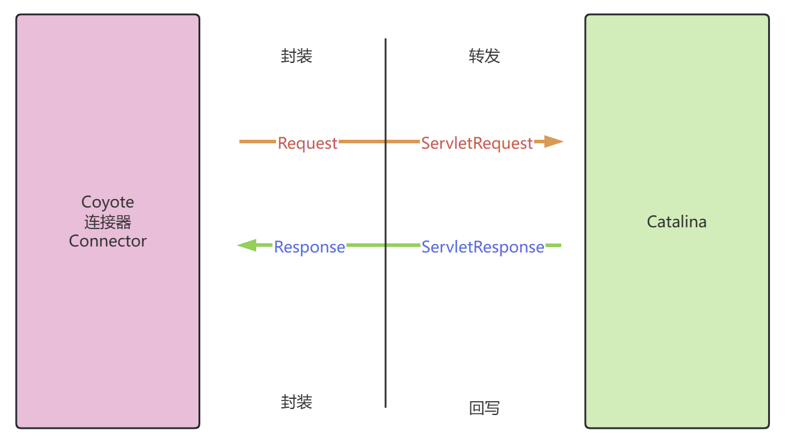
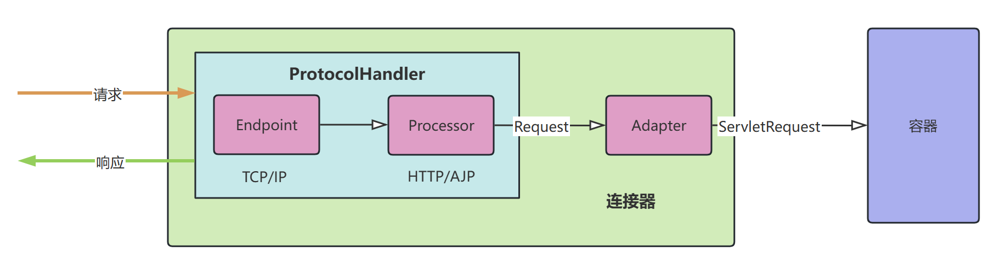
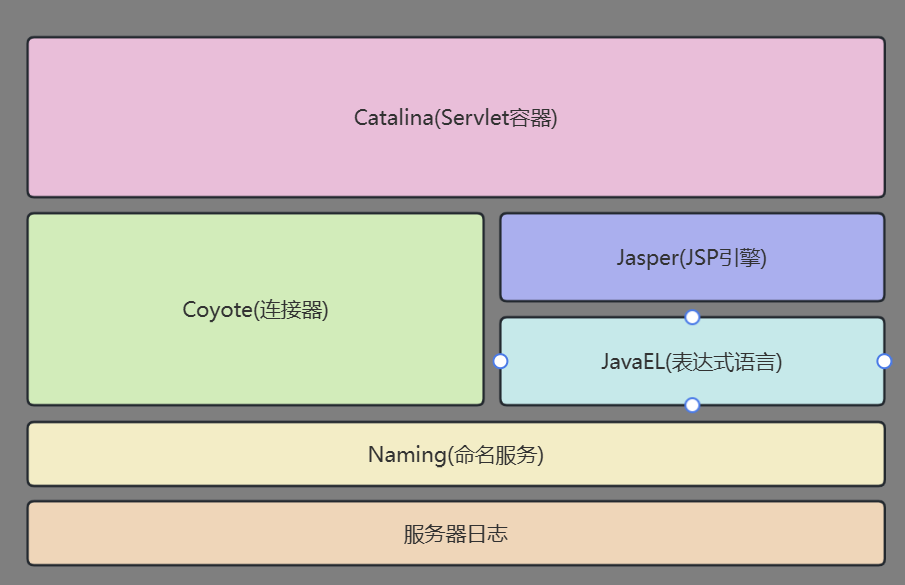
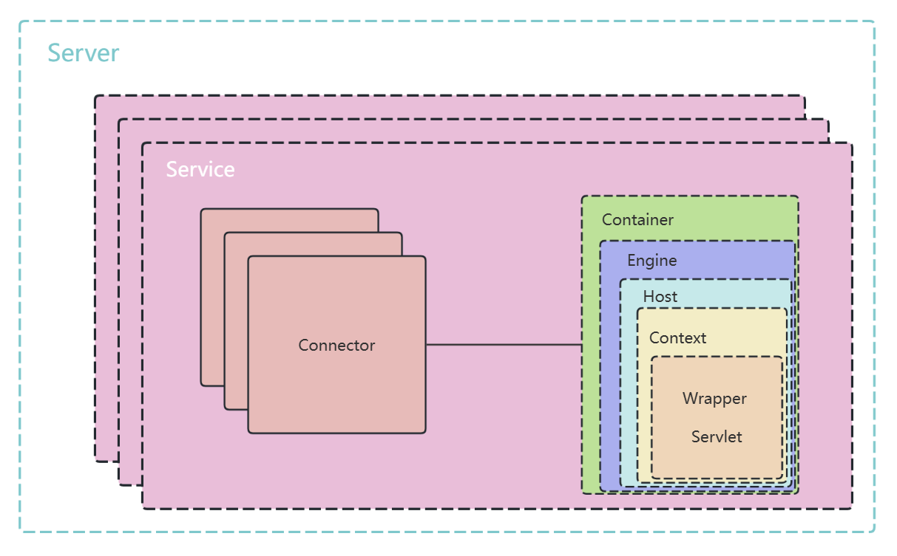
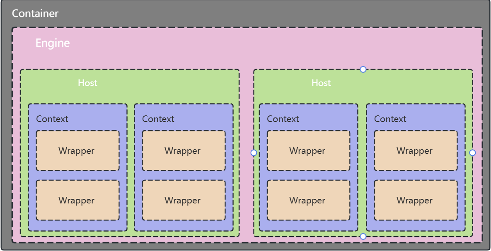
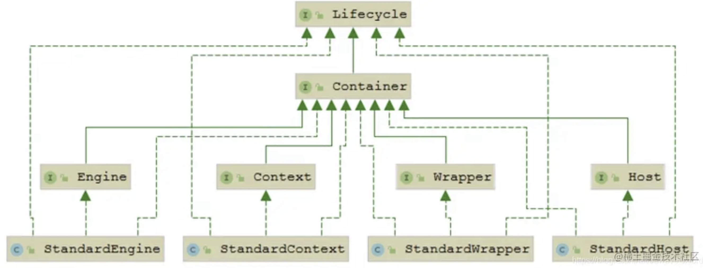

## 概述

本篇文章是https://juejin.cn/post/7055306172265414663，这篇文章的再总结，剔除了与Java安全研究没太大关系的内容，对JAVAWEB中的Servlet、Filter、Listener以及Connector、Container则加重了篇幅。

## Servlet

Servlet 是运行在 Web 服务器或应用服务器上的程序，它充当了客户端 HTTP 请求和服务器端应用程序之间的中间层。Servlet 负责处理用户请求，执行相应的业务逻辑，并返回响应结果。

这里的业务逻辑指的是，比如你使用HTTP应用处理(`新建/修改/删除/查询`)一条数据，则HTTP的客户端(一般指浏览器)一定会把这条数据封装成HTTP协议的报文，然后客户端将其发送给对应的HTTP服务端，HTTP服务器收到后会先把报文拆出来，然后根据请求的内容将其分发给对应的HTTP服务端处理逻辑代码，比如新增时给数据加上额外的相关信息，然后放入数据库中，这个动作就是业务逻辑，而这个动作就是由Servlet来执行的。

### Servlet 请求处理过程

* 客户端请求：客户端（如浏览器）发起 HTTP 请求。

* Servlet 容器接收请求：Servlet 容器（如 Tomcat）接收到请求，并将请求封装为 `HttpServletRequest` 和响应对象 `HttpServletResponse`。

* 初始化 Servlet：如果是第一次请求某个 Servlet，容器会调用 `init()` 方法初始化该 Servlet（仅在第一次请求时执行）。
* 调用 service 方法：容器调用 Servlet 的 `service()` 方法，根据请求类型（如 `GET` 或 `POST`）分发到对应的处理方法：`doGet()` 或 `doPost()`。**

* 处理业务逻辑：开发者在 `doXXX()` 方法中编写具体的业务逻辑。
* 返回响应：处理完毕后，返回响应信息到容器，容器再将结果发送给客户端。
* 销毁 Servlet：服务器关闭或容器卸载 Servlet 时，调用 `destroy()` 方法，进行资源清理。

### Servlet 生命周期

* 初始化：在服务器启动时或第一次请求时，容器创建并初始化 Servlet。
* 处理请求：Servlet 在生命周期内会不断处理来自客户端的请求。
* 销毁：在服务器关闭时，Servlet 被销毁，释放相关资源。

## Filter

Filter（过滤器）是 Servlet 的补充，主要功能是对请求和响应进行预处理。Filter 位于客户端和 Servlet 之间，拦截请求并根据需要修改请求或响应数据。

比如过滤器最常见的场景就在于限制客户请求的速率、限制未登录用户的访问等。

### Filter 的基本工作原理

* Filter 注册：Filter 类实现了 `javax.servlet.Filter` 接口，通过 `web.xml` 配置进行注册，指定哪些请求需要经过 Filter。
* doFilter 方法：当请求到达 Servlet 容器时，Filter 的 `doFilter()` 方法被调用。在该方法中，Filter 可以修改请求或响应数据，或决定是否将请求传递给后续的 Filter 或目标 Servlet。
* 调用 FilterChain：通过调用 `FilterChain.doFilter()`，Filter 将请求传递到下一个 Filter 或目标 Servlet。如果不调用该方法，Servlet 的 `service()` 方法不会被执行。

### Filter 生命周期

* 初始化：Filter 对象在应用启动时创建，并通过 `init()` 方法完成初始化。
* 处理请求：Filter 会在每次请求到达 Servlet 前调用 `doFilter()` 方法。
* 销毁：在 Web 应用关闭时，Filter 对象被销毁，执行 `destroy()` 方法，释放相关资源。

### Filter 链(FilterChain)

当多个 Filter 依次注册时，它们构成了一个 **Filter 链**。Filter 链按照配置的顺序依次执行，直到请求被传递到目标 Servlet 或响应被发送回客户端。

## Listener

### 什么是 Listener？

Listener（监听器）用于监听特定事件的发生并在事件触发时自动执行代码。在 Java Web 中，监听器常用于监控请求、会话、应用程序的生命周期事件。Listener 不直接处理业务逻辑，而是用于执行系统级的操作，例如日志记录、性能监控等。

### Listener 的种类与用途

* ServletContextListener：监听 ServletContext（Web 应用上下文）的创建和销毁。可以用于初始化应用级资源或在应用关闭时清理资源。
* HttpSessionListener：监听 HttpSession 的创建和销毁。当用户会话开始时，触发 `sessionCreated()`，当会话结束时，触发 `sessionDestroyed()`。
* ServletRequestListener：监听 ServletRequest 对象的创建和销毁，适用于监控请求的生命周期。
* ServletContextAttributeListener：监听 ServletContext 属性的添加、删除和修改。
* HttpSessionAttributeListener：监听 Session 中属性的变化。

###  Listener 生命周期

- 初始化：监听器对象在 Web 应用启动时被创建，并通过 `init()` 方法初始化。
- 处理事件：监听器通过相应的事件方法处理监听的事件，如 `contextInitialized()` 或 `sessionCreated()`。
- 销毁：在 Web 应用关闭时，监听器被销毁，执行 `destroy()` 方法，清理资源。

## Tomcat

为了弄明白Tomcat在整个HTTP流程中的作用，我们来看一下HTTP是怎么工作的

### HTTP请求流程图

1. 用户通过浏览器进行操,比如输入网站并回车或者点击链接,浏览器获取到这个事件
2. 浏览器向服务端发出**TCP**连接请求
3. 服务器接受浏览器的连接请求,并经过**TCP**三次握手建立连接
4. 浏览器将请求数据打包成一个**HTTP**格式的数据包
5. 浏览器将请求数据包推入网络,数据包经过网络传输,最终到达服务器
6. 服务器获取到请求数据包后,以**HTTP**格式解析请求数据包,获取到浏览器的请求
7. 服务器执行浏览器的请求处理,比如提供静态文件或者调用服务器相关程序获取动态结果
8. 服务器将响应的结果,包括**HTML**和图片,按照**HTTP**格式进行打包
9. 服务器将响应数据包推入网络,数据包经过网络传输,最终到达浏览器
10. 浏览器获取到响应数据包后,以**HTTP**格式解析响应数据包,获取响应到的数据
11. 浏览器解析数据，渲染页面
12. 浏览器将渲染好的页面呈现给用户

**可以看到HTTP服务器也就是Tomcat的主要作用，主要包括：**

* 接受连接
* 解析请求数据
* 处理请求
* 发送响应】

**OK，让我们把具体的流程串起来。**

### HTTP服务器请求处理

1. HTTP服务器：接收到客户端的请求后，不能直接调用业务类。相反，它会将请求交给`Servlet容器`，由容器通过实现的 `Servlet接口` 来调用具体的业务类。
2. `Servlet接口`与容器：`Servlet接口`和`Servlet容器`的结合，使得 Tomcat 实现了 HTTP 服务器与业务类之间的解耦。Tomcat 遵循了 Servlet 规范，该规范规定了容器如何加载、管理和调用 Servlet。
3. 业务扩展：如果需要添加新的业务功能，只需要实现一个 `Servlet 接口`，并将其注册到 Tomcat 服务器（即 Servlet 容器）中，Tomcat 会自动处理其余的服务器操作（如请求处理、响应管理等）。

### Servlet容器工作流程

1. 请求封装：当用户发送请求时，Tomcat 的 HTTP 服务器会使用一个 `ServletRequest` 对象将请求数据封装起来。
2. 请求调度：Servlet 容器根据 URL 和 Servlet 映射关系找到对应的 Servlet。如果该 Servlet 尚未被加载，容器会使用反射机制创建 Servlet 实例，并调用其 `init()` 方法进行初始化。
3. 请求处理：容器调用 `service()` 方法来处理请求，`service()` 方法会根据请求类型（如 GET 或 POST）分别调用 `doGet()` 或 `doPost()`。
4. 响应封装：业务逻辑执行完毕后，Servlet 使用 `ServletResponse` 对象封装响应数据，HTTP 服务器将其发送回客户端（如浏览器）。
5. 资源回收：在容器关闭或卸载 Servlet 时，会调用 `destroy()` 方法，进行资源的释放与清理。

所以，Tomcat是实现了两个核心功能

* 处理`Socket`连接,负责网络字节流与`Request`和`Response`对象的转化
* 加载和管理servlet,以及处理`Request`请求

Tomcat设计了两个核心组件来完成这两个核心功能，分别是`Connector`和`Container`

- Connector: 提供Http 服务器功能，进行 Socket 通信(基于 TCP/IP)，解析 HTTP 报文
- Container: Servlet 容器功能，加载和管理 Servlet，由 Servlet 具体负责处理 Request 请求

## 连接器Connector(Coyote)

`Coyote`是Tomcat的连接器框架，是Tomcat提供的供客户端访问的外部接口。客户端通过`Coyote`与服务器建立连接，发送请求并接受响应。`Coyote`封装了网络底层通信，包括`Socket`请求和响应处理，为`Catalina`容器提供了统一的接口，使`Catalina容器与具体的请求协议以及`IO`操作方式完全解耦。

`Coyote`将`Socket`输入转换封装为`Request`对象,交由`Catalina`容器进行处理，处理完成后Catalina通过Coyote提供的`Response`对象将结果写入输出流。

`Coyote`作为独立的模块,只负责具体协议和`IO`相关操作,与`Servlet`的规范实现没有直接关系。

`Request`对象和`Response`对象并没有实现`Servlet`规范对应的接口，而是在`Catalina`中将`Request`和`Response`对象进一步封装为`ServletRequest`和`ServletResponse`。

用一张图来分析一下连接器中干的事儿

### Endpoint

在 Tomcat 中，`Endpoint` 组件是 Coyote 模块的核心组成部分，它充当了通信监听接口，负责处理与客户端的底层通信。Endpoint 实际上是对传输层的抽象，专门用来处理 TCP/IP 协议的通信。在 Tomcat 的架构中，并没有定义一个独立的 `Endpoint 接口`，而是提供了一个抽象类 `AbstractEndpoint`，这个类负责定义具体的实现。`AbstractEndpoint` 包含了两个关键的内部类：`Acceptor` 和 `SocketProcessor`。

- `Acceptor` 负责监听客户端的 Socket 连接请求。当客户端发起连接时，Acceptor 会接收这些请求并将其交给处理器进行进一步处理。
- `SocketProcessor` 则负责处理接收到的 Socket 请求。它实现了 `Runnable` 接口，通过在 `run()` 方法中调用协议处理组件 `Processor` 来解析并处理请求。为了提升处理能力，SocketProcessor 通常会被提交到一个线程池中执行，这个线程池是 Tomcat 扩展的 Java 原生线程池，称为 **Executor**。

### Processor

`Processor` 的主要职责是处理应用层协议（例如 HTTP 协议）。当 **Endpoint** 通过 `SocketProcessor` 从网络中接收到请求数据后，数据被封装为特定协议的请求对象（如 `HttpRequest`）。这些协议对象并不是标准的 `ServletRequest`，而是 Tomcat 自定义的请求对象。因此，`Processor` 需要进一步处理这些对象，解析协议并将其转换成协议对应的 `Request` 对象，然后交由后续的`Adapter`处理。

* **接收协议特定的请求对象**：`SocketProcessor` 接收原始的 Socket 数据，并将其转换为协议特定的请求对象。例如，在 HTTP 协议中，`Processor` 将从网络连接中接收到的字节流转换为 `HttpRequest` 对象。
* **协议解析与处理**：`Processor` 负责解析协议特定的请求对象（如 `HttpRequest`），提取出请求的各种信息，如 HTTP 请求头、参数、方法等。此时，`Processor` 还没有将请求转换为标准的 `ServletRequest`，它仅仅是解析了请求的内容，并将这些内容封装在协议特定的请求对象（如 `HttpRequest`）中。
* **将请求交给适配器转换**：协议特定的请求对象（如 `HttpRequest`）随后被交给 `CoyoteAdapter`，后者会将其转换为符合 Servlet 规范的 `ServletRequest` 对象。`CoyoteAdapter` 通过适配器模式，将 `HttpRequest` 对象转化为标准的 `ServletRequest`，以便容器能够处理。

Tomcat 提供了不同的 `Processor` 实现，以支持多种协议的处理。对于 HTTP 协议，Tomcat 提供了多个协议处理器，比如：

- `Http11Processor`：用于处理 HTTP/1.1 协议的请求。
- `AjpProcessor`：用于处理 AJP 协议的请求。

这些 `Processor` 实现类都遵循了 `ProtocolHandler` 接口，负责协议解析和 `ServletRequest` 的转换。

### ProtocolHandler

**ProtocolHandler** 是 Coyote 协议接口的核心，通过`Endpoint`和`Processor`实现针对具体协议的处理能力。

常见的 `ProtocolHandler` 实现包括：

- `AjpAprProtocol`
- `AjpNioProtocol`
- `AjpNio2Protocol`
- `Http11AprProtocol`
- `Http11NioProtocol`
- `Http11Nio2Protocol`

在 Tomcat 的 `server.xml` 配置文件中，开发者可以选择并配置适合的协议处理器（例如 `Http11`），并指定使用的协议类型。如果 Tomcat 安装了 Apache Portable Runtime (APR)，则会使用 `Http11AprProtocol`，否则会回退到 `Http11NioProtocol`。

### Adapter

客户端的请求信息通常由不同的协议处理器（`Processor`）进行解析。由于 HTTP 协议和其他协议（如 AJP 协议）在传输请求信息的格式上有所不同，Tomcat 必须处理这些不同协议的数据。为了适应这些差异，Tomcat 为每种协议提供了不同的协议处理器（例如 `Http11Processor` 用于 HTTP 协议，`AjpProcessor` 用于 AJP 协议等）。这些协议处理器负责将客户端请求信息解析并生成相应的请求对象，如 `HttpRequest`。

然而，`HttpRequest` 和其他协议的请求对象并不符合 Servlet 规范。Servlet 容器只能处理实现了 `ServletRequest` 接口的对象，而 `HttpRequest` 等自定义的请求对象并不实现该接口。因此，Tomcat 面临一个问题：如何将协议特定的请求对象转换为标准的 `ServletRequest` 对象，以便 Servlet 容器可以正确处理请求。

**`Adapter` 的作用：解决协议特定请求对象与标准 `ServletRequest` 之间的转换**

为了实现协议解耦，并将协议特定的请求对象转换为标准的 `ServletRequest` 对象，Tomcat 引入了 `CoyoteAdapter`。`CoyoteAdapter` 通过适配器模式，解决了协议不同导致的请求对象格式不一致的问题。

具体来说，`CoyoteAdapter` 充当了一个适配器，负责将由 `ProtocolHandler` 生成的协议特定的 `Request` 对象（如 `HttpRequest`）转换为标准的 `ServletRequest` 对象。`ServletRequest` 是 Servlet 容器能够理解和处理的标准接口，因此，`CoyoteAdapter` 使得 Servlet 容器能够无缝地处理来自不同协议的请求。

当 Tomcat 的 `Connector` 收到客户端的请求时，首先会通过对应的 `ProtocolHandler`（如 `Http11Protocol`）将请求数据解析为协议特定的 `Request` 对象。例如，HTTP 请求会被解析为 `HttpRequest`。这些请求对象虽然包含了请求的详细信息（如请求路径、参数、头部等），但是它们并不符合 Servlet 规范，因此不能直接传递给 Servlet 容器进行处理。

此时，`CoyoteAdapter` 就起到了关键作用：

- `CoyoteAdapter` 的 `service()` 方法接收从协议处理器（如 `Http11Processor`）传递过来的 `Request` 对象（如 `HttpRequest`）。
- `CoyoteAdapter` 负责将这个协议特定的 `Request` 对象转换为标准的 `ServletRequest` 对象。
- 转换后的 `ServletRequest` 对象会被传递给 Servlet 容器的 `Service` 方法，最终由 Servlet 容器根据映射关系找到对应的 Servlet，执行业务逻辑。

## 容器Container(Catalina)

Catalina 通过与 Coyote 模块的松耦合集成，实现了根据不同的请求协议进行数据读取和处理。**Tomcat 本质上是一个 `Servlet` 容器**，而 Catalina 作为核心模块，负责处理 Web 请求和管理 `Servlet` 的生命周期，其它模块则提供了对 Catalina 的支持服务。

在 Tomcat 中，组件按照不同的功能分层组织，每个模块的作用是支持或增强 Catalina 的工作，形成一个协同工作的架构：

* **Catalina**：作为核心模块，Catalina 是 Tomcat 的 `Servlet` 容器实现。它负责解析 HTTP 请求、管理 `Servlet` 的生命周期、执行请求的调度等核心任务。
* **Coyote**：是 Tomcat 的连接器模块，主要负责处理客户端和服务器之间的网络通信。Coyote 提供了协议处理能力，将底层的网络连接请求转换成 `Servlet` 容器可以理解的 `Request` 和 `Response` 对象。它实现了不同的协议解析（如 HTTP、AJP 等）并通过 `Processor` 组件处理协议特定的数据。
* **Jasper**：是 Tomcat 提供的 JSP 引擎模块，负责将 JSP 页面转换为 `Servlet`。Jasper 可以解析 JSP 文件并生成相应的 Java `Servlet` 类，之后由 Catalina 负责处理这些 `Servlet`。
* **Java EL**：`Java EL`（Expression Language）模块用于为 JSP 页面提供表达式语言支持。它使得 JSP 中的表达式更加简洁和易于使用，通过访问 JavaBeans 属性、集合对象等，简化了 JSP 页面的开发。
* **Naming**：该模块提供 JNDI（Java Naming and Directory Interface）服务。`Naming` 模块支持应用程序对数据库连接池、JMS、EJB 等资源的访问。它提供了对外部资源的管理和查找功能。
* **Juli**：Juli 是 Tomcat 的日志模块，它负责管理 Tomcat 的日志系统，支持日志记录、日志级别配置等功能。通过 Juli，Tomcat 可以进行各种信息的记录和监控，帮助开发者调试和维护应用。

### Catalina结构

Catalina 本质上是 Tomcat 的 `Servlet` 容器实现，负责处理服务器的启动、关闭以及请求的分发。它将 Tomcat 的配置和管理功能进行有效的组织和抽象。

Catalina 负责管理 `Server`，其中 `Server` 表示整个服务器，包含多个 `Service`。每个 `Service` 包含多个由 Coyote 实现的连接器组件 `Connector` 和一个容器组件 `Container`。在 Tomcat 启动时，Catalina 会初始化一个实例来管理和协调这些组件的工作。

### Server（服务器）

`Server` 表示整个 Tomcat 服务器，作为 Catalina 的顶级组件，它负责管理整个服务器的生命周期。在 Tomcat 启动时，Catalina 会解析配置文件并根据其中的设定创建一个 `Server` 实例。每个 `Server` 实例都可以包含多个 `Service`。它负责协调和启动 Tomcat 的核心服务，包括 `Servlet` 引擎、`Coyote` 连接器等。

`Server` 负责协调多个服务、启动和关闭整个系统，确保服务器的正确运行。

### Service（服务）

`Service` 是 `Server` 的内部组件，它将多个连接器（`Connector`）和容器（`Container`）绑定在一起。一个 `Server` 实例可以包含多个 `Service`，每个 `Service` 都会提供一个独立的服务环境。

`Service` 将多个 `Connector` 和一个 `Container` 绑定到一起，负责协调请求的接收和处理。它提供了多种连接方式和处理策略，使得 Tomcat 能够灵活地支持不同的协议和网络通讯方式。

### Connector（连接器）

`Connector` 是 Tomcat 中处理与客户端之间通信的组件，负责接收客户端的请求并将请求交给容器进行处理。`Connector` 会将客户端的请求封装成 `Request` 对象，并根据协议将请求转发给相应的 `Container` 进行进一步处理。处理完毕后，`Connector` 会将响应返回给客户端。

`Connector` 的主要任务是处理与客户端之间的网络连接。它封装网络请求并将其转发给 `Container`，同时将处理结果返回给客户端。

### Container（容器）

`Container` 是处理用户请求的核心组件。它负责管理 `Servlet` 的生命周期、请求的调度和执行。`Container` 通过 `Servlet` 容器实现了请求的处理和响应的生成。请求由 `Connector` 转发到相应的 `Container`，然后由 `Container` 查找并调用合适的 `Servlet` 来处理具体的业务逻辑。

`Container` 负责处理和管理 `Servlet` 请求的执行。它将客户端请求转发给相应的 `Servlet`，并返回处理结果。

## Container结构

Tomcat 中的容器 `Container` 由四个层次化的组件组成：`Engine`、`Host`、`Context` 和 `Wrapper`。这些组件具有父子层级关系，并采用组合模式进行管理，使得容器具有灵活的结构。`Engine` 作为整个 Catalina Servlet 引擎，用于管理多个虚拟主机，每个 `Service` 最多只有一个 `Engine`，但一个 `Engine` 可以包含多个 `Host`。`Host` 代表一个虚拟主机，可以配置多个虚拟主机地址，每个虚拟主机下可以有多个 `Context`，即 Web 应用程序。每个 `Context` 可以包含多个 `Wrapper`，后者是容器中最底层的组件，不可再包含子容器。

### 容器组件层次：

- `Engine`：管理整个 Servlet 引擎，负责多个虚拟站点。
- `Host`：代表虚拟主机，一个 `Engine` 可包含多个 `Host`。
- `Context`：表示 Web 应用程序，一个 `Host` 可包含多个 `Context`。
- `Wrapper`：最底层的容器，负责封装 Servlet，不能包含子容器。

Tomcat 的容器设计采用组件化结构，所有容器组件都实现了 `Container` 接口，并通过继承 `LifeCycle` 接口来管理其生命周期。容器之间通过组合模式形成树状结构，父容器与子容器的关系提供了良好的灵活性和扩展性，且容器的配置统一通过 `server.xml` 文件进行管理。

