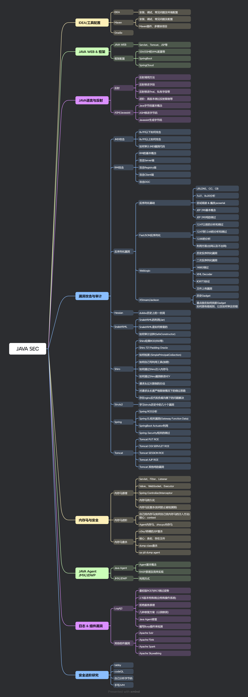

# JavaSec
师傅~，您看我24年底才开始学Java安全，俺还有机会吗？｡ﾟ(ﾟ´ω`ﾟ)ﾟ｡

Java安全学习笔记，记录一下自己从0开始学习Java安全的过程。网上有不少师傅的漏洞分析其实并不是非常友好，可能师傅们默认这个知识点俺已经会啦，其实俺一点都不会（哭~，5555555555。

所以本仓库的目的是希望真的能分享一些更加零基础的Java安全学习过程，同时会去调试一些师傅们的代码，比如在FastJson的TemplatesImpl漏洞利用代码中，网上很多师傅就直接给了一个base64的_bytecodes的代码的脚本图片，啊，这，师傅，我没法调试啊~，5555555。

所以你懂的，本仓库希望给的脚本或者是其他内容更加全面一些，也会加一些如IDEA怎么调试Tomcat这种类似的分享。

该github仓库最终会和我的博客中的内容对应起来：[博客园- Java安全学习指南](https://www.cnblogs.com/erosion2020/p/18558523)
nb
## 环境准备

在调试代码的过程中，因为漏洞触发的版本可能均不相同，所以可能会用到不同版本的JDK，我记录一下我调试过程中所有的JDK，同时这里记录一下不同版本JDK的下载地址

- JDK7u80
- JDK8u66、8u71、8u73、8u121、8u231、8u431

- [Oracle官方JDK8下载](https://www.oracle.com/cn/java/technologies/javase/javase8-archive-downloads.html)
- [华为JDK镜像站](https://repo.huaweicloud.com/java/jdk/)
- [编程宝库JDK下载地址](http://www.codebaoku.com/jdk/jdk-oracle-jdk1-8.html)
- [InJDK下载地址/镜像源导航](https://injdk.cn/)

## Java基础 & 反射

Java 的 ASM、Javassist 和反射是安全研究的重要方向之一，主要集中在字节码操作和运行时行为分析上。ASM 和 Javassist 允许研究者直接操作字节码，进行漏洞利用链（Gadget Chain）的生成、恶意代码注入，以及对反序列化、动态代理等机制的深入分析；反射则是许多漏洞的核心，例如通过访问控制绕过、内存马注入或动态方法调用实现攻击。它们共同为研究 Java 平台的动态特性和潜在安全风险提供了技术支撑，是理解漏洞机制、开发利用工具和分析攻击链的基础。

- 反射机制: [JAVA反射基础知识 + 修改被private final修饰的字段](./A%20-%20JAVA基础/Java反射/main.md)
- ClassLoader: [BootstrapClassLoader + ExtClassLoader + AppClassLoader + 双亲委派](./A%20-%20JAVA基础/详解%20JAVAClassLoader/main.md)
- 静态代理&动态代理: [静态代理 + Proxy动态代理](./A%20-%20JAVA基础/JAVA动态代理&静态代理/main.md)
- ASM: [访问者模式 + 动态操作(访问/修改)class字节码](./A%20-%20JAVA基础/JAVA%20ASM/main.md)
- RMI(远程方法调用): [RMI基本原理 + 客户端/服务端/注册中心 攻击手法 + Bypass JEP290](./A%20-%20JAVA基础/RMI远程方法调用/main.md)
- JNDI(命名空间及目录服务): [JNDI基本概念 + JNDI/RMI攻击手法 + JNDI/LDAP攻击手法](./A%20-%20JAVA基础/JNDI注入/main.md)
- SPI机制: [SPI基本概念 + SPI攻击](./A%20-%20JAVA基础/SPI/main.md)
- Debug Tomcat源码: [Tomcat安装 + IDEA创建JAVA WEB项目 + IDEA开启调试Tomcat](./C%20-%20内存马/B%20-%20JAVA%20WEB调试环境搭建/main.md)
- 为什么Java的反弹Shell这么奇怪: [Runtime的解析规则 + Base64编码 + 反弹shell示例](./A%20-%20JAVA基础/Runtime反弹shell/main.md)
- 从一个Demo示例学习序列化协议: [反序列化工具介绍 + 反序列化Demo调试 + 010Editor修改字节码](./A%20-%20JAVA基础/反序列化协议分析/main.md)
- 序列化协议-官方文档(翻译 + 补充): [官方文档翻译 + 内容补充](./A%20-%20JAVA基础/反序列化协议.官方文档(翻译%20+%20补充)/main.md)

## 反序列化

JAVA反序列化安全学习笔记，下边的调试代码都是基于ysoserial中的代码来记录的。嗯~网上有很多魔改代码，但是如果想要标准系统化的学习的话还是要基于ysoserial这个反序列化漏洞的起源项目来学习。

- Java类转字节码工具: [Java类转Base64编码字符串 + Base64编码字符串转.class文件](./B%20-%20反序列化/Java类转字节码工具/main.md)
- 基础知识：[反序列化漏洞的起源 + JAVA反序列化 + URLDNS](./B%20-%20反序列化/JAVA反序列化学习-前置知识（基于ysoserial）/反序列化与反射介绍.md)
- 详解TemplatesImpl反序列化: [XSLT + Templates + TransletClassLoader](./B%20-%20反序列化/详解TemplatesImpl/main.md)

### CC链

  `CommonsCollections(CC)`反序列化攻击链

  - CC1攻击链：[AnnotationInvocationHandler + Proxy + LazyMap + Transformer](./B%20-%20反序列化/CommonsCollections1（基于ysoserial）/main.md)
  - CC2攻击链：[PriorityQueue + TransformingComparator + Transformer + TemplatesImpl](./B%20-%20反序列化/CommonsCollections2（基于ysoserial）/main.md)
  - CC3攻击链：[AnnotationInvocationHandler + Proxy + LazyMap + Transformer + TrAXFilter + TemplatesImpl](./B%20-%20反序列化/CommonsCollections3（基于ysoserial）/main.md)
  - CC4攻击链：[PriorityQueue + TransformingComparator + TrAXFilter + TemplatesImpl](./B%20-%20反序列化/CommonsCollections4（基于ysoserial）/main.md)
  - CC5攻击链：[BadAttributeValueExpException + TiedMapEntry + LazyMap + Transformer](./B%20-%20反序列化/CommonsCollections5（基于ysoserial）/main.md)
  - CC6攻击链：[HashSet + HashMap + TiedMapEntry + LazyMap + Transformer](./B%20-%20反序列化/CommonsCollections6（基于ysoserial）/main.md)
  - CC7攻击链：[HashTable + TiedMapEntry + LazyMap + Transformer](./B%20-%20反序列化/CommonsCollections7（基于ysoserial）/main.md)
  - CC2+CC5变种攻击链: [BadAttributeValueExpException + TiedMapEntry + LazyMap + ChainedTransformer + TrAXFilter + TemplatesImpl](./B%20-%20反序列化/CC2+CC5变种笔记/CC2+CC5变种笔记.md)

  ### CB链

  `CommonsBeanUtils(CB)`反序列化攻击链

  - CB1攻击链：[PriorityQueue + BeanComparator + TemplatesImpl](./B%20-%20反序列化/CommonsBeanUtils1（基于ysoserial）/main.md)

回头有空了再汇总一下反序列化攻击链中的所有利用方法吧，其实汇总之后，你会发现反序列化的链子其实也就是各个类的不同组合而已，用已知的可利用类直接可以互相拼接。但是想要发现新的攻击链，还是非常难滴，师傅究竟是咋挖的，教教俺好不好~

  ### 其他攻击链

  主要还是ysoserial中除URLDNS、CC、CB之外的其他攻击链。
  赶紧把ysoserial中的攻击链调完，还有好多东西没学。卷不动啦，师傅~

  - JDK7u21：[HashSet + HashMap + AnnotationInvocationHandler + TemplatesImpl](./B%20-%20反序列化/JDK7u21/main.md)
  - Groovy: [AnnotationInvocationHandler + ConvertedClosure + MethodClosure](./B%20-%20反序列化/Groovy1/main.md)

## 内存马

内存马是一种无文件Webshell，简单来说就是服务器上不会存在需要链接的webshell脚本文件。 传统webshell会在目标服务器中留存具体的payload文件，但现在安全软件对于静态webshell的查杀能力已经非常的强，可能payload文件在写入的一瞬间就会被查杀，而内存马的原理就是在web组件或者应用程序中，注册一层访问路由，访问者通过这层路由，来执行我们控制器中的代码，一句话就能概括，那就是对访问路径映射及相关处理代码的动态注册。

- JAVA WEB & Tomcat: [Servlet + Filter + Listener + Connector(连接器) + Container(Servlet容器)](./C%20-%20内存马/A%20-%20JAVA%20WEB与Tomcat基本组件概念/main.md)
- JAVA WEB环境搭建: [Tomcat安装 + IDEA创建JAVA WEB项目 + IDEA开启调试Tomcat](./C%20-%20内存马/B%20-%20JAVA%20WEB调试环境搭建/main.md)
- Servlet内存马: [Context概念 + Debug Servlet加载过程 + 补充内容](./C%20-%20内存马/C%20-%20Servlet内存马/main.md)
- Listener内存马: [Listener示例 + ApplicationListener Debug + Listener内存马代码](./C%20-%20内存马/D%20-%20Listener内存马/main.md)
- Filter内存马: [Filter代码Debug + Filter内存马代码 + 运行](./C%20-%20内存马/E%20-%20Filter内存马/main.md)

## 漏洞复现篇

准备把自己分析漏洞的过程都记录下来，然后分类(就按攻击手法来分类了，不按组件来分类了，感觉按照攻击手法来分类更容易学习)，到时候回来想看的话也非常好找

JNDI注入

- log4j2 注入/远程代码执行 漏洞 CVE-2021-44228: [log4j2漏洞点分析 + 代码分析 + JNDIExploit攻击工具分析](./D%20-%20JNDI注入/log4j2%20变量注入漏洞-1(CVE-2021-44228)/main.md)
- log4j2 注入/远程代码执行-2 漏洞 [WAF绕过 + 协议总结 + 信息泄露用法](./D%20-%20JNDI注入/log4j2%20变量注入漏洞-2/main.md)

CVE复现

 - TOCTOU竞争导致的Tomcat任意代码执行[CVE-2024-50379](./F%20-%20漏洞复现/CVE-2024-50379%20条件竞争%20&%20任意代码执行/main.md)

## CTF篇

一直在学Java安全相关的内容，一直没地方实践，让我挖一条新的利用链又不现实，自己也不太能找到好玩的靶场，也不想准备环境。突然就想到做一些CTF题目了，好玩还能加深一下知识点的印象，下边就是一些关于Java安全的题目，主要来自于BUUCTF平台，不过我看BUU上边并没有很多Java安全的题目，还有兄弟们知道哪些oj平台有好玩的Java安全CTF题目吗。

- [VNCTF2022公开赛(easy-java)](./E%20-%20CTF题解/[VNCTF2022公开赛]easyJava/main.md)
- [2022DASCTF Apr X FATE 防疫挑战赛(warmup-java)](./E%20-%20CTF题解/[DASCTF2022]warmup-java/main.md)

## 学习路线图

